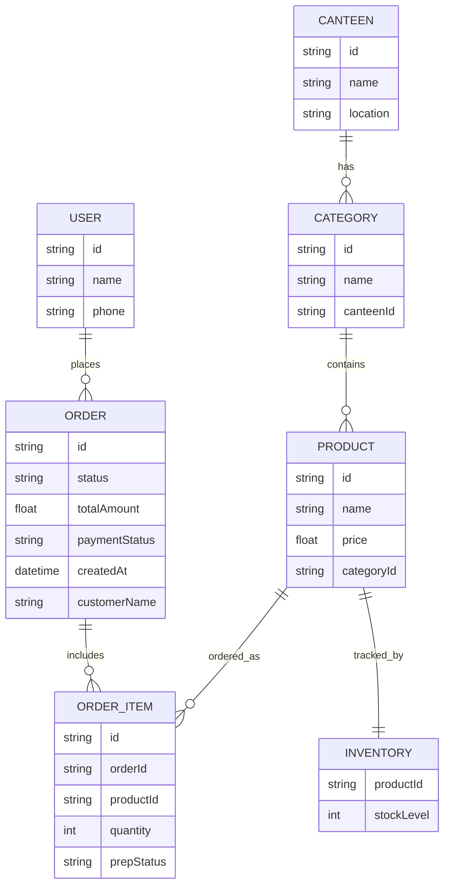

# Μοντέλο Δεδομένων (Data Model - ERD)

Οι σχέσεις μεταξύ των βασικών οντοτήτων (entities) για την υποστήριξη της επιχειρησιακής λογικής (business logic) του συστήματος.

### Οπτικοποίηση (Visualisation)

## Σχετικές Σημειώσεις
- [[system_architecture]]
- [[technical_stack]]

## Επόμενες Ενέργειες
- [ ] Επαλήθευση του μοντέλου δεδομένων (ERD) με τους developers για τυχόν παραλείψεις πριν την έναρξη του Phase 1 (MVP - Minimum Viable Product).
