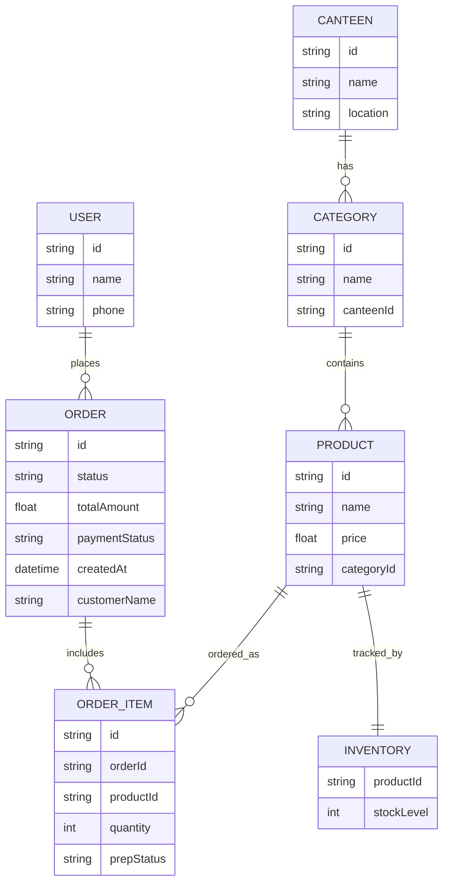

# 7. Μοντέλο Δεδομένων (ERD)
Οι σχέσεις μεταξύ των βασικών οντοτήτων για την υποστήριξη της λογικής του συστήματος.

```mermaid
erDiagram

    CANTEEN {
        string id
        string name
        string location
    }

    CATEGORY {
        string id
        string name
        string canteenId
    }

    PRODUCT {
        string id
        string name
        float price
        string categoryId
    }

    USER {
        string id
        string name
        string phone
    }

    ORDER {
        string id
        string status
        float totalAmount
        string paymentStatus
        datetime createdAt
        string customerName
    }

    ORDER_ITEM {
        string id
        string orderId
        string productId
        int quantity
        string prepStatus
    }

    INVENTORY {
        string productId
        int stockLevel
    }

    CANTEEN ||--o{ CATEGORY : has
    CATEGORY ||--o{ PRODUCT : contains
    USER ||--o{ ORDER : places
    ORDER ||--o{ ORDER_ITEM : includes
    PRODUCT ||--o{ ORDER_ITEM : ordered_as
    PRODUCT ||--|| INVENTORY : tracked_by
```
