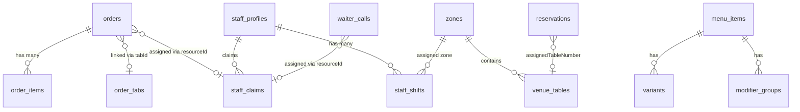

# Μοντέλο Δεδομένων (Data Model - ERD)

Οι σχέσεις μεταξύ των βασικών οντοτήτων (entities) για την υποστήριξη της επιχειρησιακής λογικής (business logic) του συστήματος. Το schema είναι οργανωμένο σε domain-specific αρχεία, όλα aggregated στο `src/lib/server/db/schema.ts`.

### Πίνακες Βάσης Δεδομένων

| Πίνακας | Περιγραφή |
|---|---|
| `orders` | Κύριος πίνακας παραγγελιών — status, tableNumber, station (bar/kitchen), τιμή, tabId |
| `order_items` | Αντικείμενα παραγγελίας — ποσότητα, pricingSnapshot (JSON) |
| `order_tabs` | "Πληρωμή αργότερα" — ομαδοποίηση πολλαπλών παραγγελιών σε ένα λογαριασμό |
| `menu_items` | Στοιχεία μενού με variants, modifiers, sortOrder, available flags |
| `menu_catalog` | Flattened/importable μενού για bulk updates & AI μεταφράσεις |
| `staff_profiles` | Σύνδεση user → ρόλος εστίασης (waiter, kitchen, bar, pda) |
| `staff_shifts` | Βάρδιες — sign in/out, zoneId |
| `staff_claims` | Ανάθεση πόρων (order ή waiter_call) σε staff — strategy, timestamps |
| `waiter_calls` | Κλήσεις σερβιτόρου — reason, status (pending/accepted/done) |
| `reservations` | Κρατήσεις — lifecycle: pending → confirmed → checked_in → completed |
| `zones` | Φυσικές ζώνες χώρου (π.χ. "Beach", "Veranda") |
| `venue_tables` | Τραπέζια — zoneId, x/y coordinates για floor plan |
| `venue_settings` | Γενικές ρυθμίσεις (Wi-Fi, service fees, assignment strategy) |
| `order_workflow_settings` | Ρυθμίσεις workflow (ποια statuses ενεργά, auto-confirmation) |
| `localization_settings` | Locales, default currency |
| `feature_overrides` | Feature toggles — ενεργοποίηση/απενεργοποίηση modules |

### Οπτικοποίηση (Visualisation)

## Σχετικές Σημειώσεις
- [[system_architecture]]
- [[technical_stack]]

## Επόμενες Ενέργειες
- [ ] Επαλήθευση του μοντέλου δεδομένων (ERD) με τους developers για τυχόν παραλείψεις πριν την έναρξη του Phase 1 (MVP - Minimum Viable Product).
