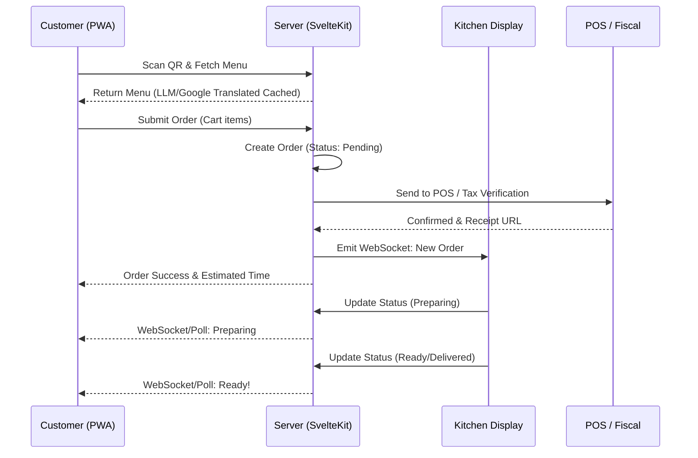

# Σχεδιασμός Ροής Παραγγελίας (Ordering Flow Design)

> ⚠️ **Αυτό το αρχείο χρειάζεται συμπλήρωση** — λείπει η λεπτομερής ροή παραγγελίας.

### Οπτικοποίηση

## Σχετικές Σημειώσεις

- [[user_flow]] — Διαδρομή πελάτη (υψηλού επιπέδου)
- [[order_lifecycle]] — Κύκλος ζωής παραγγελίας (state machine)
- [[staff_workflow]] — Ροή εργασίας προσωπικού (batch preparation)
- [[data_model]] — Μοντέλο δεδομένων

## Επόμενες Ενέργειες

- [ ] Σχεδιασμός λεπτομερούς ordering flow (από scan QR μέχρι παράδοση) με τεχνικές λεπτομέρειες API calls
- [ ] Έρευνα (Validation experiment): Χρονομέτρηση της πλήρους ροής παραγγελίας (scan έως το Kitchen Display). Μετρική επιτυχίας: < 60 δευτερόλεπτα μέσος χρόνος.
