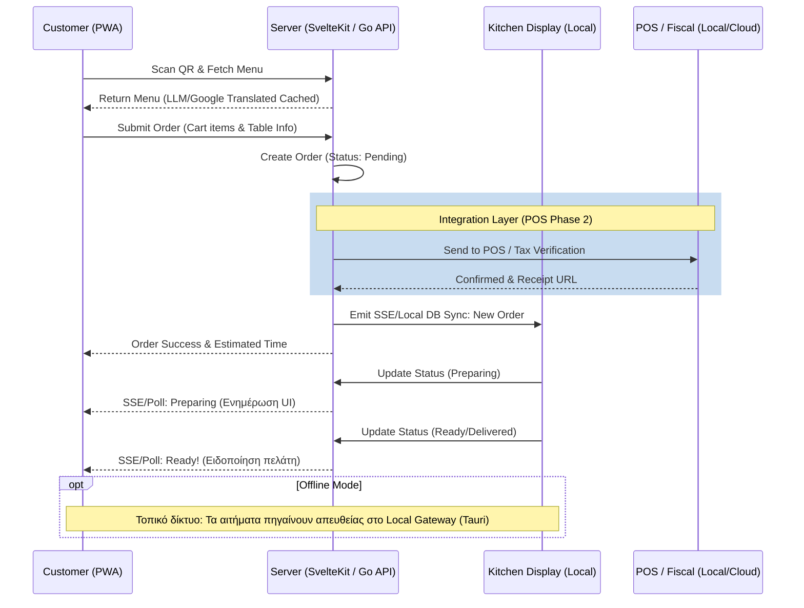

# Σχεδιασμός Ροής Παραγγελίας (Ordering Flow Design)

Αυτή είναι η λεπτομερής ροή παραγγελίας, από το scan του QR κωδικού (QR code) μέχρι την παράδοση (Delivery).

### Οπτικοποίηση

## Σχετικές Σημειώσεις

- [[user_flow]] — Διαδρομή πελάτη (υψηλού επιπέδου)
- [[order_lifecycle]] — Κύκλος ζωής παραγγελίας (state machine)
- [[staff_workflow]] — Ροή εργασίας προσωπικού (batch preparation)
- [[data_model]] — Μοντέλο δεδομένων

## Επόμενες Ενέργειες

- [ ] Validation Experiment: Σχεδιασμός ενός mock API (στοχεύοντας το Epsilon Net/SBZ Systems API) για να επιβεβαιώσουμε τη βιωσιμότητα του integration. -> [[architecture/pos_compliance.md]]
