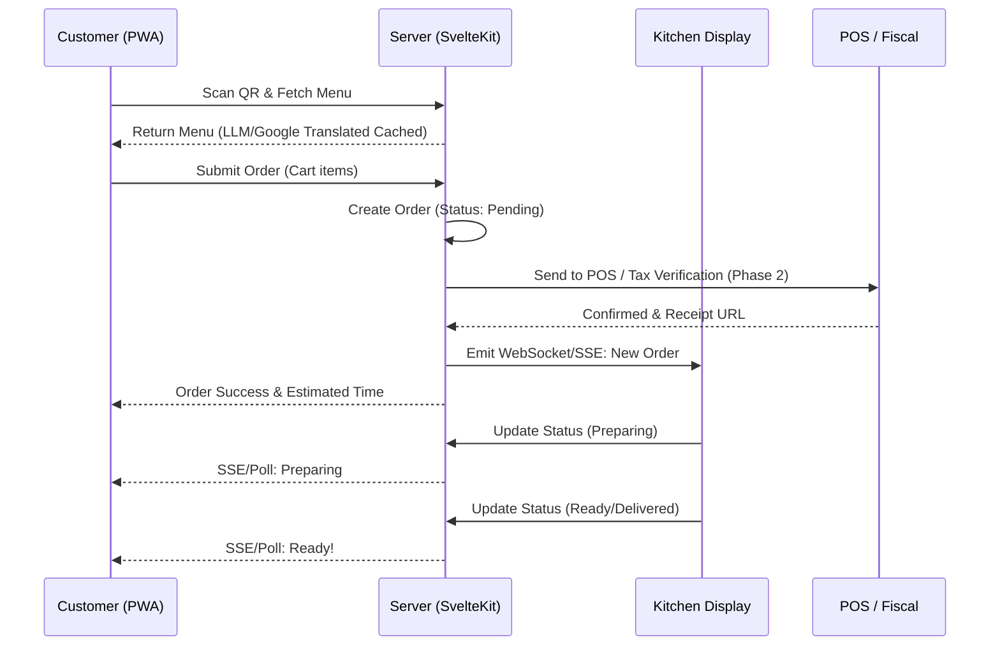

# Σχεδιασμός Ροής Παραγγελίας (Ordering Flow Design)

> ⚠️ **Αυτό το αρχείο χρειάζεται συμπλήρωση** — λείπει η λεπτομερής ροή παραγγελίας.

### Οπτικοποίηση

```mermaid
sequenceDiagram
    participant C as Customer (PWA)
    participant S as Server (SvelteKit)
    participant K as Kitchen Display
    participant P as POS / Fiscal

    C->>S: Scan QR & Fetch Menu
    S-->>C: Return Menu (LLM/Google Translated Cached)
    C->>S: Submit Order (Cart items)
    S->>S: Create Order (Status: Pending)
    S->>P: Send to POS / Tax Verification (Phase 2)
    P-->>S: Confirmed & Receipt URL
    S->>K: Emit WebSocket/SSE: New Order
    S-->>C: Order Success & Estimated Time
    K->>S: Update Status (Preparing)
    S-->>C: SSE/Poll: Preparing
    K->>S: Update Status (Ready/Delivered)
    S-->>C: SSE/Poll: Ready!
```

## Σχετικές Σημειώσεις

- [[user_flow]] — Διαδρομή πελάτη (υψηλού επιπέδου)
- [[order_lifecycle]] — Κύκλος ζωής παραγγελίας (state machine)
- [[staff_workflow]] — Ροή εργασίας προσωπικού (batch preparation)
- [[data_model]] — Μοντέλο δεδομένων

## Επιπτώσεις για την ομάδα (Team Impact)

- Η εισαγωγή του SSE API και της επιλογής Custom Polling προσθέτει επιπλέον δουλειά στην ομάδα backend για τη δημιουργία αξιόπιστης real-time επικοινωνίας.

## Επόμενες Ενέργειες

- [ ] Σχεδιασμός λεπτομερούς ordering flow (από scan QR μέχρι παράδοση) με τεχνικές λεπτομέρειες API calls
- [ ] Πείραμα Επικύρωσης (Validation Experiment): Δοκιμή της λεπτομερούς ροής παραγγελίας με το προσωπικό χρησιμοποιώντας το Fake MVP σε κινητές συσκευές
