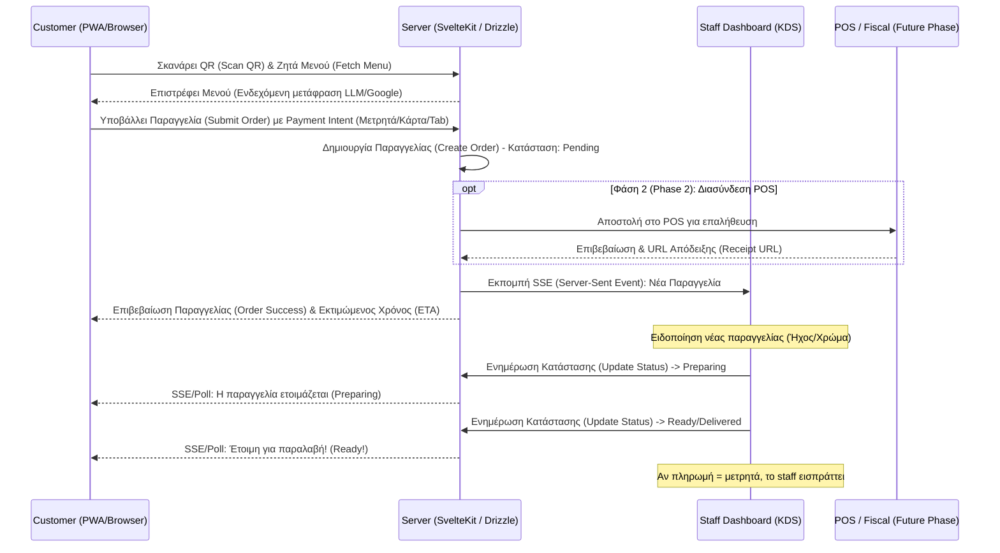

# Σχεδιασμός Ροής Παραγγελίας (Ordering Flow Design)

Αυτό το αρχείο περιγράφει τη λεπτομερή ροή παραγγελίας (Ordering Flow) από την πλευρά του πελάτη (Customer) και του προσωπικού (Staff), συμπεριλαμβανομένων των τεχνικών αλληλεπιδράσεων με το Backend.

### Οπτικοποίηση (Mermaid Diagram)

```mermaid
sequenceDiagram
    participant C as Customer (PWA/Browser)
    participant S as Server (SvelteKit / Drizzle)
    participant K as Staff Dashboard (KDS)
    participant P as POS / Fiscal (Future Phase)

    C->>S: Σκανάρει QR (Scan QR) & Ζητά Μενού (Fetch Menu)
    S-->>C: Επιστρέφει Μενού (Ενδεχόμενη μετάφραση LLM/Google)

    C->>S: Υποβάλλει Παραγγελία (Submit Order) με Payment Intent (Μετρητά/Κάρτα/Tab)
    S->>S: Δημιουργία Παραγγελίας (Create Order) - Κατάσταση: Pending

    %% Future Phase POS Integration
    opt Φάση 2 (Phase 2): Διασύνδεση POS
        S->>P: Αποστολή στο POS για επαλήθευση
        P-->>S: Επιβεβαίωση & URL Απόδειξης (Receipt URL)
    end

    S->>K: Εκπομπή SSE (Server-Sent Event): Νέα Παραγγελία
    S-->>C: Επιβεβαίωση Παραγγελίας (Order Success) & Εκτιμώμενος Χρόνος (ETA)

    Note over K: Ειδοποίηση νέας παραγγελίας (Ήχος/Χρώμα)

    K->>S: Ενημέρωση Κατάστασης (Update Status) -> Preparing
    S-->>C: SSE/Poll: Η παραγγελία ετοιμάζεται (Preparing)

    K->>S: Ενημέρωση Κατάστασης (Update Status) -> Ready/Delivered
    S-->>C: SSE/Poll: Έτοιμη για παραλαβή! (Ready!)

    Note over K: Αν πληρωμή = μετρητά, το staff εισπράττει
```

## Σχετικές Σημειώσεις

- [[user_flow]] — Διαδρομή πελάτη (User Flow - υψηλού επιπέδου)
- [[order_lifecycle]] — Κύκλος ζωής παραγγελίας (Order Lifecycle - state machine)
- [[staff_workflow]] — Ροή εργασίας προσωπικού (Staff Workflow - batch preparation)
- [[data_model]] — Μοντέλο δεδομένων (Data Model)

## Επόμενες Ενέργειες

- [ ] Σχεδιασμός τεχνικού validation πειράματος: Να δημιουργηθεί ένα mock API (στο SvelteKit) για να μετρήσουμε τον πραγματικό χρόνο απόκρισης (latency) κατά το Submit Order σε συνθήκες 3G/4G (νησί).
