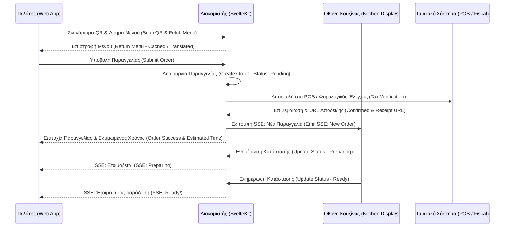

# Σχεδιασμός Ροής Παραγγελίας (Ordering Flow Design)

Αυτό το αρχείο περιγράφει τη λεπτομερή τεχνική ροή μιας παραγγελίας, από τη στιγμή που ο πελάτης σκανάρει το QR code μέχρι την παράδοση.

### Οπτικοποίηση

```mermaid
sequenceDiagram
    participant C as Πελάτης (Web App)
    participant S as Διακομιστής (SvelteKit)
    participant K as Οθόνη Κουζίνας (Kitchen Display)
    participant P as Ταμειακό Σύστημα (POS / Fiscal)

    C->>S: Σκανάρισμα QR & Αίτημα Μενού (Scan QR & Fetch Menu)
    S-->>C: Επιστροφή Μενού (Return Menu - Cached / Translated)
    C->>S: Υποβολή Παραγγελίας (Submit Order)
    S->>S: Δημιουργία Παραγγελίας (Create Order - Status: Pending)
    S->>P: Αποστολή στο POS / Φορολογικός Έλεγχος (Tax Verification)
    P-->>S: Επιβεβαίωση & URL Απόδειξης (Confirmed & Receipt URL)
    S->>K: Εκπομπή SSE: Νέα Παραγγελία (Emit SSE: New Order)
    S-->>C: Επιτυχία Παραγγελίας & Εκτιμώμενος Χρόνος (Order Success & Estimated Time)
    K->>S: Ενημέρωση Κατάστασης (Update Status - Preparing)
    S-->>C: SSE: Ετοιμάζεται (SSE: Preparing)
    K->>S: Ενημέρωση Κατάστασης (Update Status - Ready)
    S-->>C: SSE: Έτοιμο προς παράδοση (SSE: Ready!)
```

## Σχετικές Σημειώσεις

- [[user_flow]] — Διαδρομή πελάτη (υψηλού επιπέδου)
- [[order_lifecycle]] — Κύκλος ζωής παραγγελίας (state machine)
- [[staff_workflow]] — Ροή εργασίας προσωπικού (batch preparation)
- [[data_model]] — Μοντέλο δεδομένων

## Επόμενες Ενέργειες

- [ ] Σχεδιασμός λεπτομερούς API specification (OpenAPI ή τύποι) για το πως γίνεται η υποβολή της παραγγελίας από το Web App στο SvelteKit.
- [ ] Επιβεβαίωση χρόνων απόκρισης (latency) για το POS API integration.
