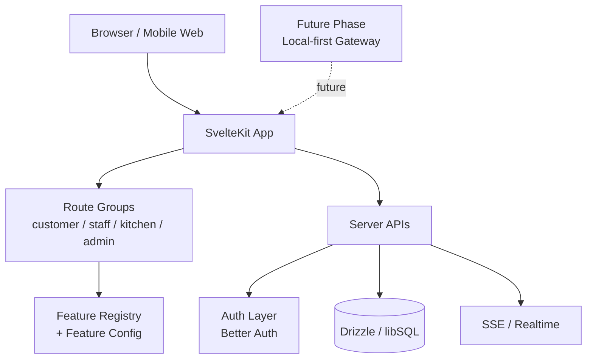

# Επισκόπηση Αρχιτεκτονικής (Architecture Overview)

Η τρέχουσα αρχιτεκτονική του Orderly είναι **cloud-first και web-first**. Το βασικό προϊόν είναι ένα SvelteKit 2 / Svelte 5 app με ρητό διαχωρισμό ανά ρόλο και domain, ενώ το feature registry λειτουργεί ως η κύρια στρώση σύνθεσης του UI.

## Βασικοί Πυλώνες

1. **Browser / Client Layer:** Ο πελάτης, το staff, η κουζίνα και ο admin χρησιμοποιούν το ίδιο web app με διαφορετικά route groups και δικαιώματα.
2. **Application Layer:** Τα features είναι μεμονωμένα Svelte components που δηλώνονται στο `featureRegistry` και τοποθετούνται σε συγκεκριμένα page slots μέσω του `feature-config`.
3. **Server / API Layer:** Better Auth για αυθεντικοποίηση, Drizzle/libSQL για δεδομένα, SSE για realtime updates και route handlers για το domain logic.
4. **Data Layer:** Η εφαρμογή γράφει στην τρέχουσα cloud-first βάση και στους βοηθητικούς πίνακες/helpers που στηρίζουν orders, reservations, tabs, staff claims και localization.

## Τρέχον vs Μελλοντικό

- **Τρέχον baseline:** cloud-first web εφαρμογή που ήδη καλύπτει ordering, staff/kitchen/admin operations, reservations, translations και demo data.
- **Μελλοντική φάση:** local-first gateway / embedded replica / Tauri-style packaging παραμένει ερευνητική κατεύθυνση, όχι το shipped μοντέλο του repo.

## Σχετικές Σημειώσεις

- [[technical_stack]] — Τρέχον stack και διάκριση φάσης.
- [[system_architecture]] — Πιο λεπτομερές διάγραμμα ροής.
- [[pos_compliance]] — Πλαίσιο για πληρωμές / POS σε επόμενη φάση.
