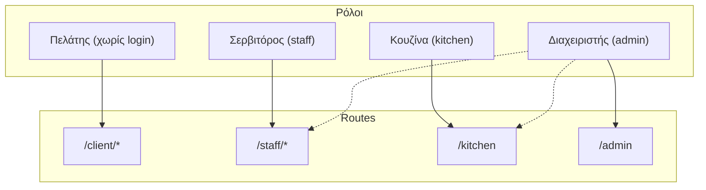

# Επισκόπηση Αρχιτεκτονικής (Architecture Overview)

Η αρχιτεκτονική του Orderly έχει σχεδιαστεί γύρω από ένα υβριδικό μοντέλο που εστιάζει στην ταχύτητα, την offline λειτουργία (Local-first) και τη φορολογική συμμόρφωση. Το Demo Orderly έχει ήδη υλοποιήσει τη βασική υποδομή για όλο τον κύκλο λειτουργίας.

**Βασικοί Πυλώνες:**
1. **Feature Registry Pattern & Tech Stack:** Η εφαρμογή είναι χτισμένη με **SvelteKit 2 + Svelte 5** και κάθε λειτουργία είναι ένα αυτόνομο Svelte component καταχωρημένο στο `src/lib/feature-registry.ts` με metadata (ID, domain, ρόλοι, dependencies). Το stack περιλαμβάνει Tailwind CSS 4, Better Auth, Drizzle ORM + Turso/libSQL, Paraglide-JS (Ελληνικά/Αγγλικά), Vitest, και Bun.
2. **Ρόλοι (RBAC - Role-Based Access Control):**
   - **Πελάτης:** Περιήγηση, order tracking, κλήση σερβιτόρου (Route: `/client/*`).
   - **Σερβιτόρος:** Ουρά παραγγελιών, κλήσεις, open tabs (Route: `/staff/*`).
   - **Κουζίνα:** Ticket board, filters (Route: `/kitchen`).
   - **Admin:** Dashboard, διαχείριση μενού, analytics, ρυθμίσεις (Route: `/admin`).
3. **Local-first MVP Architecture:** Η λύση βασίζεται σε **Tauri v2+** ως μια εφαρμογή (one-click install) που προσφέρει τοπικό server. Ως βάση δεδομένων χρησιμοποιείται το **Turso (libSQL)** για ταυτόχρονη χρήση στο Cloud με embedded replicas (τοπικά). Η αρχιτεκτονική αυτή υποστηρίζει offline λειτουργικότητα και εξαλείφει την ανάγκη για πολύπλοκες ρυθμίσεις δικτύου από τους ιδιοκτήτες καταστημάτων.
4. **Συγχρονισμός και Ασφάλεια (Real-Time SSE):** Τα δεδομένα συγχρονίζονται στο cloud, υποστηρίζοντας 5 κανάλια SSE updates (Orders, Waiter Calls, Tabs, Reservations, Occupancy) με auto-reconnection και polling fallback.
5. **Φορολογική Συμμόρφωση:** Το Phase 1 (MVP - Minimum Viable Product) λειτουργεί μόνο ως ordering layer, ενώ το Phase 2 εισάγει API integrations με το υπάρχον POS.

### Demo Mode
Η εφαρμογή τρέχει σε **Demo Mode** με:
- Cookie-based auth bypass (`orderly_demo_mode`).
- Αυτόματο seeding (8 menu items, 36 orders, 10 calls, 12 reservations).
- Dual-mode persistence: in-memory ή DB (`USE_DB_ORDERS`).

### Οπτικοποίηση

## Σχετικές Σημειώσεις

Για περισσότερες λεπτομέρειες, συμβουλευτείτε τα παρακάτω εξειδικευμένα αρχεία:
- [[technical_stack]] — Τεχνική αρχιτεκτονική, συμπεριλαμβανομένου του Tauri v2+ & Turso.
- [[data_model]] — Πίνακες Βάσης Δεδομένων (ERD).
- [[system_architecture]] — Οπτικό διάγραμμα (Mermaid) της αλληλεπίδρασης Cloud-Local-Client.
- [[pos_compliance]] — Οδηγίες για διασύνδεση POS (SBZ/EMDI, myDATA).

## Επόμενες Ενέργειες
- [ ] Έλεγχος του `feature-registry.ts` για ενδεχόμενες προσθήκες/μετατροπές των features στο UI του Admin dashboard.
