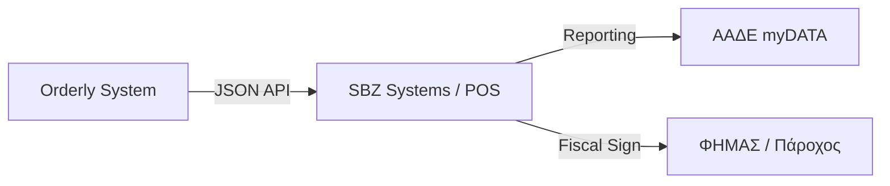

# Συμμόρφωση & Διασύνδεση POS (Greek Compliance)

Η φορολογική συμμόρφωση είναι κρίσιμη για την αποδοχή του συστήματος από τους επιχειρηματίες.

## 1. Φορολογική Συμμόρφωση (ΑΑΔΕ / myDATA)
Από τον Αύγουστο του 2024, οι επιχειρήσεις εστίασης πρέπει να χρησιμοποιούν ΦΗΜΑΣ (Φορολογικός Ηλεκτρονικός Μηχανισμός Αυτόνομης Σύνδεσης) ή Πάροχο Ηλεκτρονικής Τιμολόγησης.
*   Όλες οι συναλλαγές πρέπει να αναφέρονται στο **myDATA**.
*   Κάθε απόδειξη πρέπει να φέρει **QR Code επαλήθευσης**.

## 2. Στρατηγική MVP vs Production
*   **Phase 1 (MVP):** Η Orderly λειτουργεί ως **Ordering Layer μόνο**. Η πληρωμή γίνεται στο ταμείο με τους υπάρχοντες μηχανισμούς της επιχείρησης. Έτσι αποφεύγεται η πολυπλοκότητα των ΦΗΜΑΣ.
*   **Phase 2:** Διασύνδεση με το **Unified POS REST API της SBZ Systems**. Διαχειρίζονται κεντρικά την πολυπλοκότητα των POS APIs.
*   **Phase 3:** Συνεργασία με Παρόχους (π.χ. Oxygen, Epsilon Net).

## 3. Κυρίαρχα Συστήματα POS στην Ελλάδα
1.  **Epsilon Net:** Ηγέτης της αγοράς.
2.  **SBZ Systems (EMDI):** Το ευκολότερο API για διασύνδεση.
3.  **Cardlink:** Μεγάλη βάση Android POS τερματικών.
4.  **e-liza:** Browser-based POS, φιλικό προς APIs.

## Επόμενες Ενέργειες

- [ ] Έρευνα (Validation experiment): Επαλήθευση του SBZ Systems API για το order injection endpoint. Μετρική: Επιτυχής αποστολή test παραγγελίας.
