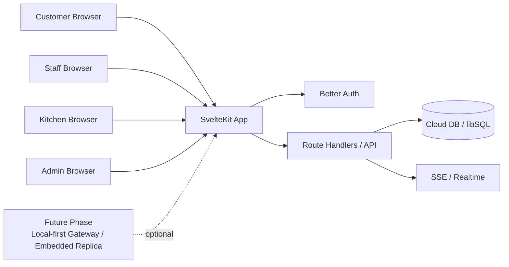

# 2. Αρχιτεκτονική Συστήματος (Cloud-First Web App)

Το τρέχον σύστημα είναι ένα web app που εξυπηρετεί πελάτες, staff, κουζίνα και admin από τον ίδιο κώδικα, με route groups και role guards. Η αρχιτεκτονική local-first παραμένει future-phase σημείωση.

## Τι σημαίνει πρακτικά

- Οι ρόλοι και τα δικαιώματα ελέγχονται server-side.
- Τα realtime updates για orders, waiter calls, reservations και tabs περνάνε από SSE.
- Τα features είναι δεμένα σε συγκεκριμένα page slots, όχι σε ad-hoc οθόνες.

## Σχετικές Σημειώσεις

- [[technical_stack]] — Αναλυτική λίστα stack.
- [[overview]] — Υψηλού επιπέδου αρχιτεκτονική.

### Τεχνικές Προδιαγραφές (Technical Specs) - Database Isolation
- **Αρχιτεκτονική Βάσης Δεδομένων (Database Architecture):** Προτείνεται απομόνωση database-per-tenant με το Turso/libSQL για να αντικατασταθεί η έλλειψη εγγενούς Row Level Security (RLS).
- **Συγχρονισμός σε Πραγματικό Χρόνο (Realtime Sync):** Τα custom Server-Sent Events (SSE) θα διαχειρίζονται τις ενημερώσεις σε πραγματικό χρόνο (π.χ. μέσω του επιπέδου Go backend) εφόσον το Turso δεν προσφέρει αντίστοιχο εγγενές `Supabase Realtime`.
