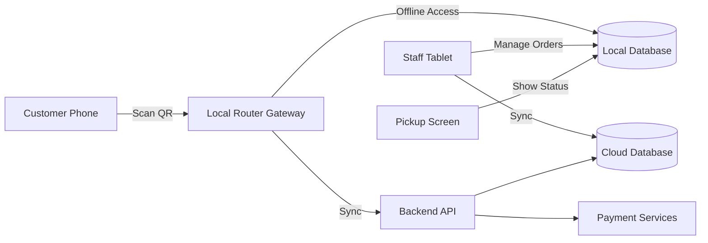

# 2. Αρχιτεκτονική Συστήματος (Υβριδικό Μοντέλο)
Οπτικοποίηση της αλληλεπίδρασης μεταξύ Cloud, τοπικού δικτύου και συσκευών.

```mermaid
graph LR

    Customer[Customer Phone]
    Gateway[Local Router Gateway]
    LocalDB[(Local Database)]
    Staff[Staff Tablet]
    Display[Pickup Screen]

    API[Backend API]
    CloudDB[(Cloud Database)]
    Auth[Payment Services]

    Customer -->|Scan QR| Gateway
    Gateway -->|Offline Access| LocalDB
    Gateway -->|Sync| API

    Staff -->|Manage Orders| LocalDB
    Staff -->|Sync| CloudDB

    Display -->|Show Status| LocalDB

    API --> CloudDB
    API --> Auth
```
