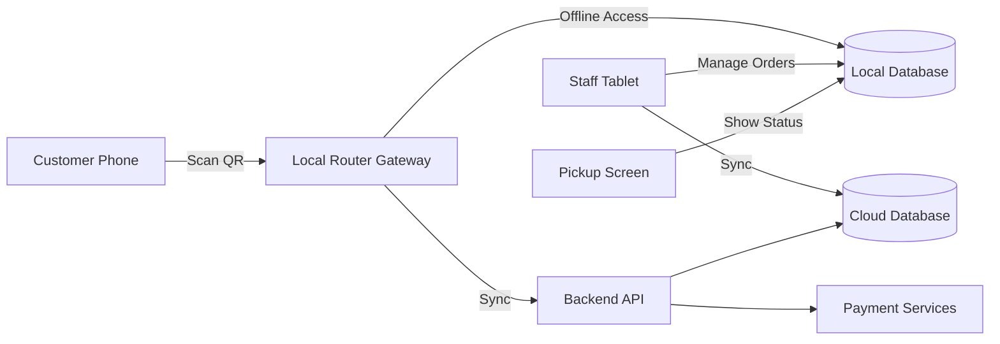

# Αρχιτεκτονική Συστήματος (System Architecture - Υβριδικό Μοντέλο)

Οπτικοποίηση της αλληλεπίδρασης μεταξύ Cloud, τοπικού δικτύου (Local Network) και συσκευών. Η τοπική πύλη (Gateway) υλοποιείται μέσω **Tauri v2+** (one-click install), το οποίο φιλοξενεί έναν τοπικό διακομιστή (Local Server) και μία embedded replica βάση δεδομένων (μέσω Turso/libSQL).

### Οπτικοποίηση (Visualisation)

## Σχετικές Σημειώσεις
- [[data_model]]
- [[technical_stack]]
- [[overview]]

## Επόμενες Ενέργειες
- [ ] Δοκιμή (Stress Test) του Gateway (Tauri v2+) σε συνθήκες offline λειτουργίας (απουσία internet) για 24 ώρες για να επιβεβαιωθεί η αξιοπιστία της τοπικής βάσης.
