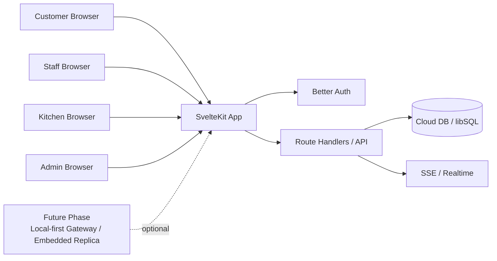

# 2. Αρχιτεκτονική Συστήματος (Cloud-First Web App)

Το τρέχον σύστημα είναι ένα web app που εξυπηρετεί πελάτες, staff, κουζίνα και admin από τον ίδιο κώδικα, με route groups και role guards. Η αρχιτεκτονική local-first παραμένει future-phase σημείωση.

```mermaid
graph LR

    Customer[Customer Browser]
    Staff[Staff Browser]
    Kitchen[Kitchen Browser]
    Admin[Admin Browser]

    App[SvelteKit App]
    Auth[Better Auth]
    API[Route Handlers / API]
    DB[(Cloud DB / libSQL)]
    SSE[SSE / Realtime]

    Customer --> App
    Staff --> App
    Kitchen --> App
    Admin --> App

    App --> Auth
    App --> API
    API --> DB
    API --> SSE

    Future[Future Phase\nLocal-first Gateway / Embedded Replica]
    Future -. optional .-> App
```

## Τι σημαίνει πρακτικά

- Οι ρόλοι και τα δικαιώματα ελέγχονται server-side.
- Τα realtime updates για orders, waiter calls, reservations και tabs περνάνε από SSE. Το SSE είναι ιδανικό για unidirectional updates (π.χ. KDS) και λειτουργεί αξιόπιστα πίσω από proxies χωρίς προβλήματα σύνδεσης.
- Τα features είναι δεμένα σε συγκεκριμένα page slots, όχι σε ad-hoc οθόνες.
- **Μελλοντική offline-first αρχιτεκτονική (Local-first):** Προβλέπεται η χρήση Turso embedded replicas (local libSQL) για μηδενικό network roundtrip και άμεση απόκριση. Σε περίπτωση πτώσης του δικτύου (π.χ. σε beach bars), τα orders θα αποθηκεύονται τοπικά, το KDS θα ενημερώνεται μέσω local SSE, και το sync με το Turso Cloud θα γίνεται στο background όταν επανέλθει η σύνδεση.

## Σχετικές Σημειώσεις

- [[technical_stack]] — Αναλυτική λίστα stack.
- [[overview]] — Υψηλού επιπέδου αρχιτεκτονική.
