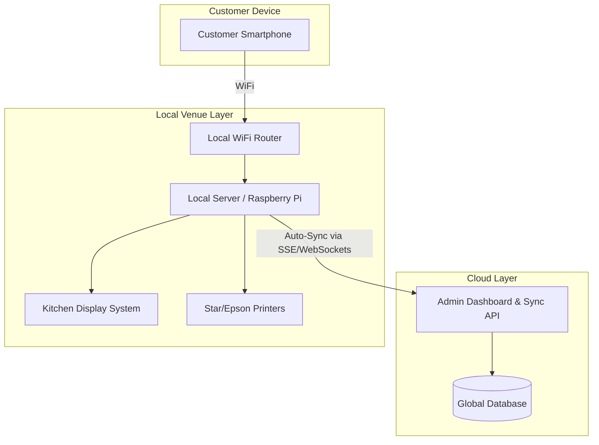

# Τεχνική Αρχιτεκτονική (Technical Architecture)

Στρατηγική επιλογή για ταχύτητα (MVP) και αξιοπιστία (Production).

## 1. MVP Stack (Rapid Development)
Για το demo των 10 ημερών, η βέλτιστη επιλογή είναι:
*   **Frontend:** Svelte / SvelteKit - PWA approach (Package Manager: Bun).
*   **Backend:** SvelteKit Server (μελλοντικά πιθανώς Golang).
*   **Database:** Υπό διερεύνηση (Supabase, CockroachDB ή άλλη λύση που να υποστηρίζει local-first sync).
*   **Styling:** Tailwind CSS + shadcn/ui.
*   **Deployment:** Vercel.

## 2. Υβριδική Αρχιτεκτονική (Production)
Στην παραγωγή, ειδικά για Beach Bars και Festivals, η σύνδεση στο internet είναι συχνά ασταθής.

## 3. Real-time Ενημερώσεις
Για το MVP προτείνεται η χρήση **SSE (Server-Sent Events)** αντί για WebSockets, καθώς το 95% της επικοινωνίας είναι server-to-client (status updates). Είναι απλούστερο στην υλοποίηση και πιο ανθεκτικό σε proxies.

## 4. Push Notifications
*   **Android:** Πλήρης υποστήριξη μέσω Web Push.
*   **iOS (16.4+):** Λειτουργεί μόνο αν ο χρήστης προσθέσει το PWA στην αρχική οθόνη.
*   **Στρατηγική Fallback:** In-browser alerts (Audio) + Προαιρετικό SMS (via Twilio).

## 5. Τοπική Αρχιτεκτονική (Local-First MVP)
Για την ευκολότερη δυνατή εγκατάσταση (One-click install) στα καταστήματα, έχει επιλεγεί η εξής προσέγγιση:
*   **Πλατφόρμα:** **Tauri v2+** ως ένα cross-platform εκτελέσιμο (EXE/APK) που περιέχει τον τοπικό server.
*   **Βάση Δεδομένων:** **Turso (libSQL)** για το Cloud, με **embedded replicas** τοπικά στο Tauri. Αυτό προσφέρει microsecond reads τοπικά και αυτόματο συγχρονισμό (sync) των writes με το Cloud.
*   **Πλεονέκτημα:** Ο ιδιοκτήτης δεν χρειάζεται τεχνικές γνώσεις (ούτε Docker, ούτε ρυθμίσεις router). Ανοίγει απλώς την εφαρμογή και η τοπική IP γίνεται εγγραφή (register) στο Cloud backend μας.

### Analytics & Data Tracking
*   **Platform:** **PostHog** (Selected for robust feature-set tailored to early-stage startups).
*   **Tracking Strategy (Zero-Friction):**
    *   Initialize PostHog in the SvelteKit frontend.
    *   Track anonymous user interactions without requiring login.
    *   Use distinct IDs tied to the local session or device fingerprint to map user journeys (scan -> view menu -> add to cart -> checkout).
*   **Key Event to Track:** OMTM (One Metric That Matters) - The Scan-to-Order conversion rate.
