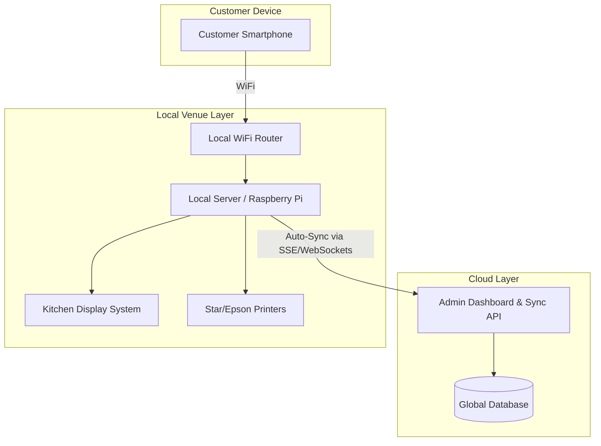

# Τεχνική Αρχιτεκτονική (Technical Architecture)

Στρατηγική επιλογή για ταχύτητα (MVP) και αξιοπιστία (Production).

## 1. MVP Stack (Rapid Development)
Για το demo των 10 ημερών, η βέλτιστη επιλογή είναι:
*   **Frontend:** Svelte / SvelteKit - PWA approach (Package Manager: Bun).
*   **Backend:** SvelteKit Server (μελλοντικά πιθανώς Golang).
*   **Database:** Υπό διερεύνηση (Supabase, CockroachDB ή άλλη λύση που να υποστηρίζει local-first sync).
*   **Styling:** Tailwind CSS + shadcn/ui.
*   **Deployment:** Vercel.

## 2. Υβριδική Αρχιτεκτονική (Production)
Στην παραγωγή, ειδικά για Beach Bars και Festivals, η σύνδεση στο internet είναι συχνά ασταθής.

## 3. Real-time Ενημερώσεις
Για το MVP προτείνεται η χρήση **SSE (Server-Sent Events)** αντί για WebSockets, καθώς το 95% της επικοινωνίας είναι server-to-client (status updates). Είναι απλούστερο στην υλοποίηση και πιο ανθεκτικό σε proxies.

## 4. Push Notifications
*   **Android:** Πλήρης υποστήριξη μέσω Web Push.
*   **iOS (16.4+):** Λειτουργεί μόνο αν ο χρήστης προσθέσει το PWA στην αρχική οθόνη.
*   **Στρατηγική Fallback:** In-browser alerts (Audio) + Προαιρετικό SMS (via Twilio).

## 5. Τοπική Αρχιτεκτονική (Local-First MVP)
Για την ευκολότερη δυνατή εγκατάσταση (One-click install) στα καταστήματα, έχει επιλεγεί η εξής προσέγγιση:
*   **Πλατφόρμα:** **Tauri v2+** ως ένα cross-platform εκτελέσιμο (EXE/APK) που περιέχει τον τοπικό server.
*   **Βάση Δεδομένων:** **Turso (libSQL)** για το Cloud, με **embedded replicas** τοπικά στο Tauri. Αυτό προσφέρει microsecond reads τοπικά και αυτόματο συγχρονισμό (sync) των writes με το Cloud.
*   **Πλεονέκτημα:** Ο ιδιοκτήτης δεν χρειάζεται τεχνικές γνώσεις (ούτε Docker, ούτε ρυθμίσεις router). Ανοίγει απλώς την εφαρμογή και η τοπική IP γίνεται εγγραφή (register) στο Cloud backend μας.

### Analytics & Data Tracking
*   **Platform:** **PostHog** (Selected for robust feature-set tailored to early-stage startups).
*   **Tracking Strategy (Zero-Friction):**
    *   Initialize PostHog in the SvelteKit frontend.
    *   Track anonymous user interactions without requiring login.
    *   Use distinct IDs tied to the local session or device fingerprint to map user journeys (scan -> view menu -> add to cart -> checkout).
*   **Key Event to Track:** OMTM (One Metric That Matters) - The Scan-to-Order conversion rate.

## 6. Turso / libSQL Database Architecture Setup
*Ανάλυση βασισμένη στην έρευνα κόστους και τεχνικών δυνατοτήτων του Turso (αντί για PocketBase).*

### Τιμολόγηση & Κόστος (Turso Cloud)
- **Developer Tier:** $4.99/μήνα. Περιλαμβάνει 500 Active DBs, 9GB storage, 2.5B reads. (Δωρεάν τα επιπλέον DBs κάτω από 500). Ιδανικό ξεκίνημα.
- **Scaler Tier:** $24.92/μήνα. Καλύπτει μέχρι 2.500 Active DBs.
- Η προσέγγιση είναι **Database-per-tenant** (μία DB ανά κατάστημα), κάτι που λύνει και την ανάγκη για Row Level Security (RLS) στο Cloud.
- Τα **Embedded Replicas** (για το local-first) είναι δωρεάν, πληρώνουμε μόνο τα sync bytes (τα οποία για QR ordering εγγραφές είναι πολύ λίγα).

### SDKs & Λειτουργικότητα
- **Frontend (SvelteKit):** Χρήση του `@libsql/client` TypeScript SDK. Προτείνεται η ενσωμάτωση του **Drizzle ORM** που προσφέρει άριστη TS υποστήριξη και type-safety για το libSQL.
- **Backend (Golang):** Χρήση του `@libsql/client-go` SDK (ή `database/sql` + `sqlc`).
- **SSE / Realtime:** Το Turso δεν έχει native realtime endpoints. Το **Server-Sent Events (SSE)** πρέπει να υλοποιηθεί custom μέσω του Backend (π.χ. στο Golang, ~20 γραμμές κώδικα) ή μέσω του `/listen` endpoint + polling, το οποίο επαρκεί για παραγγελίες.
- **Authentication:** Το Turso δεν έχει built-in Auth. Θα χρησιμοποιήσουμε λύσεις όπως Auth.js ή Clerk, αποστέλλοντας JWTs.

### Εναλλακτική Self-Hosted Λύση
Όταν ξεπεράσουμε τα ~1000 καταστήματα και τα fees αυξηθούν, είναι εφικτή η 100% μετάβαση σε **self-hosted `libsql-server` (sqld)** σε δικό μας VPS (με ελάχιστο κόστος ~$40-80/μήνα), διατηρώντας το ίδιο πρωτόκολλο επικοινωνίας και τα Embedded Replicas.

**Τελική Απόφαση:**
Ξεκινάμε με το **Turso Cloud (Developer tier)** για ταχύτητα (zero Ops) και scaling out-of-the-box. Μετάβαση σε Self-Hosted όταν φτάσουμε μεγάλο scale.
