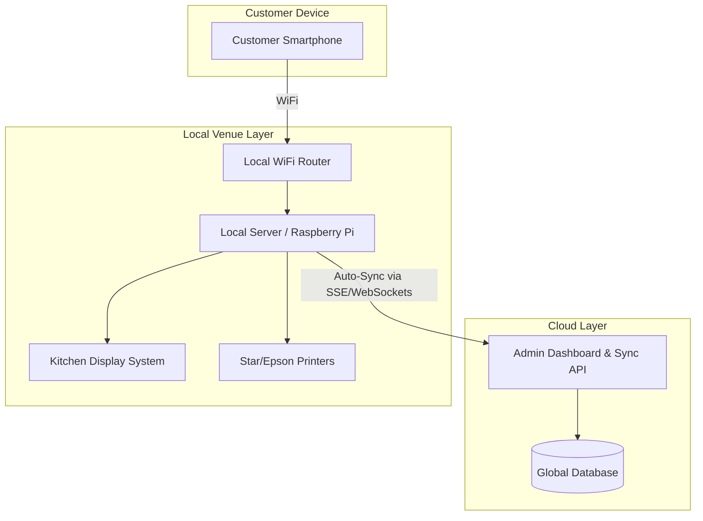

# Τεχνική Αρχιτεκτονική (Technical Architecture)

Στρατηγική επιλογή για ταχύτητα (MVP) και αξιοπιστία (Production).

## 1. MVP Stack (Rapid Development)
Για το demo των 10 ημερών, η βέλτιστη επιλογή είναι:
*   **Frontend:** Next.js 14+ (App Router) - PWA approach.
*   **Backend/Database:** Supabase (Auth, Real-time DB, Storage).
*   **Styling:** Tailwind CSS + shadcn/ui.
*   **Deployment:** Vercel.

## 2. Υβριδική Αρχιτεκτονική (Production)
Στην παραγωγή, ειδικά για Beach Bars και Festivals, η σύνδεση στο internet είναι συχνά ασταθής.

## 3. Real-time Ενημερώσεις
Για το MVP προτείνεται η χρήση **SSE (Server-Sent Events)** αντί για WebSockets, καθώς το 95% της επικοινωνίας είναι server-to-client (status updates). Είναι απλούστερο στην υλοποίηση και πιο ανθεκτικό σε proxies.

## 4. Push Notifications
*   **Android:** Πλήρης υποστήριξη μέσω Web Push.
*   **iOS (16.4+):** Λειτουργεί μόνο αν ο χρήστης προσθέσει το PWA στην αρχική οθόνη.
*   **Στρατηγική Fallback:** In-browser alerts (Audio) + Προαιρετικό SMS (via Twilio).
