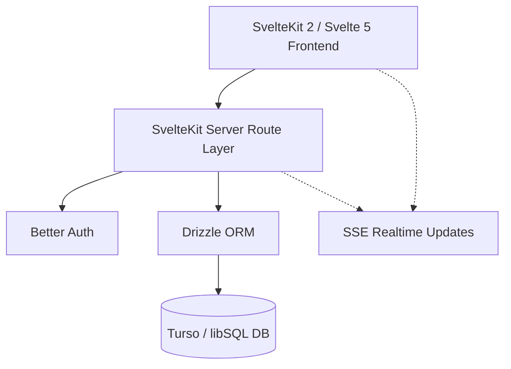

# Τεχνική Αρχιτεκτονική (Technical Stack)

Η τρέχουσα υλοποίηση είναι web-first και βελτιστοποιημένη για γρήγορη ανάπτυξη, καθαρό domain separation και εύκολη επέκταση ανά feature.

## 1. Τρέχον MVP Stack

- **Frontend:** SvelteKit 2, Svelte 5, Tailwind CSS 4
- **Routing / App Shell:** route groups για customer, staff, kitchen και admin
- **Auth:** Better Auth
- **Data:** Drizzle ORM + libSQL/Turso-style storage layer
- **Realtime:** SSE για orders, waiter calls, reservations, tabs και occupancy
- **i18n:** Paraglide JS
- **Testing:** Vitest
- **Tooling:** Bun

### Οπτικοποίηση

```mermaid
flowchart TD
    A[SvelteKit 2 / Svelte 5 Frontend] --> B[SvelteKit Server Route Layer]
    B --> C[Better Auth]
    B --> D[Drizzle ORM]
    D --> E[(Turso / libSQL DB)]
    B -.-> F[SSE Realtime Updates]
    A -.-> F
```

## 2. Τι δεν είναι baseline ακόμα

- Local-first packaging με Tauri v2+ δεν είναι το τρέχον shipping model.
- Embedded replicas / local gateway είναι future-phase κατεύθυνση, όχι baseline που στηρίζεται το repo σήμερα.
- Offline sync και local device routing παραμένουν strategic research, όχι production default.

## 3. Analytics & Tracking

- Το strategy doc έχει επιλέξει PostHog ως πιθανή λύση για anonymous conversion tracking.
- Το repo πρέπει να το αντιμετωπίζει ως επόμενη ενσωμάτωση, όχι ως δεδομένο ήδη wired-in stack component.

## 4. Deployment Logic

- Το app τρέχει ως web application και το backend logic μένει στο SvelteKit server layer.
- Τα feature-specific modules παραμένουν απομονωμένα μέσα στο feature registry και τα route orchestrators.

## Σχετικές Σημειώσεις

- [[overview]] — High-level architecture.
- [[system_architecture]] — Διάγραμμα ροής.
- [[pos_compliance]] — Φάσεις POS / fiscal integration.

### Local-First Database Baseline (Τεχνική Απόφαση)

Επιλέχθηκε το **Turso/libSQL** ως η κύρια βάση δεδομένων για την υποστήριξη του local-first requirement:
- **Cloud/Local Sync**: Το Turso παρέχει embedded replicas (SQLite) τα οποία προσφέρουν microsecond τοπικά reads και αυτόματο sync με το Turso cloud.
- **Εγκατάσταση (Deployment)**: Single binary (`sqld` ή `turso dev`) / Docker (`ghcr.io/tursodatabase/libsql-server`), ιδανικό για χαμηλής ισχύος συσκευές (π.χ. Raspberry Pi, Android via Termux) σε B2B venues.
- **SDKs**: Άψογη συμβατότητα με το tech stack μας μέσω `@libsql/client` (SvelteKit) και `Drizzle ORM` για type-safe queries. Για custom go-backend υποστηρίζεται το `@libsql/client-go`.
- **Scaling**: Το Developer tier καλύπτει άνετα το MVP (έως 500 DBs/καταστήματα). Κάθε κατάστημα λειτουργεί με database-per-tenant isolation.
- **Μελλοντικά (Future proof)**: Εάν τα κόστη αυξηθούν, είναι εφικτό το migration σε self-hosted `libsql-server`.
