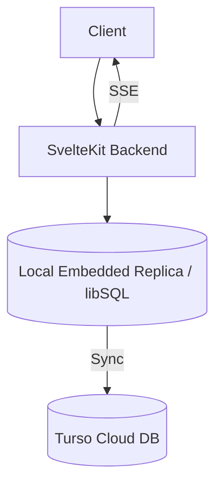

# Τεχνική Αρχιτεκτονική (Technical Stack)

Η τρέχουσα υλοποίηση είναι web-first και βελτιστοποιημένη για γρήγορη ανάπτυξη, καθαρό domain separation και εύκολη επέκταση ανά feature.

## 1. Τρέχον MVP Stack

- **Frontend:** SvelteKit 2, Svelte 5, Tailwind CSS 4
- **Routing / App Shell:** route groups για customer, staff, kitchen και admin
- **Auth:** Better Auth
- **Data:** Drizzle ORM + libSQL/Turso-style storage layer
- **Realtime:** SSE για orders, waiter calls, reservations, tabs και occupancy
- **i18n:** Paraglide JS
- **Testing:** Vitest
- **Tooling:** Bun

## 2. Τι δεν είναι baseline ακόμα

- Local-first packaging με Tauri v2+ δεν είναι το τρέχον shipping model.
- Embedded replicas / local gateway είναι future-phase κατεύθυνση, όχι baseline που στηρίζεται το repo σήμερα.
- Offline sync και local device routing παραμένουν strategic research, όχι production default.

## 3. Analytics & Tracking

- Το strategy doc έχει επιλέξει PostHog ως πιθανή λύση για anonymous conversion tracking.
- Το repo πρέπει να το αντιμετωπίζει ως επόμενη ενσωμάτωση, όχι ως δεδομένο ήδη wired-in stack component.

## 4. Deployment Logic

- Το app τρέχει ως web application και το backend logic μένει στο SvelteKit server layer.
- Τα feature-specific modules παραμένουν απομονωμένα μέσα στο feature registry και τα route orchestrators.

## Σχετικές Σημειώσεις

- [[overview]] — High-level architecture.
- [[system_architecture]] — Διάγραμμα ροής.
- [[pos_compliance]] — Φάσεις POS / fiscal integration.

## 5. Βάση Δεδομένων & Συγχρονισμός (Database Specs)

- **Database Engine:** Turso / libSQL.
- **ORM:** Drizzle ORM για type-safe queries και migrations στο SvelteKit.
- **Offline/Local Strategy:** Χρήση Embedded Replicas. Τα reads γίνονται τοπικά (microsecond latency) και τα writes συγχρονίζονται με το Turso cloud.
- **Realtime / SSE:** Δεν υπάρχει native realtime (όπως π.χ. στο Supabase). Υλοποίηση αυτόνομου SSE (Server-Sent Events) στο backend ή SvelteKit endpoint.
- **Auth:** Δεν χρησιμοποιούμε built-in auth της DB, αλλά εξωτερικό πάροχο (π.χ. Better Auth ή custom JWT) περνώντας auth token στο libSQL driver.

### Οπτικοποίηση

```mermaid
flowchart TD
    A[Client] --> B[SvelteKit Backend]
    B --> C[(Local Embedded Replica / libSQL)]
    C -- Sync --> D[(Turso Cloud DB)]
    B -- SSE --> A
```
