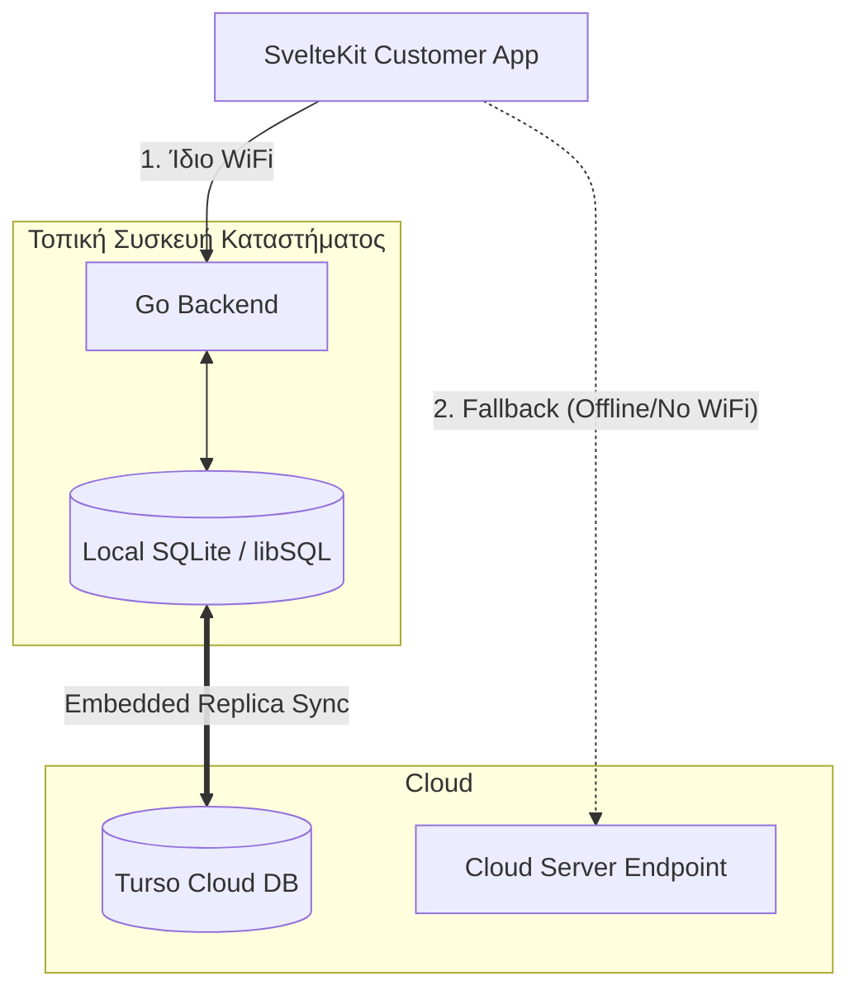

# Τεχνική Αρχιτεκτονική (Technical Stack)

Η τρέχουσα υλοποίηση είναι web-first και βελτιστοποιημένη για γρήγορη ανάπτυξη, καθαρό domain separation και εύκολη επέκταση ανά feature.

## 1. Τρέχον MVP Stack

- **Frontend:** SvelteKit 2, Svelte 5, Tailwind CSS 4
- **Routing / App Shell:** route groups για customer, staff, kitchen και admin
- **Auth:** Better Auth
- **Data:** Drizzle ORM + libSQL/Turso-style storage layer
- **Realtime:** SSE για orders, waiter calls, reservations, tabs και occupancy
- **i18n:** Paraglide JS
- **Testing:** Vitest
- **Tooling:** Bun

## 2. Τι δεν είναι baseline ακόμα

- Local-first packaging με Tauri v2+ δεν είναι το τρέχον shipping model.
- Embedded replicas / local gateway είναι future-phase κατεύθυνση, όχι baseline που στηρίζεται το repo σήμερα.
- Offline sync και local device routing παραμένουν strategic research, όχι production default.

### Σημείωση για Local-First/Turso (Future Phase)
Όταν αποφασιστεί να ενσωματωθεί local-first λειτουργία, η επιλεγμένη λύση βάσης δεδομένων είναι το **Turso/libSQL** (με εναλλακτική το PocketBase).
- **Γιατί:** Ταιριάζει απόλυτα στο μοντέλο: ελαφριά εγκατάσταση σε container ή single binary, τρέχει σε χαμηλών πόρων συσκευές (Raspberry Pi/παλιό laptop/Android), με αυτόματο sync στο cloud και offline fallback.
- **Κόστος:** Το pricing βασίζεται σε Monthly Active Databases. Το Developer tier ($4.99/μήνα για 500 DBs) καλύπτει άνετα τις αρχικές ανάγκες. Τα embedded replicas είναι δωρεάν.
- **SDKs:** Πλήρης υποστήριξη Go (`@libsql/client-go`) και SvelteKit (`@libsql/client`).
- **SSE / Auth:** Θα υλοποιηθούν custom στο Golang backend (π.χ. JWT για Auth) καθώς το Turso είναι lightweight και δεν τα περιλαμβάνει native.

### Οπτικοποίηση: Turso Sync / Fallback Architecture

```mermaid
flowchart TD
    subgraph Local Device [Τοπική Συσκευή Καταστήματος]
        LocalApp[Go Backend]
        LocalDB[(Local SQLite / libSQL)]
    end

    subgraph Cloud
        CloudTurso[(Turso Cloud DB)]
        Webhook[Cloud Server Endpoint]
    end

    CustomerBrowser[SvelteKit Customer App]

    CustomerBrowser -- "1. Ίδιο WiFi" --> LocalApp
    CustomerBrowser -. "2. Fallback (Offline/No WiFi)" .-> Webhook

    LocalApp <--> LocalDB
    LocalDB <== "Embedded Replica Sync" ==> CloudTurso
```

## 3. Analytics & Tracking

- Το strategy doc έχει επιλέξει PostHog ως πιθανή λύση για anonymous conversion tracking.
- Το repo πρέπει να το αντιμετωπίζει ως επόμενη ενσωμάτωση, όχι ως δεδομένο ήδη wired-in stack component.

## 4. Deployment Logic

- Το app τρέχει ως web application και το backend logic μένει στο SvelteKit server layer.
- Τα feature-specific modules παραμένουν απομονωμένα μέσα στο feature registry και τα route orchestrators.

## Σχετικές Σημειώσεις

- [[overview]] — High-level architecture.
- [[system_architecture]] — Διάγραμμα ροής.
- [[pos_compliance]] — Φάσεις POS / fiscal integration.

## Επόμενες Ενέργειες

- [ ] Technical Validation Experiment: Δημιουργία ενός μικρού proof-of-concept project με SvelteKit και Turso/libSQL embedded replicas για να μετρηθεί ο χρόνος sync (latency) σε συνθήκες κακού δικτύου. [[bot_questions.md#Τοπική Βάση Δεδομένων (Local-first DB)]]
