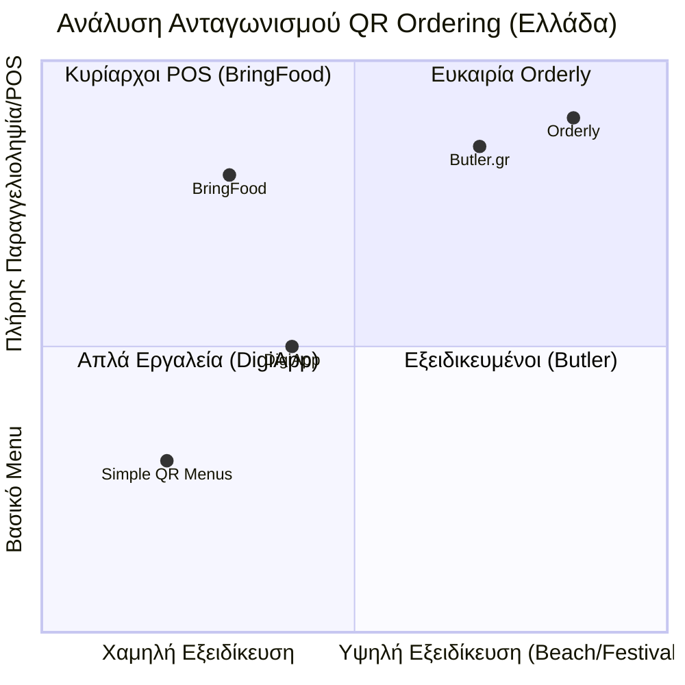

# Ανάλυση Ανταγωνισμού (Competitive Analysis)

Η Orderly εισέρχεται στην ελληνική αγορά φιλοξενίας με 73.000+ καταστήματα και 40+ εκατομμύρια ετήσιους τουρίστες, σε μια στιγμή που ο ψηφιακός μετασχηματισμός είναι αναγκαίος.

## 1. Το Τοπίο του Ανταγωνισμού

### Ελληνικοί Ανταγωνιστές
*   **Butler.gr:** Ο πιο άμεσος ανταγωνιστής. Ολοκληρωμένη λύση (QR menu, παραγγελιοληψία, πληρωμή, POS integration, staff management).
*   **BringFood.gr:** Εστιασμένο κυρίως σε Cloud POS, με το QR ordering ως πρόσθετη λειτουργία (add-on). Ισχυρό στην ελληνική φορολογική συμμόρφωση.
*   **DigiApp.gr:** Απλούστερη πλατφόρμα QR menu/ordering. Λείπει η επεξεργασία πληρωμών και η βαθιά ενοποίηση με POS.
*   **Λοιποί:** mintQR, MenuMaster.gr, Ecomenu.gr κ.α. (κυρίως menu-only εργαλεία).

### Διεθνείς Ανταγωνιστές
*   **me&u:** Ο παγκόσμιος ηγέτης (6.000+ venues). Λειτουργεί κυρίως σε Αυστραλία, ΗΠΑ, Ηνωμένο Βασίλειο. Μηδενική παρουσία στην Ελλάδα.
*   **Sunday:** Εστιάζει στην ταχύτητα πληρωμής. Αποχώρησε από τη Νότια Ευρώπη το 2022.
*   **Flipdish:** Ισχυρός παίκτης στην Ευρώπη με παρουσία σε 15+ χώρες. Υψηλό κόστος (μηνιαία συνδρομή + προμήθεια).

## 2. Οπτικοποίηση Ανταγωνιστικής Θέσης

## 3. Η Διαφοροποίηση της Orderly
1.  **Greek-first Design:** Συμμόρφωση με myDATA/ΑΑΔΕ και Viva Wallet.
2.  **Εξειδίκευση σε Beach Bars & Festivals:** Μια παραμελημένη αγορά με τεράστια ανάγκη.
3.  **Digital Queue System:** Συνδυασμός παραγγελίας με διαχείριση ουράς.
4.  **Offline Λειτουργία:** Υβριδικό μοντέλο για μέρη με κακό σήμα (νησιά, βουνά).
5.  **AI Chatbot:** Μελλοντική δυνατότητα που θα μας φέρει στο επίπεδο των me&u/Sunday.
