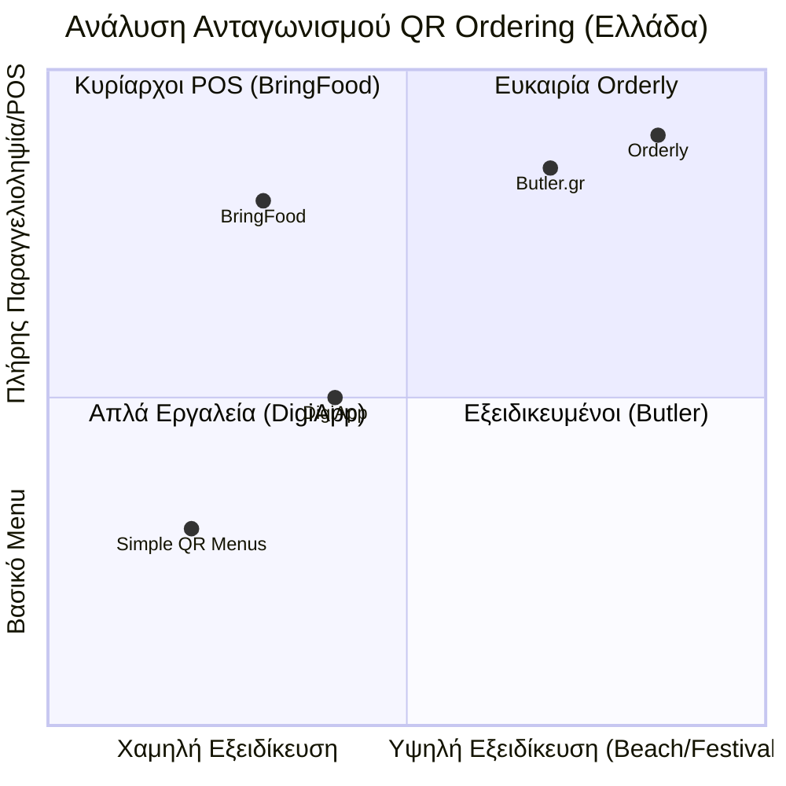

# Ανάλυση Ανταγωνισμού (Competitive Analysis)

Η πλατφόρμα εισέρχεται στην ελληνική αγορά φιλοξενίας (Hospitality) με 73.000+ καταστήματα και 40+ εκατομμύρια ετήσιους τουρίστες, σε μια στιγμή που ο ψηφιακός μετασχηματισμός (Digital Transformation) είναι αναγκαίος.

## 1. Το Τοπίο του Ανταγωνισμού (Competitive Landscape)

### Ελληνικοί Ανταγωνιστές (Greek Competitors)
- **Butler.gr:** Ο πιο άμεσος ανταγωνιστής. Ολοκληρωμένη λύση (QR menu, παραγγελιοληψία, πληρωμή, POS integration, staff management).
- **BringFood.gr:** Εστιασμένο κυρίως σε Cloud POS, με το QR ordering ως πρόσθετη λειτουργία (Add-on). Ισχυρό στην ελληνική φορολογική συμμόρφωση.
- **DigiApp.gr:** Απλούστερη πλατφόρμα QR menu/ordering. Λείπει η επεξεργασία πληρωμών (Payment Processing) και η βαθιά ενοποίηση με POS.
- **Λοιποί:** mintQR, MenuMaster.gr, Ecomenu.gr κ.α. (κυρίως menu-only εργαλεία).

### Διεθνείς Ανταγωνιστές (International Competitors)
- **me&u:** Ο παγκόσμιος ηγέτης (6.000+ venues). Λειτουργεί κυρίως σε Αυστραλία, ΗΠΑ, Ηνωμένο Βασίλειο. **Μηδενική παρουσία στην Ελλάδα.**
- **Sunday:** Εστιάζει στην ταχύτητα πληρωμής. **Αποχώρησε από τη Νότια Ευρώπη** το 2022.
- **Flipdish:** Ισχυρός παίκτης στην Ευρώπη (15+ χώρες). Υψηλό κόστος (μηνιαία συνδρομή + προμήθεια).

## 2. Οπτικοποίηση Ανταγωνιστικής Θέσης (Competitive Positioning)

## 3. Η Διαφοροποίησή μας (Our Differentiation)

1. **Greek-first Design (Σχεδίαση για την Ελλάδα):** Συμμόρφωση με myDATA/ΑΑΔΕ και Viva Wallet → [[pos_compliance]]
2. **Εξειδίκευση σε Beach Bars & Festivals:** Μια παραμελημένη αγορά με τεράστια ανάγκη
3. **Digital Queue System (Ψηφιακό Σύστημα Ουρών):** Συνδυασμός παραγγελίας με διαχείριση ουράς
4. **Offline Λειτουργία (Offline Mode):** Υβριδικό μοντέλο για μέρη με κακό σήμα (νησιά, βουνά) → [[features#3. Όταν Πέφτει το Internet]]
5. **AI Chatbot:** Μελλοντική δυνατότητα που θα μας φέρει στο επίπεδο των me&u/Sunday

## 4. Κύριο Επιχείρημα Πώλησης (Main Selling Point)

**Λειτουργική Αποδοτικότητα (Operational Efficiency):**
- Λιγότερα λάθη παραγγελιών (Fewer Order Errors)
- Γρηγορότερο service (Faster Service)
- Περισσότερες πωλήσεις (More Sales)
- Πιο αποσυμφωρημένο προσωπικό (Less Overwhelmed Staff)
- Άμεσα προσβάσιμες επιλογές στον πελάτη **διεθνώς** (Multilingual Access) → [[features#4. Πολυγλωσσικότητα]]

## Σχετικές Σημειώσεις

- [[model]] — Business Model Canvas
- [[market_strategy]] — Στρατηγική αγοράς
- [[pricing_model]] — Μοντέλο τιμολόγησης
- [[startup_synopsis]] — Σύνοψη startup
- [[deck]] — Pitch deck

## Επόμενες Ενέργειες

- [ ] Δημιουργία λεπτομερούς πίνακα σύγκρισης (Feature Comparison Table) εμάς vs ελληνικές και διεθνείς εταιρείες
- [ ] Ολοκλήρωση pitch → [[deck]]
- [ ] Ολοκλήρωση Business Model Canvas — ειδικά Value Proposition → [[model]]