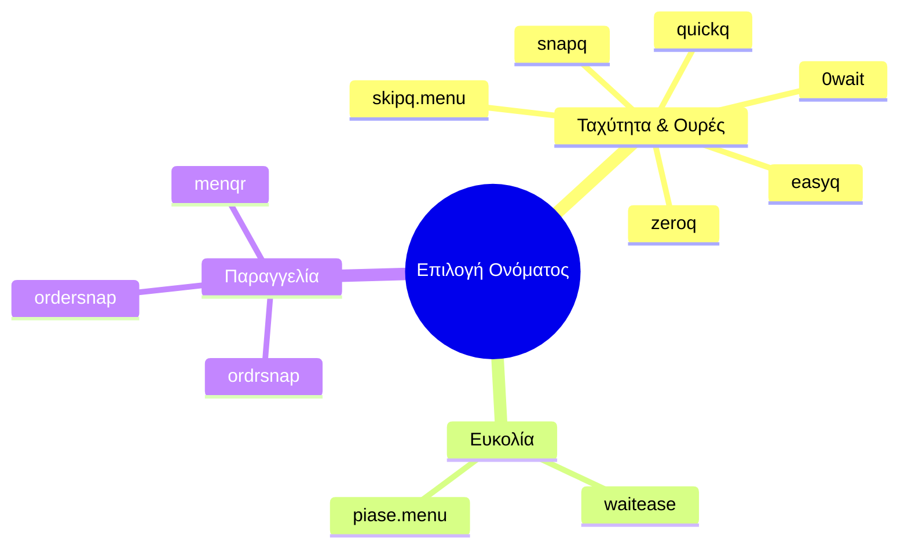

# Λογότυπο και Επωνυμία (Logo and Branding)

Η επιλογή του σωστού ονόματος για την εφαρμογή είναι κρίσιμη για την αποδοχή της από την αγορά. Επειδή η επωνυμία δεν έχει ακόμη "κλειδώσει", πρέπει να καταλήξουμε σε ένα όνομα που είναι εύκολο να το θυμάται κάποιος, ιδανικά να σχετίζεται με την ταχύτητα και τη μείωση του χρόνου αναμονής.

## Υποψήφια Ονόματα (Candidate Names)

Ακολουθεί η τρέχουσα λίστα με τα επικρατέστερα ονόματα, μαζί με εναλλακτικές επιλογές:

- **skipq.menu** (Κύρια επιλογή προς εξέταση, απαιτεί έλεγχο για εμπορικό σήμα - trademark)
- **ordersnap** / **ordrsnap**
- **waitease**
- **piase.menu**
- **easyq** / **quickq** / **snapq**
- **zeroq** / **0wait**
- **menqr**

### Οπτικοποίηση

## Επόμενες Ενέργειες

- [ ] Έλεγχος διαθεσιμότητας εμπορικού σήματος (trademark) για τα επικρατέστερα ονόματα, ξεκινώντας με το `skipq.menu`.
- [ ] Έρευνα διαθεσιμότητας domain names (.com, .gr, .io) για τα 3 επικρατέστερα ονόματα.
- [ ] Ερωτηματολόγιο/A-B Testing με 5-10 φίλους/συνεργάτες για να δούμε ποιο όνομα θυμούνται πιο εύκολα.