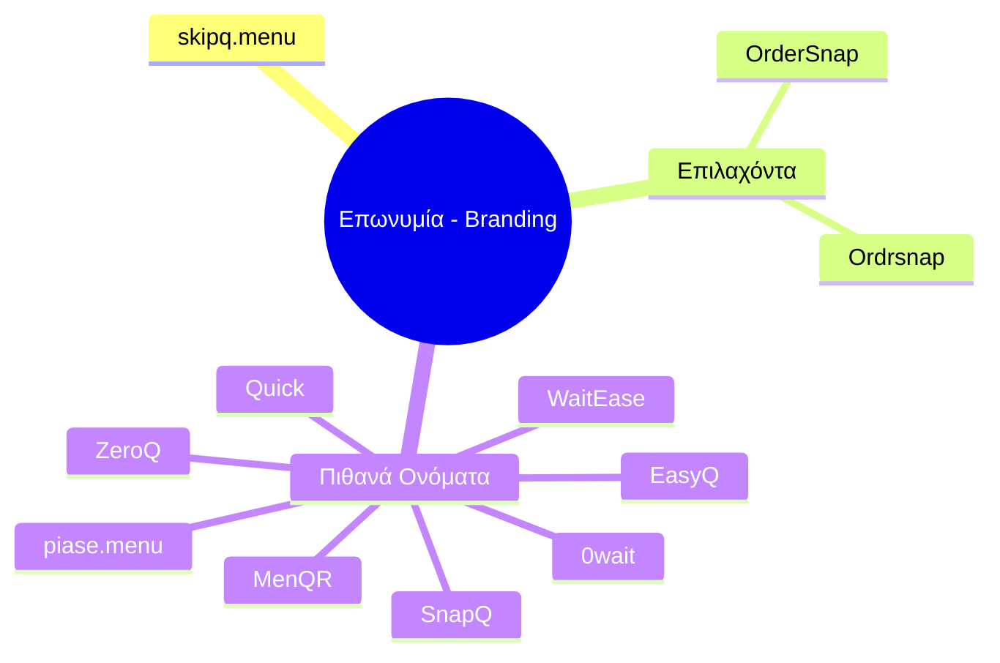

# Λογότυπο και Επωνυμία (Logo and Branding)

- **skipq.menu**

### Επιλαχόντα (Runner-ups)
- OrderSnap
- Ordrsnap

### Πιθανά Ονόματα (Possible Names)
- WaitEase
- piase.menu
- EasyQ / Quick / SnapQ
- ZeroQ
- 0wait
- MenQR

### Οπτικοποίηση

### Σχετικές Σημειώσεις
- [[active_investigations#3. Ερώτηση Ποιο θα είναι το όνομα του startup μας;]]

### Επόμενες Ενέργειες
- [ ] Έλεγχος εμπορικού σήματος (Trademark) για το όνομα 'skipq.menu'. [[bot_questions.md#3. Ερώτηση Ποιο θα είναι το όνομα του startup μας;]]
- [ ] Ψηφοφορία στην ομάδα για την τελική επιλογή της επωνυμίας (Brand Name). [[bot_questions.md#3. Ερώτηση Ποιο θα είναι το όνομα του startup μας;]]
