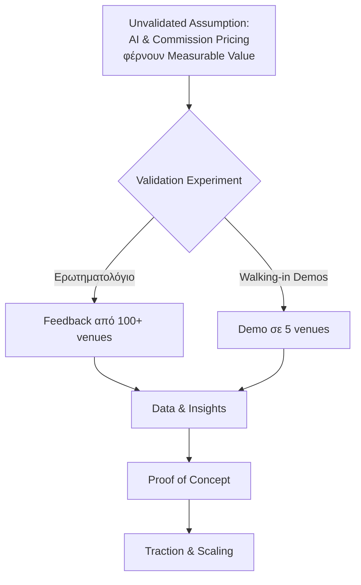
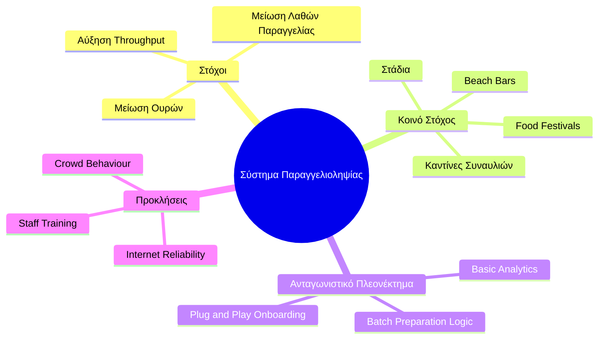

# 5. Ανάλυση Αγοράς & Στρατηγική (Market Analysis & Strategy)

Πού στοχεύει το προϊόν και ποιο είναι το ανταγωνιστικό του πλεονέκτημα.
Το τρέχον προϊόν είναι web-first και cloud-first. Τα analytics και η local-first κατεύθυνση παραμένουν επόμενες αποφάσεις υλοποίησης.

## Βασικά Insights & Υποθέσεις (Key Assumptions)

**Το Κενό (The Gap):** Λύσεις όπως η παραγγελιοληψία μέσω QR (QR Ordering) δεν εφαρμόζονται παντού λόγω δισταγμού των διαχειριστών (Manager Hesitation), υψηλού κόστους λογισμικού ή κακού μάρκετινγκ — **όχι** λόγω τεχνικών προβλημάτων.

**Η Ευκαιρία (The Opportunity):** Δεν υπάρχει ακόμα μια κυρίαρχη, προϊοντοποιημένη (Productized) λύση. Όπου υπάρχει βελτίωση που δεν έχει εφαρμοστεί παντού, υπάρχει επιχειρηματική ευκαιρία.

**Υπόθεση (Assumption):** Η Τεχνητή Νοημοσύνη (AI — πρόβλεψη παραγγελιών, δυναμικά μενού, upselling) και η τιμολόγηση βάσει προμήθειας (Commission Pricing) δίνουν ξεκάθαρη, μετρήσιμη αξία (Measurable Value) στον καταστηματάρχη.

> ⚠️ **Αυτή η υπόθεση δεν έχει τεκμηριωθεί ακόμα (Unvalidated Assumption)** — απαιτεί επικύρωση μέσω πιλοτικών (Pilot Validation).

**Positioning Update από mentorships:** Το αρχικό μήνυμα δεν είναι "QR ordering" ή "καλύτερη εμπειρία". Είναι **revenue/operations tool**: λιγότερη αναμονή, περισσότερος τζίρος, λιγότερο κόστος προσωπικού και λιγότερα λάθη.

> **Επιπτώσεις για την Ομάδα:**
> Πρέπει να μετατοπίσουμε την προσοχή μας από το «πώς θα το χτίσουμε τέλεια» στο «πώς θα μάθουμε γρήγορα». Το κλειδί είναι η λογική Build-Measure-Learn. Εφόσον στοχεύουμε σε zero-friction (χωρίς login), χρειαζόμαστε άμεσα εργαλεία analytics (PostHog/Mixpanel) για να μετράμε το scan-to-order conversion rate και τα drop-offs. → [[Product Design]]

### Οπτικοποίηση

## Στρατηγική Εισόδου στην Αγορά (Go-to-Market Strategy)

- **Γρήγορη είσοδος για κατάληψη αγοράς (Rapid Market Capture)** (λογική eFood): μπαίνουμε γρήγορα πριν γεμίσει η αγορά.
- **Επικύρωση πριν την κλίμακα (Validation Before Scale):** Πιλοτικό σε 5 καταστήματα/venues/ερωτηματολόγια → μετρήσεις (Metrics) → απόδειξη ιδέας (Proof of Concept) → επιχείρημα πώλησης (Selling Point). → Δέσιμο (Traction) → [[../pitch/deck - φαμφάρες type shit#6. Traction]]
- **Άμεση έρευνα αγοράς (Market Research):** Συνομιλία με 10 μαγαζιά για ανατροφοδότηση (Feedback) πριν οριστικοποιηθεί οτιδήποτε.
- **Στενό πρώτο ICP:** high-volume self-service / counter-service venue όπου η ουρά και ο χρόνος εξυπηρέτησης μετρώνται εύκολα. Τα ξενοδοχεία μένουν ως δεύτερη φάση μέσω ομίλων ή pool/bar pilots.
- **Χαμηλό friction εισόδου:** δωρεάν demo/free site για το venue, παρουσίαση σε κινητό ή tablet και follow-up με σαφή metrics αντί για άμεση απαίτηση integration ή συνδρομής.
- **Supply-first στόχος:** στην αρχή προτεραιότητα έχουν τα πολλά καταστήματα και τα pilot learnings, όχι η άμεση μεγιστοποίηση revenue. Ενδεικτικός στόχος: 100-1000 venues πριν πιεστεί το monetization.
- **Payments as signal, not monetization-first:** δεν ξεκινάμε με βαρύ payment/commission product, αλλά εξετάζουμε open tab ή payment intent ως operational signal για commitment, prioritization και table turnover.

## Validation Plan

Το validation πρέπει να απαντήσει πρώτα αν υπάρχει πραγματικό πρόβλημα που ο ιδιοκτήτης αναγνωρίζει και θα πλήρωνε να λύσει.

1. Μιλάμε με καταστηματάρχες πριν χτίσουμε βαριά features.
2. Δείχνουμε απλό Fake MVP ή free venue site σε πραγματικό περιβάλλον.
3. Μετράμε scan-to-order conversion, χρόνο παραγγελίας, χρόνο εξυπηρέτησης, queue reduction, open tab/payment intent completion και staff feedback.
4. Μετατρέπουμε τα pilot metrics σε ROI story: τι γλίτωσε το venue κάθε μήνα σε χρόνο, χαμένες παραγγελίες, λάθη και ανάγκη για επιπλέον προσωπικό.
5. Χρησιμοποιούμε traction από pilots πριν από οποιαδήποτε σοβαρή VC/pre-seed συζήτηση.

## Κανάλια Μάρκετινγκ (Marketing Channels)

### Πληρωμένη Απόκτηση (Paid Acquisition)
Πληρώνεις μια πλατφόρμα/εκδήλωση ώστε να σε φέρει μπροστά σε δυνητικούς πελάτες → π.χ. **Διαφημίσεις Facebook (FB Ads)**

### Πωλήσεις (Sales)
Πληρώνεις ένα _πρόσωπο_ να πείσει πελάτες να εγγραφούν → π.χ. **Sales rep κάνει cold calls σε bar owners**

1. **Cold Outreach (Ψυχρή Προσέγγιση):** Είτε αυτοπροσώπως, είτε με email — μπορούμε να το κάνουμε κι εμείς.
2. **Demo Calls (Επίδειξη Προϊόντος):** Παρουσίαση + pitch + δεδομένα [[Questionnaire]] + traction analytics. Το demo πρέπει να εξηγείται σε 10-20 δευτερόλεπτα.
3. **CRM (Customer Relationship Management — Διαχείριση Σχέσεων Πελατών):** Consistent emails, ενημερωτικά, follow-ups σε σωστούς χρόνους → **Πάρα πολύ σημαντικό**.
4. **Walking In (Αυτοπρόσωπη Επίσκεψη):** Κυριολεκτικά επισκεπτόμαστε bars και cafés με ένα tablet demo. Προφανές αλλά υποτιμημένο — οι ιδιοκτήτες εστίασης ανταποκρίνονται σε ανθρώπους, όχι σε emails.
5. **Decision-maker focus:** μιλάμε με owners/managers, όχι γενικά με staff. Το μήνυμα είναι απλό: "λιγότερη αναμονή, περισσότερος τζίρος, λιγότερο κόστος προσωπικού".

### Κίνητρα (Incentives)
Δίνεις κάτι _δωρεάν_ για να κάνεις την εγγραφή λιγότερο ρίσκο → π.χ. **Δωρεάν πρώτος μήνας**

1. Δωρεάν πρώτοι μήνες
2. Δωρεάν εξοπλισμός, εγκατάσταση (Setup) κ.λπ.
3. Δωρεάν υπηρεσίες από συνεργαζόμενες εταιρείες (π.χ. ίντερνετ ή άλλες υπηρεσίες)
4. Πακέτα τύπου 1+1 ή κάτι τύπου πιστότητας (Loyalty) με πόντους

### Οργανικό (Organic — Μακροπρόθεσμη Παρουσία)

1. **SEO (Search Engine Optimization — Βελτιστοποίηση Μηχανών Αναζήτησης)**
2. **Δημιουργία περιεχομένου Social Media (Social Media Content Creation)**
3. **Ενημερωτικά δελτία μέσω email (Email Newsletters)**

### Παραπομπές (Referrals)

1. Από τον έναν manager στον άλλο — αξιολόγηση επιτυχίας (Success Review)
2. Συνεργασία με μέλη του οικοσυστήματος εστίασης — π.χ. τους προμηθευτές, τους λογιστές (Accountants), και στοχευμένα μέλη που «γνωρίζουν» καλά το κοινό μας, το κοινό μας τους εμπιστεύεται, και έμμεσα αγοράζουμε αυτή την εμπιστοσύνη (~€100/deal) — σαν affiliate.

### Άλλες Ιδέες

- **PR (Δημόσιες Σχέσεις):** Εμφάνιση σε groups, εφημερίδες, εκδηλώσεις εστίασης, ανεξάρτητοι φορείς (δημοσιογράφοι, podcasts κ.λπ.) → «δωρεάν» visibility
- **Community Building (Δημιουργία Κοινότητας):** Δημιουργία Facebook group ή forum για ιδιοκτήτες bar/cafe
- **Events (Εκδηλώσεις):** Διοργάνωση δικών μας hospitality meetups

### Σχετικό ερώτημα
Έχουν θέση οι influencers και affiliates δεδομένης της φύσης μας; → [[open-questions#Συνεργασίες & Marketing]]

## Συνοπτική Στρατηγική (Summary)

### Αρχική Φάση (Phase 1)
1. Cold outreach / Walking in κ.λπ.
2. Free demo/free site σε narrow ICP, ώστε να μειωθεί το ρίσκο για τον πρώτο πελάτη
3. Demo calls + Demo Pitch + Δεδομένα [[Questionnaire]] + Traction από analytics
4. CRM
5. Organics + Incentive (παραδείγματα αναλυτικά πιο πάνω)
6. Referrals, PR, Community Building, Event Joining — κορυφαία σημασία

### Μακροπρόθεσμη Φάση (Phase 2 — Long Term)
- Event building (Διοργάνωση δικών μας εκδηλώσεων)

> **Τα Paid Ads (Πληρωμένες Διαφημίσεις)** είναι πανάκριβα και ειδικά για το εξειδικευμένο κοινό μας (Niche) δεν νομίζουμε ότι μας δίνουν αρκετό όφελος, εκτός από την περίπτωση Referral/Affiliate.

## Σχετικές Σημειώσεις

- [[Questionnaire]] — Ερωτηματολόγιο επικύρωσης
- [[competitive_analysis]] — Ανάλυση ανταγωνισμού
- [[pricing_model]] — Μοντέλο τιμολόγησης
- [[COGS, CACs, overheads]] — Κόστη
- [[../pitch/deck - φαμφάρες type shit]] — Pitch deck
- [[mentors]] — Μέντορες

## Επόμενες Ενέργειες

- [ ] Μιλάμε σε μαγαζιά, φίλους, γενικά για την ιδέα, να δούμε τι παίζει (π.χ. μπαρ στην Κύπρο που κάνει κάτι αρκετά παρόμοιο + McDonalds)
- [ ] Ερωτηματολόγιο (5-6 απλές ερωτήσεις τύπου ΝΑΙ/ΟΧΙ και πολλαπλής επιλογής, θα το πλασάρουμε σε φίλους, groups) → [[Questionnaire]]
- [ ] Demo MVP → [[roadmap]]
- [ ] Pitch σε μαγαζιά πιλοτικά (στην αρχή ως δωρεάν service) + για traction (**Προϋπόθεση:** να γίνει πρώτα το demo και το ερωτηματολόγιο, ώστε να έχουμε πιο πειστικό approach) → [[../pitch/deck - φαμφάρες type shit#6. Traction]]

### Ορισμοί Αγοράς (Market Definitions)
- **Total market:** Όλοι όσοι έχουν το πρόβλημα που εμείς λύνουμε.
- **Addressable market:** Όλοι όσοι θα μπορούσαν να χρησιμοποιήσουν το προϊόν μας για να λύσουν το πρόβλημα.
- **Target market:** Εκεί που κάνουμε launch (κάπου συγκεκριμένα, π.χ. στο Παγκράτι).

### Implementation Logic: Phase 1 Sales (Acquiring First 10 Customers)
- **Primary Method:** Direct Sales (Walking In).
- **Target Profiles:** Self-service cafes, beach bar counters and festival/event bars with visible queues.
- **Pitch Focus:** Time saved, queue reduction, more orders/revenue, fewer order mistakes and easier staff coordination.
- **Conversion Strategy:** Provide a free, no-obligation "Fake MVP" demo directly on the venue owner's mobile device to demonstrate the zero-friction experience.
- **Tooling Constraint:** Use a simple CRM (e.g., Planka) to track touchpoints and follow-up reminders. Avoid complex automated email sequences initially; focus on face-to-face trust.

### Phase 2: Ξενοδοχεία

- Στόχος δεν είναι να ξεκινήσουμε από full hotel group integration. Ξεκινάμε με μικρό operational entry point: pool bar, beach bar, breakfast queue ή restaurant pilot.
- Ενδεικτικά sales cycles από mentorship: bar περίπου 1 μήνας, whole hotel περίπου 3 μήνες, chain περίπου 2 χρόνια.
- Βασικοί decision makers: F&B Manager και Operations. Το IT μπαίνει κυρίως για approval, security και vendor checks.
- Οι επαφές με ξενοδοχειακούς ομίλους χρησιμοποιούνται για να μάθουμε ποιος αγοράζει, ποιος μπλοκάρει, και ποιο metric τους ενδιαφέρει.
- Τα integrations με PMS/POS/channel managers μπαίνουν μόνο αν αποδειχθεί ότι είναι blocker για pilot ή για enterprise deal.
- Δεν πάμε multi-country early, γιατί κάθε χώρα έχει διαφορετικούς dominant POS/PMS vendors. Πρώτα μία αγορά, μετά expansion.
- Για να μπει φέτος σε hotel, το offer πρέπει να είναι απλό, άμεσο, γρήγορο σε implementation και low friction. Αλλιώς η απάντηση θα είναι "ελάτε του χρόνου".
