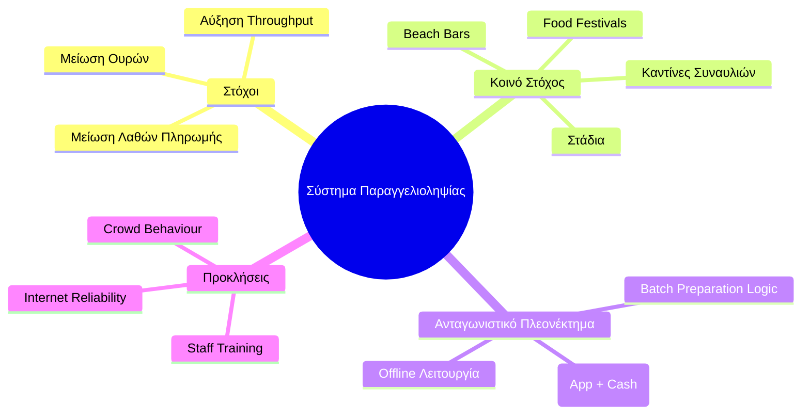

# 5. Ανάλυση Αγοράς (Market Analysis & Strategy)
Πού στοχεύει το προϊόν και ποιο είναι το ανταγωνιστικό του πλεονέκτημα.

## Βασικά Insights & Υποθέσεις

**Το Κενό:** Λύσεις όπως το QR ordering δεν εφαρμόζονται παντού λόγω δισταγμού των managers, υψηλού κόστους λογισμικού ή κακού marketing — όχι λόγω τεχνικών προβλημάτων.

**Η Ευκαιρία:** Δεν υπάρχει ακόμα μια κυρίαρχη, productized λύση. Όπου υπάρχει βελτίωση που δεν έχει εφαρμοστεί παντού, υπάρχει επιχειρηματική ευκαιρία.

**Υπόθεση:** Το AI (πρόβλεψη παραγγελιών, dynamic menus, upselling) και το commission pricing δίνουν ξεκάθαρη, μετρήσιμη αξία στον μαγαζιά.

## Go-to-Market Στρατηγική

- **==Γρήγορη είσοδος για market capture==** (λογική eFood): μπες γρήγορα πριν γεμίσει η αγορά.
- **==Validation πριν την κλίμακα==:** Πιλοτικό σε 5 καταστήματα/ venues/ ερωτηματολόγια → metrics → proof of concept → selling point. --> Traction [[deck#6. Traction]]. 
- **==Άμεση έρευνα αγοράς==:** Συνομιλία με 10 μαγαζιά για feedback πριν οριστικοποιηθεί οτιδήποτε. 

Tasks: 
- [ ] Μιλάμε σε μαγαζιά, φίλους, γενικά για την ιδέα, να δούμε τι παίζει (π.χ. μπαρ στην Κύπρο που κάνει κάτι αρκετά παρόμοιο + Mcdonalds). 
- [ ] Ερωτηματολόγιο (5-6 απλές ερωτήσεις τύπου ΝΑΙ/ΟΧΙ και πολλαπλής με επιλογές, θα το πλασάρουμε σε φίλους, groups) 
- [ ] Demo MVP 
- [ ] Pitch σε μαγαζιά πιλοτικά (μπορούμε δλδ στην αρχή να το πλασάρουμε ως δωρεάν service) + για traction (conditions - να γίνει το demo και το ερωτηματολόγιο, έτσι ώστε να έχουμε ένα πιο πειστικό approach) 

Τρόποι για να κάνουμε marketting και να γίνουμε γνωστοί - short term και long term: 

Γενικοί τύποι: 
**Paid Acquisition** = you pay a platform/event to put you in front of potential clients --> ==fb ads== 
**Sales** = you pay a _person_ to go out and convince clients to sign up --> ==sales guy cold calls bar owners== 
**Incentives** = you give something _away_ to make signing up feel less risky --> ==first month free px== 
**Organic/Content** = you invest in being _found naturally_ over time --> ==e.g. writing blog posts that bar owners find on Google== 

Για την περίπτωση μας, events που μαζεύονται άτομα εστίασης, + referrals/ στόμα σε στόμα από ικανοποιημένους πελάτες, newsletters είναι πιο efficient. 

Για την περίπτωση μας, ίσως ΔΕΝ είναι relevant οι affilliates, + influencers --> [[open-questions]]. 

Ιδανικά, θέλουμε χαμηλού κόστους διαφήμιση, με ψηλή αποδοτικότητα, δλδ χαμηλό CAC (customer acquisition rate). 

Αναλυτικά παραδείγματα: 
Paid: 
1. Ads - social media οπουδήποτε κλπ. 
2. Affiliate marketing - influencers 

Sales: 
1. Cold outreach - είτε από κοντά είτε με mail (αυτό μπορούμε να το κάνουμε και εμείς) 
2. Demo calls 
3. CRM - customer relationship management - consistent emails, ενημερωτικά, follow ups σε σωστούς χρόνους κλπ. 

Incentive: 
1. Δωρεάν πρώτοι μήνες π.χ. 
2. Δωρεάν εξοπλισμός, setup κλπ. π.χ. 
3. Δωρεάν υπηρεσίες από συνεργαζόμενες εταιρείες 
4. ++ 

Organic: (building long term presence) 
1. SEO - 
2. Social media content creation 
3. Email newsletters 

Referrals: 
1. Από τον έναν manager στον άλλο - review επιτυχίας 
2. Συνεργασία με μέλη της ομάδας της εστίασης - π.χ. τους προμηθευτές, τους accountants, και ουσιαστικά targeted μέλη που "γνωρίζουν" καλά το κοινό μας, το κοινό μας τους εμπιστεύεται, και έμμεσα αγοράζουμε αυτή την εμπιστοσύνη για ένα ποσό (π.χ. 100 euro) ως αντάλλαγμα - σαν affiliate. 

Άλλες άσχετες ιδέες: 
- **PR** --> visibility σε groups και εφημερίδες, events που αφορούν την εστίαση 
- **Community building** — owning a Facebook group or forum for bar/café owners
	- Ουσιαστικά είναι σαν το social media που λέω πάνω, αλλά αυτό το κάνεις για να μαζέψεις άσχετους που ασχολούνται με εστίαση 
- **Events** — hosting your own hospitality meetups
	- Δλδ οργανώνουμε εμείς event για τοπικές επιχειρήσεις, με ομιλητές, φαι πότο κλπ - και γενικά θέματα που να τους ενδιαφέρουν (άσχετα με την ιδέα μας αλλά σχετικά με την εστίαση, τα pains των managers) 
	- 

Both PR and community are highly relevant and underutilised for your market.