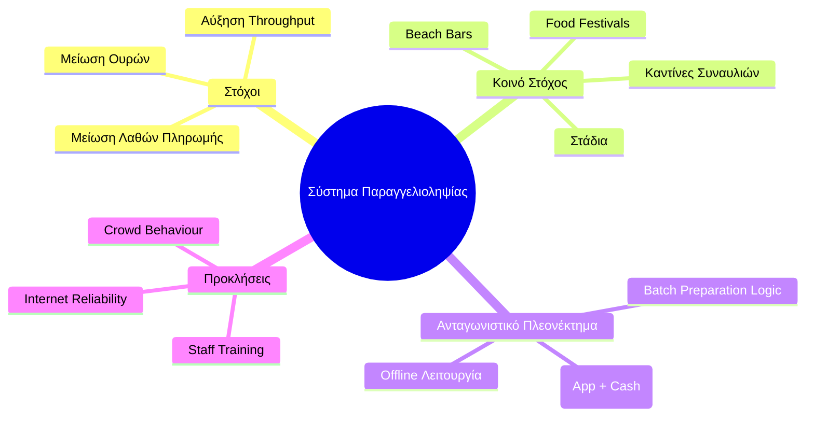

# 5. Ανάλυση Αγοράς (Market Analysis & Strategy)
Πού στοχεύει το προϊόν και ποιο είναι το ανταγωνιστικό του πλεονέκτημα.

## Βασικά Insights & Υποθέσεις

**Το Κενό:** Λύσεις όπως το QR ordering δεν εφαρμόζονται παντού λόγω δισταγμού των managers, υψηλού κόστους λογισμικού ή κακού marketing — όχι λόγω τεχνικών προβλημάτων.

**Η Ευκαιρία:** Δεν υπάρχει ακόμα μια κυρίαρχη, productized λύση. Όπου υπάρχει βελτίωση που δεν έχει εφαρμοστεί παντού, υπάρχει επιχειρηματική ευκαιρία.

**Υπόθεση:** Το AI (πρόβλεψη παραγγελιών, dynamic menus, upselling) και το commission pricing δίνουν ξεκάθαρη, μετρήσιμη αξία στον μαγαζιά.

## Go-to-Market Στρατηγική

- **==Γρήγορη είσοδος για market capture==** (λογική eFood): μπες γρήγορα πριν γεμίσει η αγορά.
- **==Validation πριν την κλίμακα==:** Πιλοτικό σε 5 καταστήματα/ venues/ ερωτηματολόγια → metrics → proof of concept → selling point. --> Traction [[deck#6. Traction]]. 
- **==Άμεση έρευνα αγοράς==:** Συνομιλία με 10 μαγαζιά για feedback πριν οριστικοποιηθεί οτιδήποτε. 

Tasks: 
- [ ] Μιλάμε σε μαγαζιά, φίλους, γενικά για την ιδέα, να δούμε τι παίζει (π.χ. μπαρ στην Κύπρο που κάνει κάτι αρκετά παρόμοιο + Mcdonalds). 
- [ ] Ερωτηματολόγιο (5-6 απλές ερωτήσεις τύπου ΝΑΙ/ΟΧΙ και πολλαπλής με επιλογές, θα το πλασάρουμε σε φίλους, groups) 
- [ ] Demo MVP 
- [ ] Pitch σε μαγαζιά πιλοτικά (μπορούμε δλδ στην αρχή να το πλασάρουμε ως δωρεάν service) + για traction (conditions - να γίνει το demo και το ερωτηματολόγιο, έτσι ώστε να έχουμε ένα πιο πειστικό approach) 
