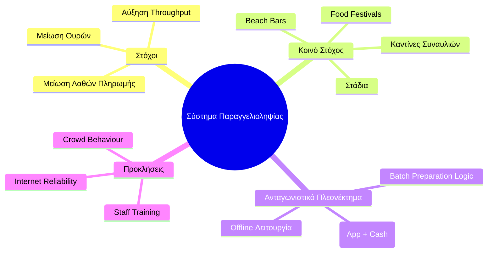

# 5. Ανάλυση Αγοράς (Market Analysis & Strategy)
Πού στοχεύει το προϊόν και ποιο είναι το ανταγωνιστικό του πλεονέκτημα.

```mermaid
mindmap
  root((Σύστημα Παραγγελιοληψίας))
    Στόχοι
      Αύξηση Throughput
      Μείωση Ουρών
      Μείωση Λαθών Πληρωμής
    Κοινό Στόχος
      Beach Bars
      Καντίνες Συναυλιών
      Food Festivals
      Στάδια
    Ανταγωνιστικό Πλεονέκτημα
      Offline Λειτουργία
      Batch Preparation Logic
      Υβριδική Πληρωμή (App + Cash)
    Προκλήσεις
      Crowd Behaviour
      Internet Reliability
      Staff Training
```
