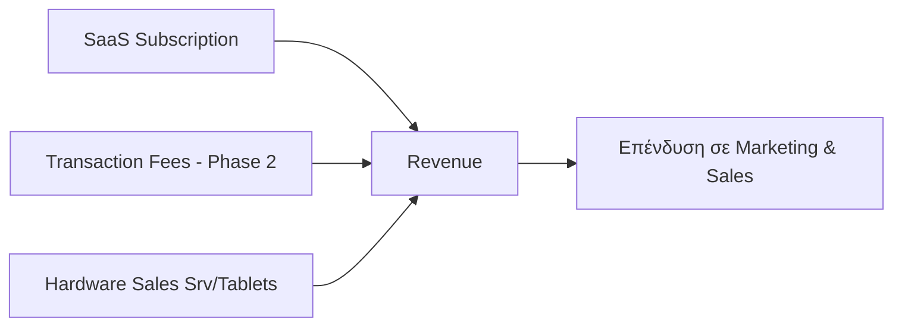

# Μοντέλο Τιμολόγησης & Αγορά (Pricing & Market)

Η ελληνική αγορά χαρακτηρίζεται από έντονη εποχικότητα (Seasonality) και ευαισθησία στις τιμές.
Το τρέχον προϊόν είναι web-first, άρα τα tiers πρέπει να χτίζονται πάνω σε λειτουργίες που ήδη υπάρχουν ή είναι άμεσα κοντά στο shipped surface.

## 1. Μοντέλο Τιμολόγησης (Πρόταση)

Mentorship update: στην πρώτη φάση το pricing πρέπει να υπηρετεί adoption. Δεν κυνηγάμε άμεσα revenue max. Ξεκινάμε με free/freemium ή πολύ χαμηλό pilot κόστος, με στόχο να αποδείξουμε measurable impact και μετά να περάσουμε σε subscription ή light commission.

| Βαθμίδα (Tier) | Τιμή / Μήνα | Βασικά Χαρακτηριστικά |
|------|------------|-----------------------|
| **Free (Starter)** | €0 | Ψηφιακό μενού, QR ordering, βασικό branding, περιορισμένα tables |
| **Basic** | €19 | Πλήρης QR παραγγελιοληψία, πολυγλωσσικό μενού, βασικό owner setup |
| **Pro** | €39 | Staff/KDS workflows, analytics, unlimited tables, ROI reporting |
| **Enterprise** | €69+ | Multi-location, custom branding, POS integration, dedicated support |

## 2. Εναλλακτικό Μοντέλο: Προμήθεια (Commission)

Αντί για πάγια συνδρομή, **light commission** σε δεύτερη φάση — μειώνει το ρίσκο για το venue. Κατάλληλο ιδιαίτερα για εποχιακά venues και για αρχική είσοδο στην αγορά, αλλά όχι πριν λυθεί το adoption και η πολυπλοκότητα των payments. → [[COGS, CACs, overheads#Commission based vs Subscription based]]

## 3. Εποχιακή Στρατηγική (Seasonality)

Η ελληνική φιλοξενία (Hospitality) λειτουργεί έντονα το διάστημα Μαΐου–Οκτωβρίου.
- **Summer Plans (Καλοκαιρινά Πακέτα):** Προπληρωμή 5 μηνών με 20% έκπτωση.
- **Pause/Resume (Αναστολή/Επανενεργοποίηση):** Δυνατότητα αναστολής της συνδρομής κατά τους χειμερινούς μήνες.
- **Transaction-based (Βασισμένο σε Συναλλαγές):** Εναλλακτική με % επί της συναλλαγής για εποχιακά venues.

## 4. Δίλημμα Χρηματοδότησης (Funding Dilemma)

| Μοντέλο | Πλεονεκτήματα | Μειονεκτήματα |
|---|---|---|
| **Startup/VC** (πρόταση Μάριου) | Γρήγορη κλίμακα (Rapid Scale), δίκτυο, 10-20% equity | Πίεση για ανάπτυξη (Growth Pressure), απώλεια ελέγχου |
| **Indie SaaS/Bootstrapping** | Πλήρης έλεγχος, βιώσιμο tempo | Αργή ανάπτυξη, περιορισμένοι πόροι |

→ [[introduction to fund raising]] / [[Relevance Branding Workshop#3. Στρατηγική Χρηματοδότησης]]

## 5. Μέγεθος Αγοράς (Market Size)

- **73.000–75.000** επιχειρήσεις εστίασης στην Ελλάδα.
- **10,73 δις €** κύκλος εργασιών το 2025.
- **Στόχος (3-ετία):** 800+ πελάτες (Βασικό Σενάριο / Base Case) έως 2.000 (Αισιόδοξο Σενάριο / Optimistic Case).

## 6. Commission-based εναντίον Subscription-based

→ [[COGS, CACs, overheads]]

Η προμήθεια (Commission) έχει χαμηλό εμπόδιο εισόδου (Low Barrier to Entry) — πιο εύκολο να το πουλήσεις γιατί το προωθείς ως «όσο δουλέψεις πληρώνεις», και κλιμακώνεται αυτόματα. **Ωστόσο**, εισάγει αβεβαιότητα για τα μελλοντικά έσοδα και οι πιο ώριμοι πελάτες θα προτιμήσουν συνήθως συνδρομή.

Η συνδρομή (Subscription) από την άλλη, είναι πιο δύσκολο να το πουλήσεις στην αρχή πριν να έχεις δέσιμο με την αγορά (Traction), γιατί ζητάς «πολλά» λεφτά και εισάγεις κάτι καινούργιο, αλλά είναι πιο «ξεκάθαρο» σαν μέθοδος / πιο αντιληπτό, + μας δίνει βεβαιότητα (Predictability) για τα οικονομικά μας.

**Ιδανικό:** Ξεκινάμε με free/freemium ή χαμηλό pilot κόστος για adoption. Μετά τα πρώτα proof points, μεταφέρουμε τους ώριμους πελάτες σε κλιμακωτή συνδρομή και δοκιμάζουμε light commission όπου ταιριάζει.

## 7. Κλιμακωτή Συνδρομή (Tiered Subscription)

> **⚠️ ΧΡΕΙΑΖΕΤΑΙ ΣΥΖΗΤΗΣΗ:** Οι βαθμίδες πρέπει να κουμπώνουν σε πραγματικό operational value, όχι σε αυθαίρετα feature packs.

### Χαρακτηριστικά που Δικαιολογούν Υψηλότερες Βαθμίδες (Features That Justify Higher Tiers)

**Λειτουργικά (Operational)**
- Αριθμός τερματικών (Terminals) / συσκευών που επιτρέπονται
- Πολλαπλές τοποθεσίες (Multiple Locations) υπό έναν λογαριασμό
- Λογαριασμοί προσωπικού (Staff Accounts) και επίπεδα δικαιωμάτων (Permission Levels)
- Zone-aware operations και table management

**Αναφορές & Πληροφόρηση (Reporting & Insights)**
- Βασική σύνοψη πωλήσεων έναντι λεπτομερών αναλύσεων (ανά ώρα, προϊόν, υπάλληλο)
- Αναφορές τέλους ημέρας έναντι real-time dashboards
- Εξαγωγή (Export) σε λογιστικό λογισμικό (π.χ. QuickBooks)

**Προσανατολισμένα στον Πελάτη (Customer-Facing)**
- Ενσωματωμένο πρόγραμμα ανταμοιβών / πιστότητας (Loyalty/Rewards Programme)
- Παραγγελιοληψία μέσω QR Code (QR Code Ordering)
- Προσαρμοσμένο branding (Custom Branding) στις αποδείξεις
- Πολυγλωσσικότητα και public venue info

**Υποστήριξη (Support)**
- Μόνο email έναντι ζωντανής συνομιλίας (Live Chat) έναντι αφοσιωμένου υπεύθυνου λογαριασμού (Dedicated Account Manager)
- Βοήθεια ενσωμάτωσης (Onboarding Assistance) για μεγαλύτερους πελάτες
- Προαιρετική βοήθεια σε POS / local-first phase

## Σχετικές Σημειώσεις

- [[model]] — Business Model Canvas
- [[competitive_analysis]] — Ανάλυση ανταγωνισμού
- [[COGS, CACs, overheads]] — Κόστη και περιθώρια κέρδους
- [[market_strategy]] — Στρατηγική αγοράς

## Επόμενες Ενέργειες

- [ ] Έρευνα για χρηματοδοτήσεις (Fundings) και μελλοντικά έξοδα (πόσα λεφτά και πού θα κατευθυνθούν) — για τον όποιο επενδυτή
- [ ] Υπολογισμός βασικών κοστών (COGS) + ροών εσόδων (Revenue Streams) + υγιών περιθωρίων (Healthy Margins): κόστη λειτουργίας (Overheads) + κόστος παραγωγής (Cost of Production) κ.λπ.
- [ ] Οριστικοποίηση χαρακτηριστικών ανά βαθμίδα (Tier Features) μετά από ομαδική συζήτηση
