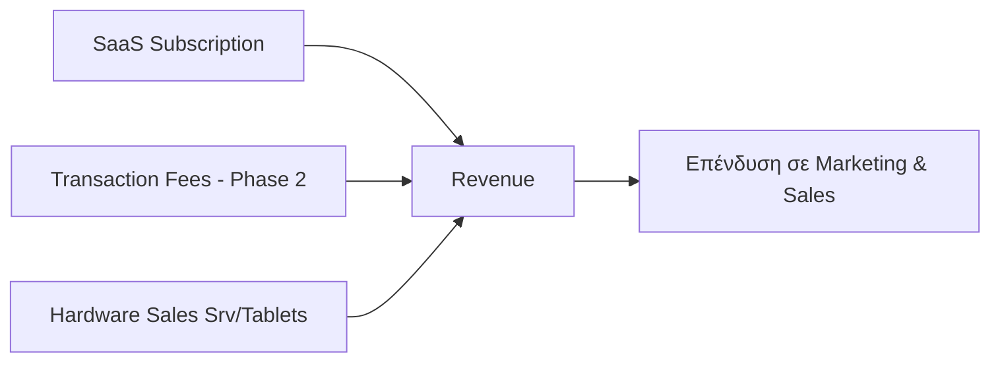

# Μοντέλο Τιμολόγησης & Αγορά (Pricing & Market)

Η ελληνική αγορά χαρακτηρίζεται από έντονη εποχικότητα (Seasonality) και ευαισθησία στις τιμές.

## 1. Μοντέλο Τιμολόγησης (Πρόταση)

| Βαθμίδα (Tier) | Τιμή / Μήνα | Βασικά Χαρακτηριστικά |
|------|------------|-----------------------|
| **Free (Starter)** | €0 | Ψηφιακό Μενού (Digital Menu), έως 5 τραπέζια, Orderly branding |
| **Basic** | €19 | Παραγγελιοληψία (Ordering), έως 20 τραπέζια, Πολυγλωσσικό μενού |
| **Pro** | €39 | Ενσωμάτωση POS (POS Integration), Απεριόριστα τραπέζια, Αναλυτικά Στοιχεία (Analytics), Upselling |
| **Enterprise** | €69+ | Πολλαπλές Τοποθεσίες (Multi-location), API access, Αφοσιωμένη υποστήριξη (Dedicated Support) |

## 2. Εναλλακτικό Μοντέλο: Προμήθεια (Commission)

Αντί για πάγια συνδρομή, **3-5% επί των πωλήσεων** — μειώνει το ρίσκο για τον μαγαζιά (πληρώνει μόνο αν βγάζει λεφτά). Κατάλληλο ιδιαίτερα για εποχιακά venues και για αρχική είσοδο στην αγορά. → [[COGS, CACs, overheads#Commission based vs Subscription based]]

## 3. Εποχιακή Στρατηγική (Seasonality)

Η ελληνική φιλοξενία (Hospitality) λειτουργεί έντονα το διάστημα Μαΐου–Οκτωβρίου.
- **Summer Plans (Καλοκαιρινά Πακέτα):** Προπληρωμή 5 μηνών με 20% έκπτωση.
- **Pause/Resume (Αναστολή/Επανενεργοποίηση):** Δυνατότητα αναστολής της συνδρομής κατά τους χειμερινούς μήνες.
- **Transaction-based (Βασισμένο σε Συναλλαγές):** Εναλλακτική με % επί της συναλλαγής για εποχιακά venues.

## 4. Δίλημμα Χρηματοδότησης (Funding Dilemma)

| Μοντέλο | Πλεονεκτήματα | Μειονεκτήματα |
|---|---|---|
| **Startup/VC** (πρόταση Μάριου) | Γρήγορη κλίμακα (Rapid Scale), δίκτυο, 10-20% equity | Πίεση για ανάπτυξη (Growth Pressure), απώλεια ελέγχου |
| **Indie SaaS/Bootstrapping** | Πλήρης έλεγχος, βιώσιμο tempo | Αργή ανάπτυξη, περιορισμένοι πόροι |

→ [[introduction to fund raising]] / [[Relevance Branding Workshop#3. Στρατηγική Χρηματοδότησης]]

## 5. Μέγεθος Αγοράς (Market Size)

- **73.000–75.000** επιχειρήσεις εστίασης στην Ελλάδα.
- **10,73 δις €** κύκλος εργασιών το 2025.
- **Στόχος (3-ετία):** 800+ πελάτες (Βασικό Σενάριο / Base Case) έως 2.000 (Αισιόδοξο Σενάριο / Optimistic Case).

## 6. Commission-based εναντίον Subscription-based

→ [[COGS, CACs, overheads]]

Η προμήθεια (Commission) έχει χαμηλό εμπόδιο εισόδου (Low Barrier to Entry) — πιο εύκολο να το πουλήσεις γιατί το προωθείς ως «όσο δουλέψεις πληρώνεις», και κλιμακώνεται (Scales) αυτόματα. **Ωστόσο**, αυτό μας «επιβαρύνει» με το αν ο κάθε πελάτης δουλέψει, προσδίδοντας αβεβαιότητα (Uncertainty) για τα μελλοντικά μας κέρδη, + ότι οι πελάτες που βγάζουν πολλά λεφτά θα προτιμήσουν τελικά μοντέλο συνδρομής (Subscription Model).

Η συνδρομή (Subscription) από την άλλη, είναι πιο δύσκολο να το πουλήσεις στην αρχή πριν να έχεις δέσιμο με την αγορά (Traction), γιατί ζητάς «πολλά» λεφτά και εισάγεις κάτι καινούργιο, αλλά είναι πιο «ξεκάθαρο» σαν μέθοδος / πιο αντιληπτό, + μας δίνει βεβαιότητα (Predictability) για τα οικονομικά μας.

**Ιδανικό:** Ξεκινάμε υβριδικά (Hybrid), κάνοντας προσφορά και τα δύο, και τελικά τους μεταφέρουμε όλους σε κλιμακωτό μοντέλο συνδρομής (Tiered Subscription Model).

## 7. Κλιμακωτή Συνδρομή (Tiered Subscription)

> **⚠️ ΧΡΕΙΑΖΕΤΑΙ ΣΥΖΗΤΗΣΗ:** Ποιες θα είναι οι διαφορές των βαθμίδων μεταξύ τους; Αν οι βαθμίδες έχουν διαφορετικά κόστη λειτουργίας (Running Costs), έχουμε την απάντησή μας.

### Χαρακτηριστικά που Δικαιολογούν Υψηλότερες Βαθμίδες (Features That Justify Higher Tiers)

**Λειτουργικά (Operational)**
- Αριθμός τερματικών (Terminals) / συσκευών που επιτρέπονται
- Πολλαπλές τοποθεσίες (Multiple Locations) υπό έναν λογαριασμό
- Λογαριασμοί προσωπικού (Staff Accounts) και επίπεδα δικαιωμάτων (Permission Levels)

**Αναφορές & Πληροφόρηση (Reporting & Insights)**
- Βασική σύνοψη πωλήσεων έναντι λεπτομερών αναλύσεων (ανά ώρα, προϊόν, υπάλληλο)
- Αναφορές τέλους ημέρας (End-of-Day Reports) έναντι πινάκων ελέγχου σε πραγματικό χρόνο (Real-time Dashboards)
- Εξαγωγή (Export) σε λογιστικό λογισμικό (π.χ. QuickBooks)

**Προσανατολισμένα στον Πελάτη (Customer-Facing)**
- Ενσωματωμένο πρόγραμμα ανταμοιβών / πιστότητας (Loyalty/Rewards Programme)
- Παραγγελιοληψία μέσω QR Code (QR Code Ordering)
- Προσαρμοσμένο branding (Custom Branding) στις αποδείξεις

**Υποστήριξη (Support)**
- Μόνο email έναντι ζωντανής συνομιλίας (Live Chat) έναντι αφοσιωμένου υπεύθυνου λογαριασμού (Dedicated Account Manager)
- Βοήθεια ενσωμάτωσης (Onboarding Assistance) για μεγαλύτερους πελάτες

## Σχετικές Σημειώσεις

- [[model]] — Business Model Canvas
- [[competitive_analysis]] — Ανάλυση ανταγωνισμού
- [[COGS, CACs, overheads]] — Κόστη και περιθώρια κέρδους
- [[market_strategy]] — Στρατηγική αγοράς

## Επόμενες Ενέργειες

- [ ] Έρευνα για χρηματοδοτήσεις (Fundings) και μελλοντικά έξοδα (πόσα λεφτά και πού θα κατευθυνθούν) — για τον όποιο επενδυτή
- [ ] Υπολογισμός βασικών κοστών (COGS) + ροών εσόδων (Revenue Streams) + υγιών περιθωρίων (Healthy Margins): κόστη λειτουργίας (Overheads) + κόστος παραγωγής (Cost of Production) κ.λπ.
- [ ] Οριστικοποίηση χαρακτηριστικών ανά βαθμίδα (Tier Features) μετά από ομαδική συζήτηση
