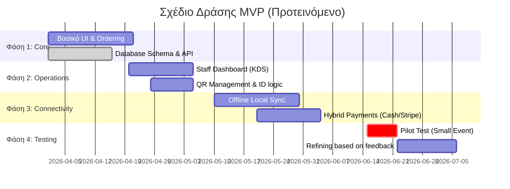

# 6. Οδικός Χάρτης MVP (MVP Roadmap)
Σχέδιο δράσης για την ανάπτυξη και την πρώτη δοκιμή του συστήματος.

Plan: 
1. First phase - questionnaire, MVP, pitching, basic marketing, reviewing and adapting changes based on customer needs. 
2. Rapid expansion via low margins, low CAC - extremely fast customer acquisition. 