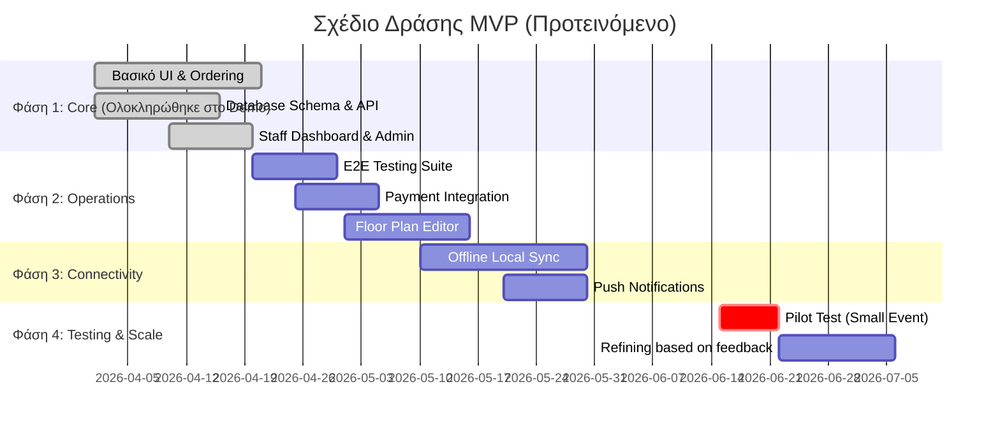

# 6. Οδικός Χάρτης MVP (MVP Roadmap)

Σχέδιο δράσης για την ανάπτυξη και την πρώτη δοκιμή του συστήματος, έχοντας ως βάση το ήδη υλοποιημένο Demo Orderly (37 λειτουργίες, 4 ρόλοι, 5 SSE κανάλια, 2 γλώσσες).

## Σχέδιο Δράσης (Action Plan) & Insights

Η πλατφόρμα είναι σε προχωρημένο στάδιο. Βάσει των insights, τα παρακάτω είναι "Low-Hanging Fruits" (Σχεδόν έτοιμα):

1. **E2E Testing Suite & CI Pipeline:** Η υποδομή (Vitest, i18n checks) είναι έτοιμη. Απαιτείται ολοκλήρωση των test workflows.
2. **Analytics:** Tα ωριαία γραφήματα χρησιμοποιούν ήδη πραγματικά δεδομένα από τη DB. Απαιτείται απλώς αφαίρεση τυχόν υπολειπόμενων mock data.
3. **Per-Role Feature Configuration:** Το Feature Registry υπάρχει. Λείπει μόνο το UI διαχείρισης στο Admin panel.
4. **Floor Plan Visual Editor:** Οι συντεταγμένες (x, y) υπάρχουν στη βάση. Χρειάζεται ένα drag-and-drop UI.
5. **Payment Integration & Push Notifications:** Η υποδομή billing (tabs/pay_now) και τα SSE channels υπάρχουν, έτοιμα να δεχθούν τα αντίστοιχα external APIs.

## Σχετικές Σημειώσεις

- [[v1_scope]] — Εύρος MVP
- [[market_strategy]] — Στρατηγική αγοράς
- [[deck]] — Pitch deck
- [[The long road of turning your idea toa successful startup]] — Στρατηγική ανάπτυξης

## Επόμενες Ενέργειες

- [ ] Δημιουργία issues στο repository για τα 5 "Σχεδόν Έτοιμα" insights (π.χ. E2E tests, Floor Plan editor).
