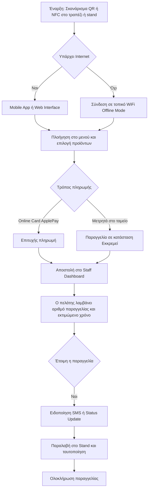
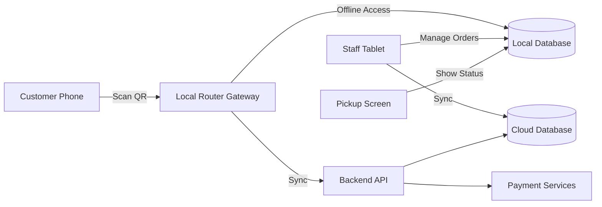
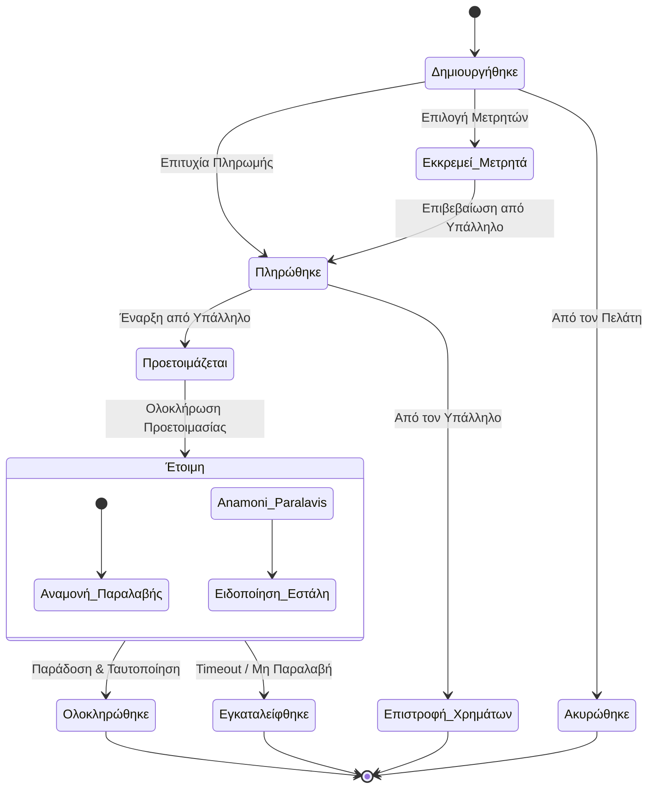
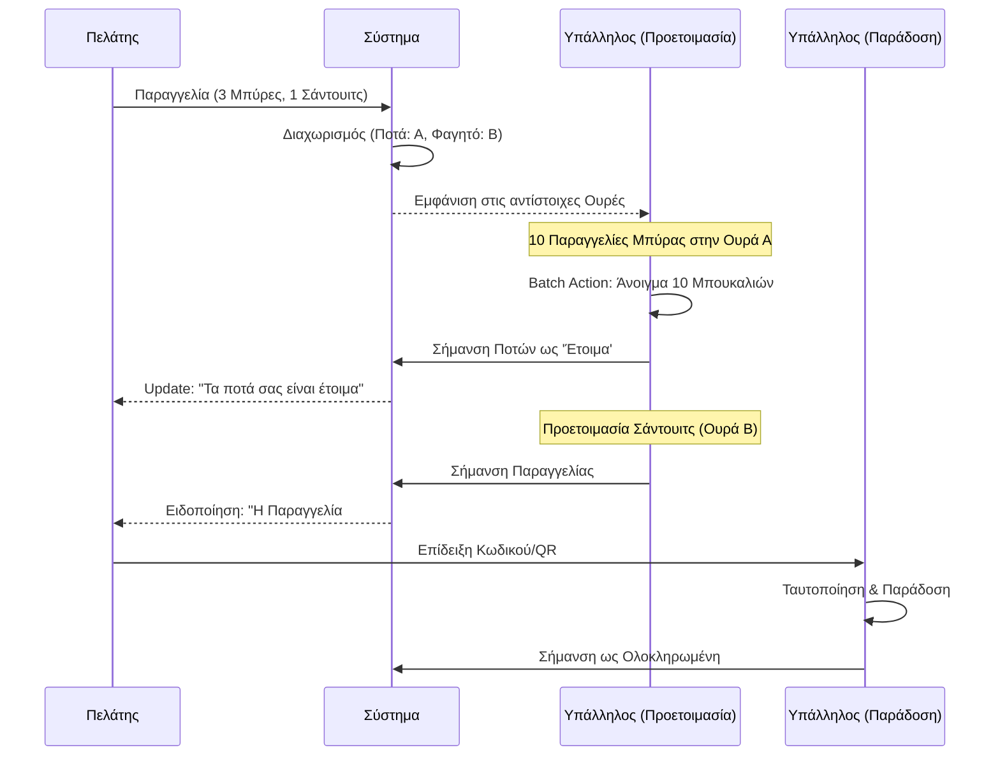
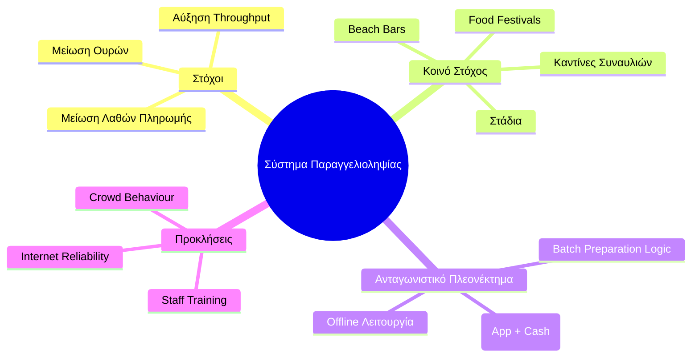
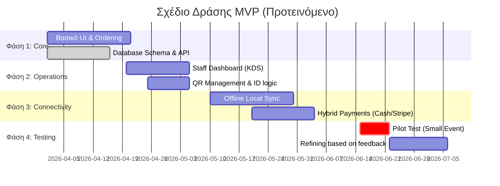
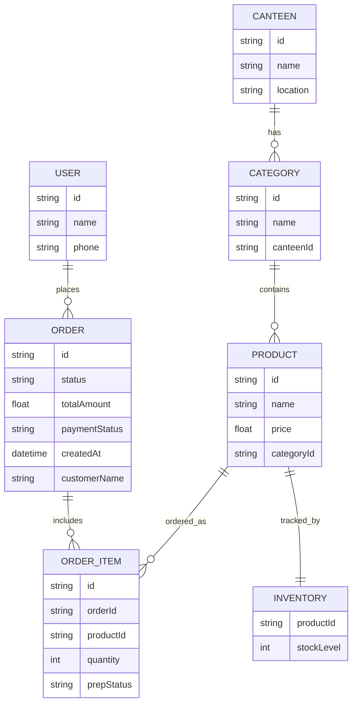

# Σχεδιασμός Συστήματος Παραγγελιοληψίας (Refine)

Αυτό το έγγραφο περιέχει τον ολοκληρωμένο σχεδιασμό και την οπτικοποίηση του συστήματος παραγγελιοληψίας για εκδηλώσεις (καντίνες, φεστιβάλ, κλπ.) βασισμένο στην έρευνα και τις συζητήσεις "Refine".

---

## 1. Διαδρομή Πελάτη (User Flow)
[Λεπτομέρειες στο αρχείο: design/user_flow.md](file:///home/harold/.openclaw/workspace/projects/orderly_docs/design/user_flow.md)

---

## 2. Αρχιτεκτονική Συστήματος (Υβριδικό Μοντέλο)
[Λεπτομέρειες στο αρχείο: architecture/system_architecture.md](file:///home/harold/.openclaw/workspace/projects/orderly_docs/architecture/system_architecture.md)

---

## 3. Κύκλος Ζωής Παραγγελίας (State Machine)
[Λεπτομέρειες στο αρχείο: design/order_lifecycle.md](file:///home/harold/.openclaw/workspace/projects/orderly_docs/design/order_lifecycle.md)

---

## 4. Επιχειρησιακή Ροή Υπαλλήλων (Batch Preparation)
[Λεπτομέρειες στο αρχείο: design/staff_workflow.md](file:///home/harold/.openclaw/workspace/projects/orderly_docs/design/staff_workflow.md)

---

## 5. Ανάλυση Αγοράς (Market Analysis & Strategy)
[Λεπτομέρειες στο αρχείο: business/market_strategy.md](file:///home/harold/.openclaw/workspace/projects/orderly_docs/business/market_strategy.md)

---

## 6. Οδικός Χάρτης MVP (MVP Roadmap)
[Λεπτομέρειες στο αρχείο: business/roadmap.md](file:///home/harold/.openclaw/workspace/projects/orderly_docs/business/roadmap.md)

---

## 7. Μοντέλο Δεδομένων (ERD)
[Λεπτομέρειες στο αρχείο: architecture/data_model.md](file:///home/harold/.openclaw/workspace/projects/orderly_docs/architecture/data_model.md)

