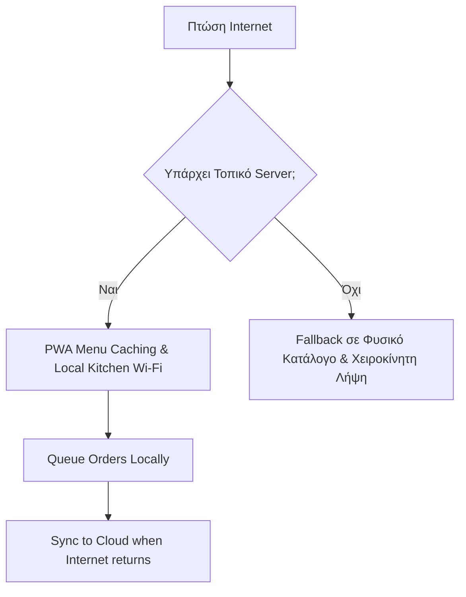

# Επιχειρησιακές Εξαιρέσεις & Λειτουργίες (Operational Edge Cases & Features)

Λεπτομέρειες που καθορίζουν την επιτυχία στην πράξη.

## 1. Πληρωμές: Viva Wallet (Προτίμηση)

Η **Viva Wallet (Viva.com)** είναι η ιδανική επιλογή:
- Ελληνική υποστήριξη και φορολογική συμβατότητα
- Υποστήριξη Apple Pay / Google Pay
- Χαμηλές προμήθειες (Νόμος 5167/2024: 0,5% για συναλλαγές <20€)
- *Εναλλακτικά:* Stripe (καλύτερο Dev Experience, λιγότερο τοπικό support)

→ [[pos_compliance]] / [[pricing_model]]

## 2. GDPR & Ιδιωτικότητα (Privacy)

- **Ανώνυμη χρήση εξ ορισμού (Anonymous by Default):** Δεν χρειάζεται εγγραφή ή σύνδεση (Login) για την παραγγελία
- **Κρυπτογράφηση δεδομένων (Tokenization):** Τα δεδομένα πληρωμής δεν αποθηκεύονται στους διακομιστές μας
- **Τοπική αποθήκευση (Local Storage):** Χρήση EU-based servers (Supabase Frankfurt)

## 3. Όταν Πέφτει το Internet (Offline Fallback)

Το μεγαλύτερο πρόβλημα στα νησιά και τα φεστιβάλ.

→ [[technical_stack#2. Υβριδική Αρχιτεκτονική]] / [[system_architecture]]

## 4. Πολυγλωσσικότητα (Multilingual)

Προτεραιότητα γλωσσών βάσει τουριστικών δαπανών:
1. **Ελληνικά / Αγγλικά** (MVP — καλύπτει το 80%)
2. **Γερμανικά** (No1 αγορά σε δαπάνες)
3. **Γαλλικά / Ιταλικά**

*Χρήση αυτοματοποιημένης μετάφρασης (DeepL API) με δυνατότητα επεξεργασίας (Edit) από τον καταστηματάρχη.*

## 5. Διαχείριση QR Codes (QR Code Management)

- **Dynamic QR (Δυναμικά QR):** Redirect μέσω short-URLs για εύκολη αλλαγή αν καταστραφεί το αυτοκόλλητο
- **Table Verification (Επιβεβαίωση Τραπεζιού):** Επιβεβαίωση αριθμού τραπεζιού στη ροή του πελάτη → [[user_flow]]
- **Durability (Αντοχή):** Πλαστικοποίηση (Lamination) για χρήση σε εξωτερικούς χώρους/παραλίες

## 6. Αξία για τον Ιδιοκτήτη (Value for Owner)

> **Κρίσιμο ερώτημα:** Θα πλήρωνε ένας ιδιοκτήτης παραπάνω γι' αυτό; → Πρέπει να μπούμε στη θέση του manager — αν θα τον ενδιέφερε η υπηρεσία που πουλάμε, και γιατί.

Αυτό το ερώτημα πρέπει να επικυρωθεί με A/B testing στο Value Proposition.
→ Δες σχετικά [[model]], [[Questionnaire]], [[COGS, CACs, overheads#Ενδιαφέροντες Παράγοντες]].

## Σχετικές Σημειώσεις

- [[v1_scope]] — Εύρος MVP
- [[user_flow]] — Διαδρομή πελάτη
- [[staff_workflow]] — Ροή εργασίας προσωπικού
- [[pos_compliance]] — Φορολογική συμμόρφωση
- [[technical_stack]] — Τεχνική αρχιτεκτονική

## Επόμενες Ενέργειες

- [ ] Έρευνα κόστους DeepL API για αυτόματη μετάφραση μενού (ανά αίτημα / ανά λέξη)
- [ ] Τεστ offline mode σε πραγματικές συνθήκες (χωρίς Wi-Fi) πριν τα πιλοτικά
