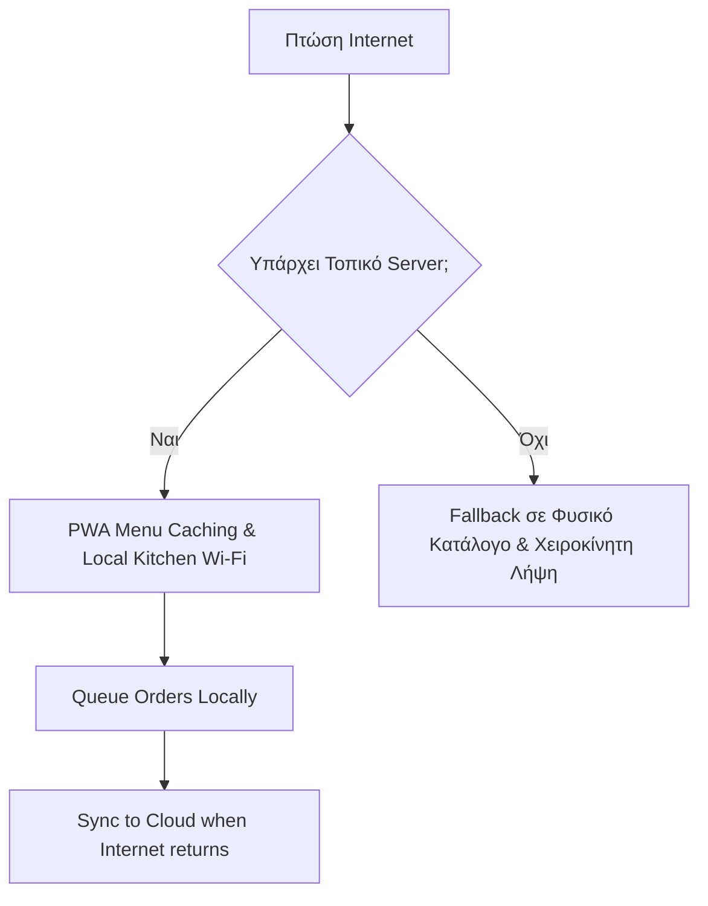

# Επιχειρησιακές Εξαιρέσεις (Operational Edge Cases)

Λεπτομέρειες που καθορίζουν την επιτυχία στην πράξη.

## 1. Πληρωμές: Viva Wallet (Προτίμηση)
Η **Viva Wallet (Viva.com)** είναι η ιδανική επιλογή:
*   Ελληνική υποστήριξη και φορολογική συμβατότητα.
*   Υποστήριξη Apple Pay / Google Pay.
*   Χαμηλές προμήθειες (Νόμος 5167/2024: 0,5% για συναλλαγές <20€).
*   *Εναλλακτικά:* Stripe (καλύτερο Dev Experience, λιγότερο local support).

## 2. GDPR & Ιδιωτικότητα
*   **Anonymous by Default:** Δεν χρειάζεται εγγραφή ή login για την παραγγελία.
*   **Tokenization:** Τα δεδομένα πληρωμής δεν αποθηκεύονται στους servers μας.
*   **Local Storage:** Χρήση EU-based servers (Supabase Frankfurt).

## 3. Όταν Πέφτει το Internet
Το μεγαλύτερο πρόβλημα στα νησιά και τα φεστιβάλ.

## 4. Πολυγλωσσικότητα (Multilingual)
Προτεραιότητα γλωσσών βάσει τουριστικών δαπανών:
1.  **Ελληνικά / Αγγλικά** (MVP - καλύπτει το 80%).
2.  **Γερμανικά** (Νο1 αγορά σε δαπάνες).
3.  **Γαλλικά / Ιταλικά**.
*Χρήση αυτοματοποιημένης μετάφρασης (DeepL API) με δυνατότητα edit από τον καταστηματάρχη.*

## 5. Διαχείριση QR Codes
*   **Dynamic QR:** Redirect μέσω short-URLs για εύκολη αλλαγή αν καταστραφεί το αυτοκόλλητο.
*   **Table Verification:** Επιβεβαίωση αριθμού τραπεζιού στο flow του πελάτη.
*   **Durability:** Πλαστικοποίηση (lamination) για χρήση σε εξωτερικούς χώρους/παραλίες.
