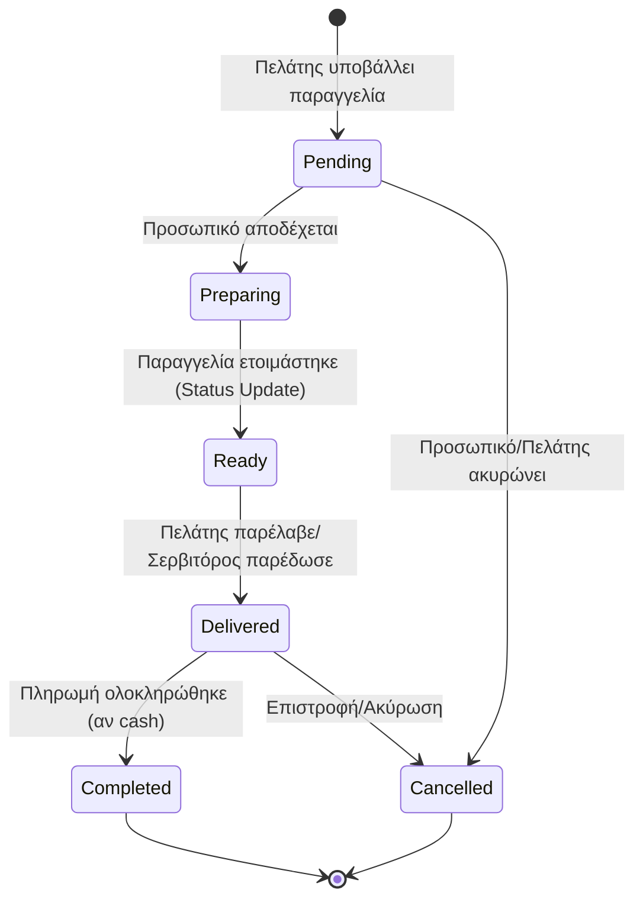

# 3. Κύκλος Ζωής Παραγγελίας (Order Lifecycle — State Machine)

Οι καταστάσεις από τις οποίες περνάει μια παραγγελία, συμπεριλαμβανομένων των εξαιρέσεων (π.χ. εγκατάλειψη).

### Οπτικοποίηση

## Σχετικές Σημειώσεις

- [[user_flow]] — Διαδρομή πελάτη
- [[staff_workflow]] — Ροή εργασίας προσωπικού
- [[data_model]] — Μοντέλο δεδομένων (ORDER → ORDER_ITEM)
- [[features]] — Λεπτομέρειες λειτουργιών

## Επόμενες Ενέργειες

- [ ] Προσθήκη ειδικών exception states (π.χ. επιστροφή χρημάτων / refunds) στο state machine diagram.
