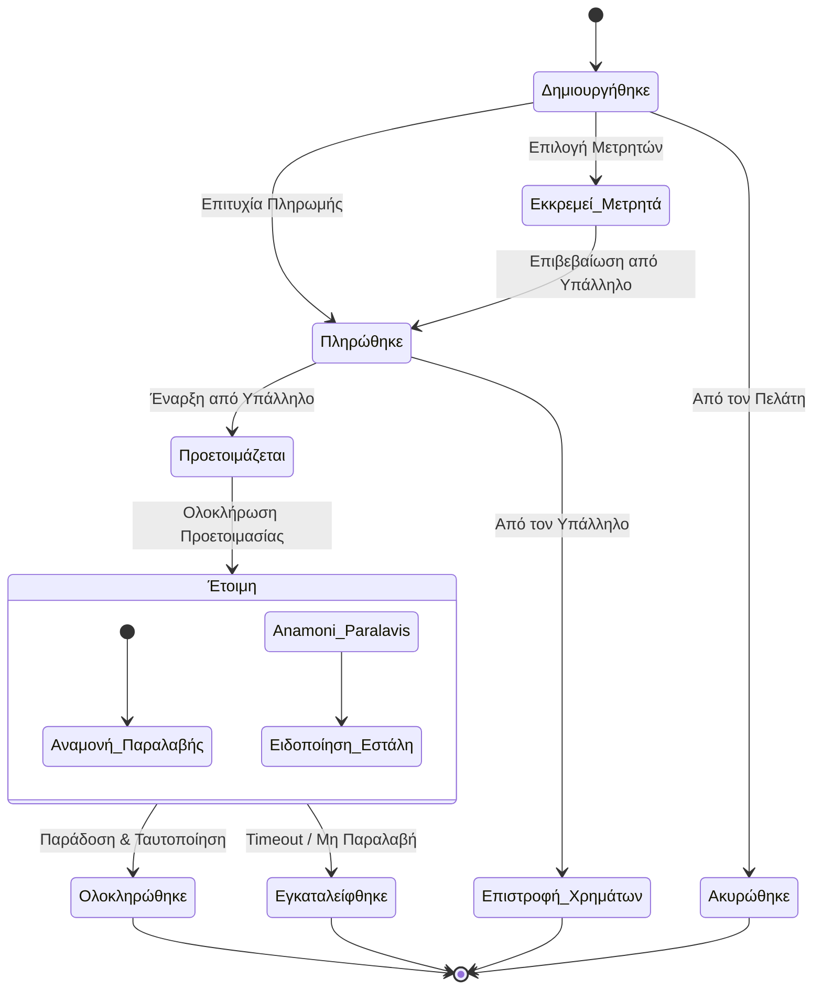

# 3. Κύκλος Ζωής Παραγγελίας (State Machine)
Οι καταστάσεις από τις οποίες περνάει μια παραγγελία, συμπεριλαμβανομένων των εξαιρέσεων (π.χ. εγκατάλειψη).

```mermaid
stateDiagram-v2
    [*] --> Δημιουργήθηκε
    Δημιουργήθηκε --> Πληρώθηκε: Επιτυχία Πληρωμής
    Δημιουργήθηκε --> Εκκρεμεί_Μετρητά: Επιλογή Μετρητών
    Εκκρεμεί_Μετρητά --> Πληρώθηκε: Επιβεβαίωση από Υπάλληλο
    
    Πληρώθηκε --> Προετοιμάζεται: Έναρξη από Υπάλληλο
    Προετοιμάζεται --> Έτοιμη: Ολοκλήρωση Προετοιμασίας
    
    state Έτοιμη {
        [*] --> Αναμονή_Παραλαβής
        Anamoni_Paralavis --> Ειδοποίηση_Εστάλη
    }
    
    Έτοιμη --> Ολοκληρώθηκε: Παράδοση & Ταυτοποίηση
    Έτοιμη --> Εγκαταλείφθηκε: Timeout / Μη Παραλαβή
    
    Δημιουργήθηκε --> Ακυρώθηκε: Από τον Πελάτη
    Πληρώθηκε --> Επιστροφή_Χρημάτων: Από τον Υπάλληλο
    
    Ολοκληρώθηκε --> [*]
    Εγκαταλείφθηκε --> [*]
    Ακυρώθηκε --> [*]
    Επιστροφή_Χρημάτων --> [*]
```
