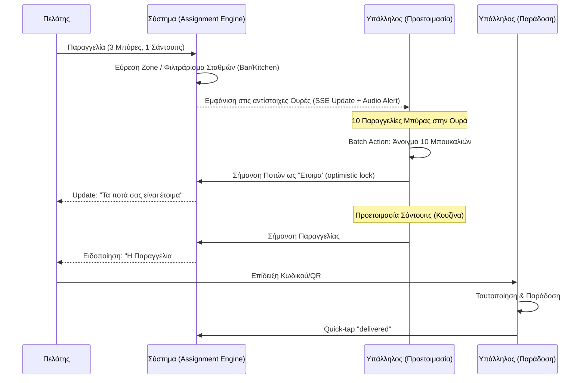

# Ροές Εργασίας Προσωπικού (Staff Workflows)

Πώς το σύστημα κατηγοριοποιεί τις παραγγελίες και αναθέτει εργασίες για μέγιστη ταχύτητα εξυπηρέτησης.

### Ροή Παραγγελίας (Order Lifecycle)
```
pending → accepted → preparing → ready → delivered
```
- Κάθε μετάβαση γίνεται με **optimistic lock-and-revert** pattern.
- Real-time SSE ενημερώνει όλα τα connected clients (`/api/orders/sse`).
- Audio alert (780Hz sine wave) για νέες παραγγελίες στο staff.
- SLA timer με warning (< 3 λεπτά πριν) και overdue (> 15 λεπτά).

### Ροή Κουζίνας (Kitchen Flow)
```
Ticket Board → Station Filter (All/Kitchen/Bar) → Quick Status Actions → Delivered
```
- Φιλτράρισμα ανά σταθμό (bar/kitchen/all).
- Quick-tap "delivered" chips στο κάτω μέρος για ready orders.
- Light/Dark/Auto theme toggle για τα display.

### Assignment Engine (Ανάθεση Εργασιών)
```
Νέα Παραγγελία/Κλήση → Εύρεση Zone Τραπεζιού → Φιλτράρισμα Staff → Εξισορρόπηση Φόρτου → Ανάθεση
```
- 3 στρατηγικές ανάθεσης: `auto_zone_with_override`, `manual_claims_only`, `auto_only`.
- Tie-breaking: ο σερβιτόρος που ξεκίνησε βάρδια πρώτος (FIFO).
- Retry λογική μέχρι 3 φορές σε περιπτώσεις race conditions.

### Οπτικοποίηση



## Σχετικές Σημειώσεις

- [[order_lifecycle]] — Κύκλος Ζωής Παραγγελίας
- [[user_flow]] — Διαδρομή Πελάτη

## Επόμενες Ενέργειες

- [ ] Δοκιμή (QA) των Audio alerts και SLA timers σε noisy περιβάλλον.
