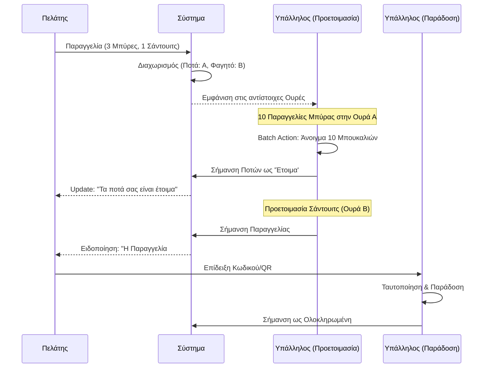

# 4. Επιχειρησιακή Ροή Υπαλλήλων (Batch Preparation)
Πώς το σύστημα κατηγοριοποιεί τις παραγγελίες για μέγιστη ταχύτητα εξυπηρέτησης.

```mermaid
sequenceDiagram
    participant C as Πελάτης
    participant S as Σύστημα
    participant SP as Υπάλληλος (Προετοιμασία)
    participant SD as Υπάλληλος (Παράδοση)
    
    C->>S: Παραγγελία (3 Μπύρες, 1 Σάντουιτς)
    S->>S: Διαχωρισμός (Ποτά: Α, Φαγητό: Β)
    S-->>SP: Εμφάνιση στις αντίστοιχες Ουρές
    
    Note over SP: 10 Παραγγελίες Μπύρας στην Ουρά Α
    SP->>SP: Batch Action: Άνοιγμα 10 Μπουκαλιών
    SP->>S: Σήμανση Ποτών ως 'Έτοιμα'
    
    S-->>C: Update: "Τα ποτά σας είναι έτοιμα"
    
    Note over SP: Προετοιμασία Σάντουιτς (Ουρά Β)
    SP->>S: Σήμανση Παραγγελίας #123 ως Πλήρως Έτοιμη
    S-->>C: Ειδοποίηση: "Η Παραγγελία #123 είναι έτοιμη για παραλαβή"
    
    C->>SD: Επίδειξη Κωδικού/QR #123
    SD->>SD: Ταυτοποίηση & Παράδοση
    SD->>S: Σήμανση ως Ολοκληρωμένη
```
