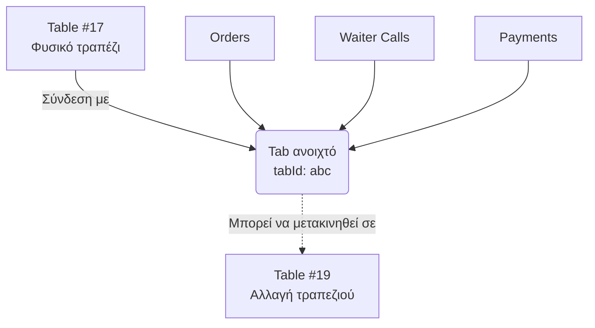

# Αρχιτεκτονική Τραπεζιών και Λογαριασμών (Table & Tab Architecture)

Η λογική του συστήματος για τον χειρισμό φυσικών τραπεζιών και ψηφιακών λογαριασμών (tabs).

### Οπτικοποίηση

## Λογική Πελάτη / Έναρξης (Client/Start Logic)

- Ο πελάτης βλέπει τα τραπέζια (π.χ. 15-22).
- Μπορεί να επιλέξει να καθίσει **μόνο** εάν:
  1. Δεν υπάρχει ήδη ανοιχτός λογαριασμός (Open Tab) στο τραπέζι.
  2. Κανείς άλλος δεν κάθεται ήδη εκεί.
- **Άνοιγμα λογαριασμού (Opening a tab):** Δεσμεύει αυτόματα το τραπέζι.
- **Κλείσιμο λογαριασμού (Closing a tab):** Ελευθερώνει το τραπέζι για νέους πελάτες.

## Σχετικές Σημειώσεις

- [[order_lifecycle]] — Κύκλος ζωής παραγγελίας
- [[features]] — Λειτουργίες συστήματος

## Επόμενες Ενέργειες

- [ ] Δοκιμή (Validation test) της λογικής μετακίνησης Tab με πραγματικούς σερβιτόρους σε demo περιβάλλον.
