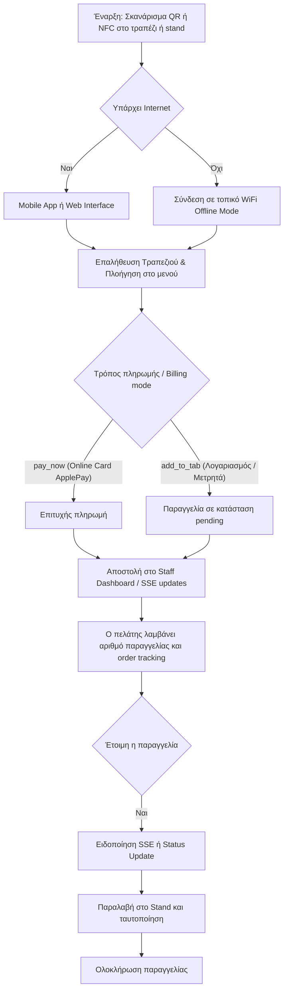

# 1. Διαδρομή Πελάτη (User Flow)
Η εμπειρία του πελάτη από το σκανάρισμα του QR code μέχρι την παραλαβή της παραγγελίας, με πρόβλεψη για τη λειτουργία σε τοπικό δίκτυο (Offline Fallback).

### Ροή Πελάτη (Customer Flow)
```
QR Scan → Επαλήθευση Τραπεζιού → Μενού → Προϊόν/Customization → Καλάθι → Checkout → Order Tracking (real-time SSE)
```
- Το καλάθι αποθηκεύεται σε `localStorage` με 6ωρο expiry.
- Αν αλλάξει τραπέζι (νέο QR), το καλάθι καθαρίζεται αυτόματα.
- Υποστηρίζεται `pay_now` ή `add_to_tab` billing mode.
- Το Pricing snapshot κλειδώνει τις τιμές τη στιγμή της παραγγελίας.

### Real-Time System (SSE)
Η επικοινωνία σε πραγματικό χρόνο επιτυγχάνεται με Server-Sent Events (SSE) (στα endpoints `/api/orders/sse`, `/api/tabs/sse`, κλπ.) με auto-reconnection και polling fallback.

### Οπτικοποίηση



## Σχετικές Σημειώσεις
- [[staff_workflow]] — Ροή εργασίας προσωπικού
- [[v1_scope]] — Εύρος MVP

## Επόμενες Ενέργειες
- [ ] Έλεγχος UI/UX για το `localStorage` clear sequence όταν αλλάζει το QR/τραπέζι.
