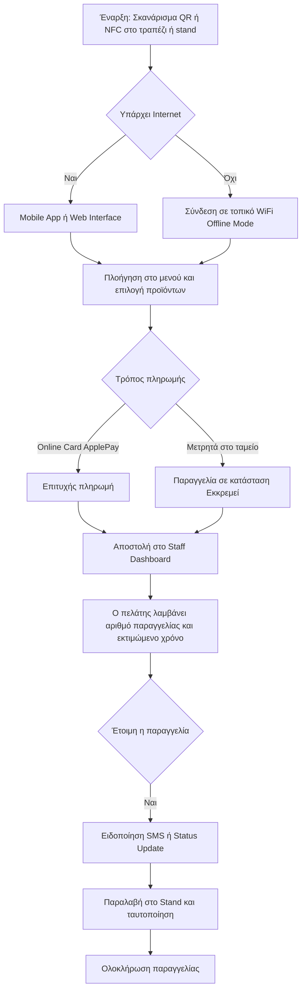

# 1. Διαδρομή Πελάτη (User Flow)
Η εμπειρία του πελάτη από το σκανάρισμα του QR code μέχρι την παραλαβή της παραγγελίας, με πρόβλεψη για τη λειτουργία σε τοπικό δίκτυο (Offline Fallback).

---

## Σχετικές Σημειώσεις
- [[architecture/ordering-flow.md]]: Technical Architecture of the Ordering Flow
