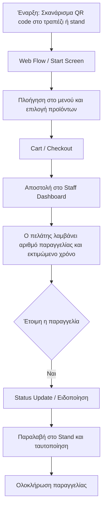

# 1. Διαδρομή Πελάτη (User Flow)
Η εμπειρία του πελάτη από το σκανάρισμα του QR code μέχρι την παραλαβή της παραγγελίας. Η τρέχουσα ροή είναι cloud-first web flow, με offline/local fallback να παραμένει future-phase ιδέα.

### Οπτικοποίηση

