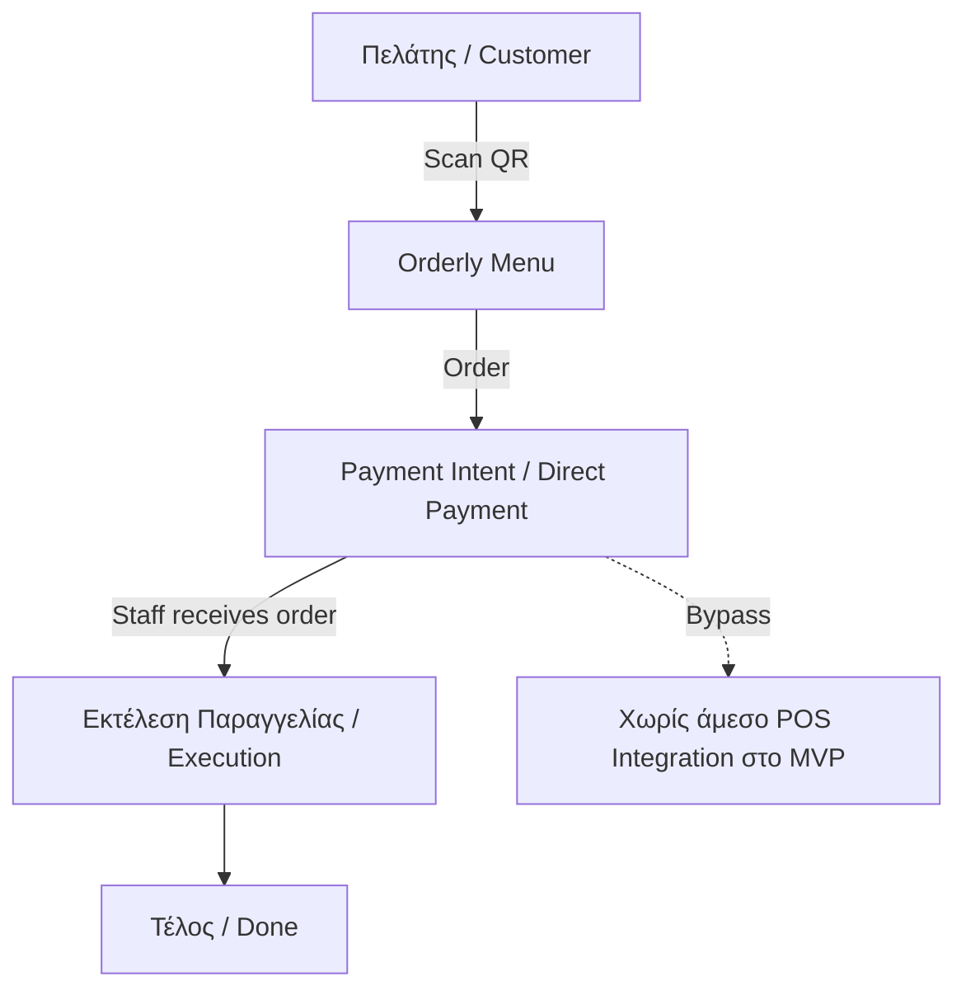

# Meeting Logs & Mentor Notes

Συγκεντρωμένες σημειώσεις από mentoring sessions και operational συζητήσεις. Οι actionable αποφάσεις μεταφέρονται στα σχετικά docs: [[v1_scope]], [[market_strategy]], [[pitch_strategy]], [[open-questions]].

## Γιώργος Νικολάου

### Key Takeaways

- Ξεκινάμε από το πρόβλημα, όχι από τη λύση. Το validation πρέπει να γίνει με πραγματικούς πελάτες και όχι μόνο με βάση προσωπική εμπειρία.
- Αν κάτι δεν υπάρχει ήδη στην αγορά, ρωτάμε πρώτα "γιατί": πραγματική ανάγκη, κόστος, τεχνολογικός περιορισμός, κακό timing ή δύσκολη πώληση.
- Η σχετική βαρύτητα είναι: ομάδα > εκτέλεση > ιδέα/καινοτομία > χρηματοδότηση.
- Μιλάμε με καταστηματάρχες πριν χτίσουμε βαριά features. Πρέπει να επιβεβαιωθεί ότι το θέλουν και ότι καταλαβαίνουν την αξία.
- VC funding έχει νόημα μόνο με traction. Πριν από αυτό, προτιμώνται bootstrapping, friends/family ή accelerator.
- Funding σημαίνει πλάνο 12-18 μηνών με καθαρό use of funds: πού πάνε τα λεφτά και τι milestones αγοράζουν.

### Επιπτώσεις για την Orderly

- Το pitch πρέπει να δείχνει ότι δεν πουλάμε "έξυπνο σύστημα", αλλά μετρήσιμη μείωση ουρών, χρόνου εξυπηρέτησης και λειτουργικού χάους.
- Το fundraising narrative πρέπει να μετακινηθεί μετά το MVP validation: πρώτα pilots και metrics, μετά ask.
- Το πρώτο demo πρέπει να δοκιμάζει αν ο ιδιοκτήτης θέλει τη λύση πριν ζητηθεί πληρωμή ή integration.

## Κυριάκος Τσίγκρος

### Key Takeaways

Η ιδέα έχει λογική, αλλά η επιτυχία δεν θα κριθεί από το πόσο "έξυπνο" ή "πλούσιο" είναι το σύστημα. Θα κριθεί από το αν μπορούμε να κάνουμε τέσσερα πράγματα:

1. Να επιλέξουμε πολύ στενό αρχικό use case.
2. Να βγούμε γρήγορα με απλό MVP.
3. Να μπούμε εύκολα σε πραγματικά μαγαζιά.
4. Να αποδείξουμε με metrics ότι το προϊόν δημιουργεί αξία.

### Επιπτώσεις για την Orderly

- Το αρχικό use case πρέπει να είναι high-volume self-service ή counter-service venue όπου η ουρά φαίνεται και μετριέται.
- Το MVP πρέπει να λύσει ένα επιχειρησιακό πρόβλημα και όχι να αποδείξει όλο το product vision.
- Τα analytics πρέπει να είναι μέρος του validation, όχι "nice to have".

## Άλεξ Σχίζας

### Ζουμί

- Να μη φαινόμαστε σαν "άλλο ένα QR ordering tool". Το positioning πρέπει να είναι revenue growth για το μαγαζί.
- Το MVP μένει απλό: QR ordering που δουλεύει άψογα + basic analytics. Speech-to-text και advanced AI πάνε αργότερα.
- Ξεκινάμε web app για low friction, αλλά κρατάμε από νωρίς centralized user accounts για loyalty/personalization/network effects.
- Πρώτο GTM priority είναι supply: πολλά καταστήματα, όχι άμεσο revenue. Στόχος αρχικά 100-1000 venues.
- Μην μπλέξουμε με payments στην αρχή. Πρώτα adoption, μετά subscription ή light commission.
- Το onboarding πρέπει να είναι plug & play, γιατί κάθε μαγαζί έχει δικά του συστήματα.

### Τι έχει ξεχωριστό από τους άλλους mentors

- Έβαλε πολύ καθαρά το revenue narrative: δεν πουλάμε παραγγελιοληψία, πουλάμε αύξηση εσόδων.
- Τόνισε supply-first growth και adoption metrics πριν το monetization.
- Έφερε το θέμα centralized accounts ως θεμέλιο για μελλοντικό loyalty και network value.

### Επιπτώσεις για την Orderly

- Κεντρική φράση pitch: "Δεν πουλάμε παραγγελιοληψία — πουλάμε αύξηση εσόδων για το μαγαζί."
- MVP: Scan -> Order -> Done + basic analytics. AI/speech/payments μένουν outside v1.
- Το sales approach ξεκινά free/πολύ φθηνά και door-to-door, με στόχο pilot density και measurable impact.

## Σωτηρία Γουναρίδη

### Ζουμί

- Οι ιδιοκτήτες δεν αγοράζουν "experience". Αγοράζουν περισσότερο τζίρο, λιγότερη αναμονή και λιγότερο κόστος προσωπικού.
- Το μήνυμα πρέπει να είναι απλό και σε ευρώ: λιγότερη αναμονή, περισσότερος τζίρος, λιγότερο κόστος.
- Το product focus πρέπει να μείνει σε ένα use case: QR -> παραγγελία χωρίς αναμονή.
- Να μη μπερδευτεί το initial pitch με call waiter, notifications, complex flows ή speech-to-text.
- Για τελικούς χρήστες το βασικό trigger είναι η ανυπομονησία: "Παράγγειλε χωρίς αναμονή", "Skip the wait".
- Value boosters για αργότερα ή δεύτερο επίπεδο pitch: πολυγλωσσικό μενού, upselling, λιγότερα λάθη παραγγελιών.

### Τι έχει ξεχωριστό από τους άλλους mentors

- Ξεχώρισε το owner pitch από το end-user messaging.
- Έκοψε το αφηρημένο "καλύτερη εμπειρία" και το γύρισε σε ROI/operations language.
- Ζήτησε πολύ μικρό demo/video και decision-maker targeting, όχι γενική επικοινωνία σε staff.

### Επιπτώσεις για την Orderly

- TL;DR pitch προς ιδιοκτήτη: "Λιγότερη αναμονή, περισσότερος τζίρος, λιγότερο κόστος προσωπικού."
- TL;DR message προς πελάτη: "Ξέρεις τι θέλεις; Παράγγειλε χωρίς αναμονή."
- Χρειαζόμαστε demo που φαίνεται σε 10-20 δευτερόλεπτα και συζήτηση με owners/managers.

## Σάββας Γεωργίου

### Ζουμί

- Το payment δεν είναι απλά checkout. Είναι behavioral signal: δείχνει ποιος είναι committed και ποια παραγγελία/λίστα αναμονής πρέπει να πάρει προτεραιότητα.
- Δεν πρέπει να ζητάμε full upfront payment με το πρώτο order, γιατί ο πελάτης μπορεί να προσθέσει κι άλλα. Το υπάρχον flow μπορεί να το καλύψει ως payment intent: πληρώνω τώρα με μετρητά/κάρτα ή μπαίνει στον λογαριασμό/tab.
- Τα analytics πρέπει να μείνουν light αλλά χρήσιμα: QR orders, channel conversion, estimated time saved και πιθανό money saved.
- Στα hotels δεν ξεκινάμε με όλο το ξενοδοχείο ή αλυσίδα. Entry point: μικρό unit όπως pool bar, breakfast ή restaurant.
- Ενδεικτικά sales cycles: bar περίπου 1 μήνας, whole hotel περίπου 3 μήνες, chain περίπου 2 χρόνια.
- Decision makers στα hotels: F&B Manager και Operations. IT μπαίνει κυρίως για approval, security και vendor checks.
- Τα POS/PMS integrations δεν είναι απαραίτητα τρομερά δύσκολα τεχνικά, αλλά κάθε χώρα έχει άλλους dominant vendors. Άρα δεν πάμε multi-country early.
- Τα hotels δεν έχουν urgency από μόνα τους. Το offer πρέπει να είναι απλό, άμεσο, γρήγορο σε implementation και low friction.

### Τι έχει ξεχωριστό από τους άλλους mentors

- Αντέστρεψε την προηγούμενη υπόθεση για payments: όχι ως monetization/commission feature, αλλά ως core operational signal για prioritization και table turnover.
- Έδωσε πιο ρεαλιστική εικόνα για hotel sales cycles και decision makers.
- Έβαλε καθαρό constraint στο expansion: πρώτα μία αγορά/ένα hotel unit, μετά integrations και αλυσίδες.

### Επιπτώσεις για την Orderly

- Το MVP πρέπει να κρατήσει την επιλογή payment intent στο καλάθι ως core flow: pay now με μετρητά/κάρτα ή add to tab. Room charge μπορεί να προστεθεί αργότερα για hotels.
- Για hotels, το πρώτο pitch πρέπει να είναι για pool bar/breakfast/restaurant pilot, όχι για group-wide rollout.
- Το product πρέπει να παραμείνει πολύ απλό για να μπει φέτος: στενό use case, λίγη τεχνολογία, γρήγορο onboarding.

## Αλέξανδρος Τρίμης

### Ζουμί

- Το pain είναι πραγματικό, αλλά δεν είναι universal. Δεν χτίζουμε γενικά για "εστίαση", χτίζουμε πρώτα για συγκεκριμένα scenarios: beach bars, μεγάλα venues, self-service vibes και peak load.
- Το πιο καθαρό product framing είναι "express ordering layer" πάνω από την υπάρχουσα λειτουργία του μαγαζιού. Δεν αντικαθιστούμε απαραίτητα POS/PDA, γινόμαστε έξτρα κανάλι παραγγελίας.
- Το μεγαλύτερο ρίσκο είναι το integration hell. POS/PDA integrations είναι fragmented, δύσκολα και δεν πρέπει να μπλοκάρουν το MVP.
- Το σωστό αρχικό μοντέλο είναι bypass: δικό μας dashboard/tablet/printer flow. Integration μπαίνει ως future problem μόνο αν αποδειχθεί απαραίτητο.
- Το MVP πρέπει να μείνει σε 3 πράγματα: πελάτης βλέπει menu και κάνει order, κατάστημα λαμβάνει order, order εκτελείται.
- Loyalty, AI menu editing, simulations και advanced analytics είναι startup dopamine αν μπουν πριν κλειδώσει το core value.
- Το customer journey είναι το πιο κρίσιμο κομμάτι. Ιδανικά ο πελάτης κάθεται, σκανάρει, βλέπει menu χωρίς friction και παραγγέλνει σε 10-15 δευτερόλεπτα.
- Το pitch προς καταστήματα πρέπει να είναι αποτέλεσμα, όχι dashboard: λιγότερη πίεση στο προσωπικό, περισσότερες παραγγελίες στις busy ώρες, καμία αλλαγή στο υπάρχον setup.
- Για τους πρώτους μήνες το onboarding των menus θα είναι χειροκίνητο από εμάς. Αυτό είναι φυσιολογικό marketplace/startup operation, όχι πρόβλημα.
- Το AI menu editing με prompt αξίζει ως internal tool για να στήνουμε γρήγορα menus, όχι ως customer-facing MVP feature.

### Τι έχει ξεχωριστό από τους άλλους mentors

- Έβαλε πολύ καθαρά ότι το παιχνίδι δεν είναι "καλύτερο POS", αλλά "fastest ordering experience".
- Έδωσε ξεκάθαρη απόφαση για bypass model στην αρχή, αντί να περιμένουμε integrations.
- Τόνισε ότι η μεγαλύτερη δυσκολία είναι adoption, behavior change και operations, όχι το software.

### Επιπτώσεις για την Orderly

- Το πρώτο segment πρέπει να είναι beach bars και high-volume casual venues, όχι generic restaurants.
- Το MVP πρέπει να αποδείξει ένα πράγμα: ότι το Orderly κάνει την παραγγελία πιο γρήγορη και πιο εύκολη σε πραγματική πίεση.
- Το sales pitch πρέπει να είναι "increase revenue χωρίς αλλαγή συμπεριφοράς/setup".
- Το menu onboarding πρέπει να θεωρηθεί service/ops κομμάτι του MVP, με AI tooling εσωτερικά όπου βοηθάει.

## Στέφανος Βασδέκης

### Ζουμί

- Το βασικό concept είναι web-based σύστημα, όχι app: QR menu, παραγγελία, πιθανή online πληρωμή και admin/order management για τον επιχειρηματία.
- Το μεγάλο ανοιχτό θέμα είναι οι πληρωμές. Marketplace model σημαίνει ότι κρατάμε χρήματα και αποδίδουμε στο κατάστημα, άρα έχει λογιστική/φορολογική πολυπλοκότητα.
- Για MVP προτιμάται direct payment direction ή απλό payment intent, ώστε ο πελάτης να πληρώνει απευθείας το κατάστημα ή να δηλώνει τρόπο πληρωμής χωρίς να χτίσουμε settlement product.
- Offline sync και τοπική βάση είναι overengineering για την αρχή. Έχει conflicts, sync logic και πολλά edge cases.
- MVP πρέπει να είναι 100% online. Offline mode μπαίνει μόνο ως future version αν αποδειχθεί πραγματικό blocker.
- Το μεγαλύτερο πρόβλημα είναι scope creep: QR ordering, bookings, AI voice assistant, offline mode και hotel integrations μαζί μπορούν να οδηγήσουν στο να μη βγει τίποτα.
- Το core MVP είναι QR menu, παραγγελία, payment/payment intent και basic admin.
- Το product πρέπει να σκέφτεται modular: core ordering τώρα, extras όπως bookings, analytics και hotel-specific flows αργότερα.
- Το positioning χαλάει αν προσπαθούμε να πουλήσουμε ordering, bookings, AI και hotels ταυτόχρονα.
- Οι συνεργασίες και οι τρίτοι αργούν περισσότερο από όσο φαίνεται. Δεν πρέπει να βασίζεται το MVP σε εξωτερικές συνεργασίες.
- Το "last click wins" είναι σημαντικό insight: η αξία και τα λεφτά βρίσκονται στο τελικό στάδιο της παραγγελίας, όπου το Orderly ήδη βρίσκεται.

### Τι έχει ξεχωριστό από τους άλλους mentors

- Έβαλε τις πληρωμές ως στρατηγικό/λογιστικό decision, όχι μόνο ως product feature.
- Έκοψε καθαρά το offline/local-first ως early complexity.
- Έδωσε framework modular platform: πουλάμε core ordering, όχι όλα τα πιθανά hospitality modules μαζί.

### Επιπτώσεις για την Orderly

- Το MVP πρέπει να μείνει online-only και να μη μπλέξει με offline sync.
- Το payment flow πρέπει να λυθεί με όσο γίνεται πιο απλό μοντέλο για pilots, χωρίς να μετατραπούμε νωρίς σε marketplace settlement layer.
- Το roadmap πρέπει να φαίνεται modular: core QR ordering πρώτα, bookings/hotels/advanced analytics αργότερα.
- Κάθε feature που δεν βοηθά το QR -> order -> pay/intent -> staff flow πρέπει να πάει εκτός αρχικού pitch.

## Βασιλική Αργυροπούλου

### Ζουμί

- Το βασικό πρόβλημα δεν είναι το όνομα. Είναι ότι δεν έχει κλειδώσει 100% τι ακριβώς πουλάμε.
- Αυτή τη στιγμή το προϊόν κινδυνεύει να φαίνεται σαν λίγο από όλα: QR ordering, μείωση ουράς και workflow optimization. Αυτά πρέπει να γίνουν ένα καθαρό μήνυμα.
- Το δυνατό USP είναι QR-based ordering χωρίς app και με πλήρη προσωποποίηση για το κατάστημα.
- Δεν είμαστε app-based όπως κάποιες λύσεις, δεν είμαστε marketplace όπως Wolt/eFood και δεν πρέπει να δείχνουμε generic.
- Πιο καθαρό positioning: "We help restaurants take and manage orders digitally, without apps, without queues, fully branded."
- Το SkipQ είναι narrow γιατί κλειδώνει το brand μόνο στην ουρά και ακούγεται σαν feature. Το Orderly είναι safer direction επειδή χωράει ordering και οργάνωση workflow.
- Τα slogans τύπου "Make ordering easy", "Reduce queues", "Personalized for you" είναι features. Χρειάζεται ενιαία positioning πρόταση.
- Το Orderly είναι B2B product με B2C interface. Το brand πρέπει να πείθει τον επιχειρηματία, ενώ η εμπειρία πρέπει να δουλεύει για τον πελάτη.
- Στο deck χρειάζονται λίγα πράγματα ανά slide, ρεαλιστικά visuals και product μέσα σε context.
- Το "Your logo here" concept είναι δυνατό γιατί βοηθά τον επιχειρηματία να φανταστεί το προϊόν ως δικό του.

### Τι έχει ξεχωριστό από τους άλλους mentors

- Έφερε το πρόβλημα focus/positioning πιο καθαρά από όλους.
- Ξεχώρισε το brand decision από το product decision: πρώτα κλειδώνουμε τι πουλάμε, μετά το όνομα.
- Έβαλε χρήσιμο framing ότι πουλάμε σε B2B buyer αλλά η εμπειρία καταναλώνεται από B2C user.

### Επιπτώσεις για την Orderly

- Πρέπει να κλειδώσει μία πρόταση προϊόντος πριν φτιαχτούν νέα pitch slides ή slogans.
- Τα 3 βασικά value bullets πρέπει να είναι speed, no app και personalization/branding.
- Το Orderly είναι πιο ασφαλής κατεύθυνση ονόματος από SkipQ για να μην περιοριστούμε μόνο στο "skip queue" use case.
- Το pitch πρέπει να δείχνει το προϊόν πάνω σε πραγματικό venue context, ιδανικά με το logo/branding του καταστήματος.

## Softone / Operational Notes

- Η ειδοποίηση νέας παραγγελίας για barista/staff πρέπει να τραβάει προσοχή με ήχο και χρώμα, όχι μόνο με νέο row στο dashboard.
- Το simulation δεν αρκεί ως validation, γιατί οι χρήστες μπορεί ήδη να ξέρουν τη ροή ή να μη συμπεριφερθούν όπως σε πραγματική πίεση.
- Χρειάζεται analytics layer που δείχνει στον ιδιοκτήτη τι γλίτωσε κάθε μήνα σε χρόνο εξυπηρέτησης και πιθανές εργατοώρες.

## Product & Pitch Ideas

- QR code σε natural text menu: ο πελάτης να μπαίνει σε μενού που εξηγεί καθαρά τα προϊόντα, όχι απλά σε static PDF.
- Speech-to-text και AI chat βοηθός να μπουν στο pitch ως future differentiators, όχι ως απαραίτητο core MVP.
- Προσαρμοσμένο μενού ανάλογα με τις συνθήκες, π.χ. αν το μαγαζί είναι πολύ busy, προώθηση γρήγορων επιλογών.
- Analytics για το πόση ώρα παίρνει κάθε παραγγελία και πού κολλάει η ροή.
- Κριτικές και feedback για insights: τι μπορούν να βελτιώσουν οι σερβιτόροι ή το venue. Εναλλακτικά, integration με Google Reviews.
- Δωρεάν μοντέλο εισόδου: φτιάχνουμε free site/demo για venue και πάμε να το δείξουμε για χαμηλό friction.
- Ξενοδοχεία μέσω ξενοδοχειακού ομίλου στην Ελλάδα ως πιθανό δεύτερο κανάλι, μετά από αρχικό validation σε απλούστερο use case.

## Positioning Lines

- Κάνουμε τις παραγγελίες εύκολες.
- Μειώνουμε την ουρά.
- Tailored for you.
- Self-order made easy.
- Zero to no queues.
- Optimised business operations / staff orchestrator.
- Menu tailored to you.
- Effortless ordering. No apps. Fully yours.
- Smart ordering for modern restaurants.
- Παραγγελίες από QR, χωρίς app, με την εικόνα του μαγαζιού σου.
- Περισσότερες παραγγελίες στις busy ώρες, χωρίς αλλαγή στο setup σου.

## Consolidated Mentor Consensus

- Το Orderly πρέπει να ξεκινήσει ως branded QR ordering layer για busy venues, όχι ως POS replacement, marketplace ή all-in-one hospitality platform.
- Το πρώτο target είναι beach bars, high-volume casual venues και self-service/counter-service scenarios όπου η ουρά και η καθυστέρηση φαίνονται.
- Το MVP είναι QR -> menu -> order -> payment intent/pay choice -> staff receives order -> execution.
- Εκτός αρχικού core μένουν AI, offline sync, bookings, hotel-wide flows, advanced analytics, loyalty και POS/PDA integrations.
- Το customer journey είναι το προϊόν: scan, menu, order και done σε όσο γίνεται λιγότερα δευτερόλεπτα.
- Το staff journey πρέπει να είναι εξίσου απλό: νέα παραγγελία με έντονο visual/audio signal και εύκολη εκτέλεση.
- Το go-to-market pitch προς επιχειρηματία πρέπει να είναι: περισσότερες παραγγελίες στις ώρες αιχμής, λιγότερη πίεση στο προσωπικό, χωρίς αλλαγή στο υπάρχον setup.
- Το onboarding στην αρχή θα είναι χειροκίνητο από την ομάδα. Αυτό περιλαμβάνει menu setup, demo pages και πιθανώς internal AI tools για γρήγορη δημιουργία/διόρθωση menus.
- Τα πρώτα validation metrics πρέπει να είναι orders through Orderly, scan-to-order conversion, χρόνος ολοκλήρωσης παραγγελίας, χρόνος εξυπηρέτησης, queue/wait-time reduction και staff feedback.
- Funding, integrations και μεγαλύτερα modules έχουν νόημα αφού υπάρχουν pilots και μετρήσιμη traction.

## Product Backlog Notes

### Order Display

- [ ] Να μπει κουμπί για αλλαγή sort, π.χ. χρόνος παραγγελίας ή προτεραιότητα.

### Order Flow / Tab

- [ ] Edge case: τι γίνεται αν υπάρχει ανοιχτό tab και ο πελάτης φύγει.

### Οπτικοποίηση

