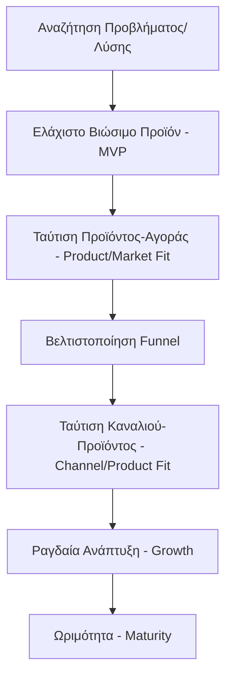

# Σχεδιασμός Προϊόντος (Product Design)

https://drive.google.com/file/d/1PdhPwBNBAzjzk6av4FKMecvBdI2eclS3/view?usp=sharing

Σχετικό αρχείο: [[business/market_strategy.md]]

## Μοναδικά Σημεία Πώλησης (USP - Unique Selling Points)
- Γιατί το προϊόν μας είναι καλύτερο από τον ανταγωνισμό, είτε άμεσα είτε έμμεσα.
- Πώς λύνουμε το πρόβλημα ή εξυπηρετούμε τους πελάτες με καλύτερο τρόπο.

Το προϊόν συνδυάζει: Επιχειρηματικότητα (Business) + Τεχνολογία (Tech) + Εμπειρία Χρήστη (UX/Design).

## Στάδια Προϊόντος και Ανάπτυξης (Stages of Product and Growth)

Η εικόνα είναι ένα γράφημα που αναλύει τα στάδια ανάπτυξης ενός προϊόντος (Stages of Product & Growth). Απεικονίζει μια καμπύλη ανάπτυξης (Growth) που χωρίζεται σε τρεις βασικές περιόδους:
1. **Περίοδος εστίασης στο προϊόν (Product-first period):** Ξεκινά με την αναζήτηση ταύτισης προβλήματος-λύσης (Problem-Solution Fit) και τη δημιουργία του Ελάχιστου Βιώσιμου Προϊόντος (MVP - Minimum Viable Product).
    - Οδηγεί στην Ταύτιση Προϊόντος-Αγοράς (Product/Market Fit), όπου αναζητείται η ταύτιση προϊόντος-αγοράς και γλώσσας-αγοράς.
2. **Περίοδος εστίασης στο μάρκετινγκ (Marketing-first period):** Εστιάζει στη βελτιστοποίηση της διαδικασίας (Funnel) και καταλήγει στην Ταύτιση Καναλιού-Προϊόντος (Channel/Product Fit).
3. **Ανάπτυξη / Κέρδος (Growth / Money first):** Ξεκινά η ραγδαία ανάπτυξη με επένδυση πόρων.
    - Καταλήγει στο στάδιο της ωριμότητας (Maturity), όπου η ανάπτυξη συνεχίζεται μέσω εξαγορών και διεθνούς επέκτασης.

### Οπτικοποίηση: Στάδια Ανάπτυξης

## Ερωτήσεις για Ταύτιση Προϊόντος-Αγοράς (Product Market Fit Questions)
1. Πόσο πιθανό είναι να προτείνετε αυτό το προϊόν ή την υπηρεσία σε έναν συνάδελφο ή φίλους; (1-10) Μέτρηση "NPS" (Net Promoter Score - Δείκτης Καθαρής Σύστασης) από -100% έως 100%. Θέλουμε τουλάχιστον +30% για να πούμε ότι έχουμε ταύτιση.
2. Πόσο θα απογοητευόσασταν αν δεν μπορούσατε πλέον να χρησιμοποιήσετε αυτό το προϊόν;
   - α) Πολύ απογοητευμένος (Very disappointed) (>75%)
   - β) Κάπως απογοητευμένος (Somewhat disappointed)
   - γ) Καθόλου απογοητευμένος, δεν είναι και τόσο χρήσιμο (Not disappointed)
   - δ) Δεν χρησιμοποιώ πλέον το προϊόν (N/A)

## Το Σωστό Προϊόν (The Right Product)

Η εικόνα δείχνει ένα απλό διάγραμμα Venn που ορίζει τι αποτελεί «Το ΣΩΣΤΟ προϊόν» (The RIGHT product). Αποτελείται από δύο κύκλους που τέμνονται:
- **Αριστερός κύκλος:** Προϊόντα που «Οι πελάτες τα χρειάζονται» (Customers need it).
- **Δεξιός κύκλος:** Προϊόντα που «Αναπτύσσουν την επιχείρηση» (Grows the business).
Στο σημείο τομής υπάρχει η λέξη «ΝΑΙ» (YES).

### 1. Η Νοοτροπία του "Fake MVP" (Ταχύτητα)
- **Τι λέει το workshop:** Μιλάει για δημιουργία MVP σε 4 μέρες, "Fake MVPs" και χρήση εργαλείων (όπως v0/bolt.new για κώδικα ή λύσεις χαμηλού κώδικα / low-code) για να βγει το προϊόν γρήγορα.
- **Εφαρμογή στην ομάδα μας:** Στο Σχέδιο Πορείας (Roadmap) έχουμε υπολογίσει ~80 μέρες μέχρι το πιλοτικό (Απρίλιος - Ιούνιος). Η πρόκληση είναι: *Μπορούμε να τεστάρουμε τη βασική μας υπόθεση γρηγορότερα;* Πριν στηθεί όλο το backend, θα μπορούσαμε να πάμε σε ένα beach bar με ένα "σχεδόν ψεύτικο" (mocked) UI στο κινητό μας, απλά για να δούμε αν ο ιδιοκτήτης θα έλεγε «Ναι, το θέλω, πού υπογράφω;».

### 2. Αναλυτικά Δεδομένα & Ο Κύκλος "Κατασκευάζω-Μετράω-Μαθαίνω" (Analytics & Build-Measure-Learn Loop)
- **Τι λέει το workshop:** Αναφέρει εργαλεία μέτρησης (π.χ. PostHog, Mixpanel) και βιβλία-σταθμούς όπως το "The Lean Startup".
- **Εφαρμογή στην ομάδα μας:** Επειδή στοχεύουμε σε μηδενική τριβή (zero-friction) χωρίς εγγραφή/εφαρμογή (login/app), η μέτρηση της συμπεριφοράς είναι το παν. Πρέπει να ξέρουμε πού "κολλάει" ο τουρίστας. Στο MVP πρέπει να ενσωματώσουμε εργαλεία μέτρησης (Analytics) από την 1η μέρα: Πόσοι σκάναραν το QR; Πόσοι έβαλαν κάτι στο καλάθι; Πόσοι εγκατέλειψαν στην οθόνη της πληρωμής (Drop-off rate);

### 3. Το Μοντέλο "Εθισμού" (Hooked Model)
- **Τι λέει το workshop:** Προτείνει το βιβλίο *Hooked* (πώς να φτιάχνεις προϊόντα που γίνονται συνήθεια).
- **Εφαρμογή στην ομάδα μας:** Στο B2B κομμάτι μας, το Σύστημα Οθόνης Κουζίνας (KDS - Kitchen Display System) ή το ταμπλό διαχείρισης (Admin Dashboard) πρέπει να είναι τόσο εθιστικά απλό που το προσωπικό να μην θέλει να ξαναδεί χαρτάκι παραγγελίας.

---

Ουσιαστικά, η ομάδα της Welcome Pickups μας λέει να μετατοπίσουμε την εστίασή μας από το "πώς θα το χτίσουμε τέλεια τεχνικά" στο "πώς θα μάθουμε γρηγορότερα αν δουλεύει στην πραγματική αγορά".

Έχοντας στο μυαλό τη λογική του κύκλου "Κατασκευάζω-Μετράω-Μαθαίνω" (Build-Measure-Learn), ποια είναι η **μία και μοναδική μέτρηση** (One Metric That Matters - OMTM) που αν την πιάσουμε στα πιλοτικά μας, θα μας πείσει ότι το προϊόν έχει πετύχει;

## Επιπτώσεις για την ομάδα (Impact for the team)
Πρέπει να μετατοπίσουμε την εστίασή μας από το "πώς θα χτίσουμε το τέλειο σύστημα τεχνικά" στο "πώς θα μετρήσουμε γρήγορα την αλληλεπίδραση των χρηστών". Η προτεραιότητα είναι η επικύρωση των υποθέσεών μας (Validation Experiments).

## Σχετικές Σημειώσεις
- [[v1_scope]]
- [[market_strategy]]
- [[roadmap]]

## Επόμενες Ενέργειες
- [ ] Ρύθμιση αναλυτικών δεδομένων (Tracking) (π.χ. PostHog) για μέτρηση του ποσοστού μετατροπής από σκανάρισμα σε παραγγελία (Scan-to-order conversion rate) στο Fake MVP.
- [ ] Να γίνει ένα Fake MVP UI mock test (Demo) σε 2-3 beach bars πριν ολοκληρωθεί το τεχνικό MVP, για να επικυρωθεί η ζήτηση.
