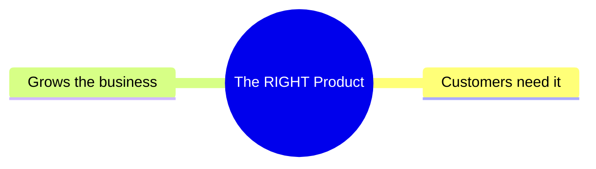

https://drive.google.com/file/d/1PdhPwBNBAzjzk6av4FKMecvBdI2eclS3/view?usp=sharing

[[business/market_strategy.md]]

USP (Unique Selling Points - Μοναδικά Πλεονεκτήματα Πώλησης)
- γιατί το προϊόν μου είναι καλύτερο από τον ανταγωνισμό, είτε άμεσα είτε έμμεσα
- πώς λύνω το πρόβλημα ή εξυπηρετώ τους πελάτες με καλύτερο τρόπο

Product (Προϊόν): Business (Επιχείρηση) + Tech (Τεχνολογία) + UX (Design - Σχεδιασμός Εμπειρίας Χρήστη)

## Stages of Product and Growth

Η εικόνα είναι ένα γράφημα που αναλύει τα στάδια ανάπτυξης ενός προϊόντος («Stages of Product & Growth»). Απεικονίζει μια καμπύλη ανάπτυξης (Growth) που χωρίζεται σε τρεις βασικές περιόδους:
1. **Product-first period:** * Ξεκινά με την αναζήτηση ταύτισης προβλήματος-λύσης και τη δημιουργία του **MVP** (Minimum Viable Product).
    - Οδηγεί στο **Product/Market Fit**, όπου αναζητείται η ταύτιση προϊόντος-αγοράς και γλώσσας-αγοράς.    
2. **Marketing-first period:** * Εστιάζει στη βελτιστοποίηση της διαδικασίας (funnel) και καταλήγει στο **Channel/Product Fit** (ταύτιση καναλιού-προϊόντος).
3. **Growth (money first):** * Ξεκινά η ραγδαία ανάπτυξη με επένδυση πόρων.
    - Καταλήγει στο στάδιο της ωριμότητας (**Maturity**), όπου η ανάπτυξη συνεχίζεται μέσω εξαγορών και διεθνούς επέκτασης.

## Ερωτήσεις για Product/Market Fit (Ταύτιση Προϊόντος-Αγοράς)
1) Πόσο πιθανό είναι να προτείνετε αυτό το προϊόν ή την υπηρεσία σε έναν συνάδελφο ή φίλους; (1 - 10) "NPS" (Net Promoter Score - Δείκτης Καθαρής Σύστασης) από -100% έως 100%. Θέλουμε τουλάχιστον +30% για να πούμε ότι έχουμε fit.
2) Πόσο απογοητευμένοι θα ήσασταν αν δεν μπορούσατε πλέον να χρησιμοποιήσετε αυτό το προϊόν;
   a) Πολύ απογοητευμένος (>75%)
   b) Κάπως απογοητευμένος
   c) Καθόλου απογοητευμένος, δεν είναι πραγματικά τόσο χρήσιμο
   d) Δ/Υ - Δεν χρησιμοποιώ πλέον αυτό το προϊόν

## Το Σωστό Προϊόν (The Right Product):

Αυτή η εικόνα δείχνει ένα απλό διάγραμμα Venn που ορίζει τι αποτελεί «Το ΣΩΣΤΟ προϊόν» (**The RIGHT product**).

### Οπτικοποίηση

```mermaid
mindmap
  root((The RIGHT Product))
    Customers need it
    Grows the business
```
Συγκεκριμένα, αποτελείται από δύο κύκλους που τέμνονται:
- **Αριστερός κύκλος:** Προϊόντα που «Οι πελάτες τα χρειάζονται» (**Customers need it**). 
- **Δεξιός κύκλος:** Προϊόντα που «Αναπτύσσουν την επιχείρηση» (**Grows the business**).
Στο σημείο τομής των δύο κύκλων υπάρχει η λέξη «**ΝΑΙ**» (**YES**).

### 1. Η Νοοτροπία του "Fake MVP" (Ταχύτητα)

- **Τι λέει το workshop:** Μιλάει για δημιουργία MVP σε 4 μέρες, "Fake MVPs" και χρήση εργαλείων (όπως v0/bolt.new για κώδικα ή low-code λύσεις) για να βγει το προϊόν γρήγορα.
    
- **Εφαρμογή στην Orderly:** Στο Roadmap σας έχετε υπολογίσει ~80 μέρες μέχρι το πιλοτικό (Απρίλιος - Ιούνιος). Η πρόκληση εδώ είναι: _Μπορείτε να τεστάρετε το βασικό σας assumption γρηγορότερα;_ Για παράδειγμα, πριν στηθεί όλο το backend, θα μπορούσατε να πάτε σε ένα beach bar με ένα "σχεδόν ψεύτικο" (mocked) UI στο κινητό σας, απλά για να δείτε αν ο ιδιοκτήτης θα έλεγε «Ναι, το θέλω, πού υπογράφω;».
    

### 2. Analytics & The "Build-Measure-Learn" Loop

- **Τι λέει το workshop:** Αναφέρει εργαλεία μέτρησης (όπως PostHog, Mixpanel) και βιβλία-σταθμούς όπως το _The Lean Startup_.
    
- **Εφαρμογή στην Orderly:** Επειδή είστε "zero-friction" (χωρίς login/app), η μέτρηση της συμπεριφοράς είναι το παν. Πρέπει να ξέρετε ακριβώς πού "κολλάει" ο τουρίστας. Στο MVP σας πρέπει να ενσωματώσετε analytics από την Day 1: Πόσοι σκάναραν το QR; Πόσοι έβαλαν κάτι στο καλάθι; Πόσοι εγκατέλειψαν στην οθόνη της πληρωμής (drop-off rate);
    

### 3. Το Μοντέλο "Hooked"

- **Τι λέει το workshop:** Προτείνει το βιβλίο _Hooked_ (πώς να φτιάχνεις προϊόντα που γίνονται συνήθεια).
    
- **Εφαρμογή στην Orderly:** Στο B2B κομμάτι σας (τα venues), το KDS (Kitchen Display System) ή το admin dashboard που θα φτιάξετε στην Φάση 2 πρέπει να είναι τόσο εθιστικά απλό που ο σερβιτόρος ή ο μάγειρας να μην θέλει να ξαναδεί χαρτάκι παραγγελίας ποτέ στη ζωή του.
    

---

Ουσιαστικά, η ομάδα της Welcome Pickups σας λέει να μετατοπίσετε την εστίασή σας από το "πώς θα το χτίσουμε τέλεια τεχνικά" στο "πώς θα μάθουμε γρηγορότερα αν δουλεύει στην πραγματική αγορά".

Έχοντας στο μυαλό τη λογική του "Build-Measure-Learn", ποιο είναι το **ένα και μοναδικό metric** (π.χ. χρόνος ολοκλήρωσης παραγγελίας, ποσοστό μετατροπής) που αν το πιάσετε στα 5 πιλοτικά σας τον Ιούνιο, θα σας πείσει 100% ότι το προϊόν σας έχει πετύχει;

## Επιπτώσεις για την ομάδα (Impact for the team)
Πρέπει να μετατοπίσουμε την εστίασή μας από το "πώς θα χτίσουμε το τέλειο σύστημα τεχνικά" στο "πώς θα μετρήσουμε γρήγορα την αλληλεπίδραση των χρηστών". Η προτεραιότητα είναι η επικύρωση των υποθέσεών μας (Build-Measure-Learn loop).

## Επόμενες Ενέργειες
- [ ] Ρύθμιση tracking (π.χ. PostHog/Mixpanel) για το scan-to-order conversion rate στο Fake MVP.

## Σχετικές Σημειώσεις
- [[v1_scope]]
- [[market_strategy]]
- [[roadmap]]

- [ ] Δημιουργία πλάνου A/B testing για conversion rate στο Fake MVP.
