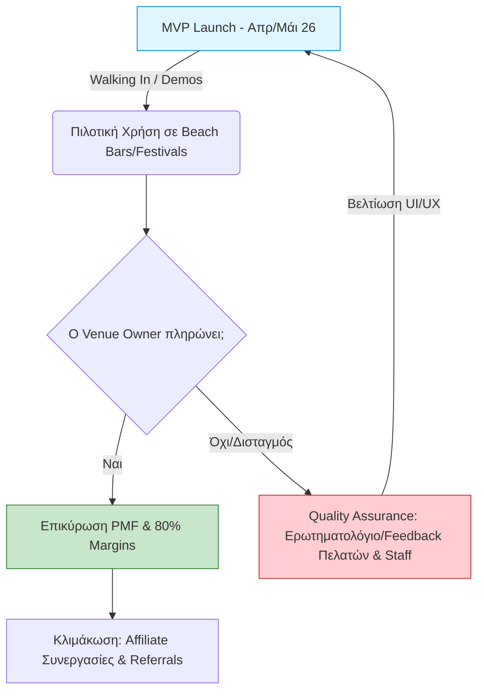
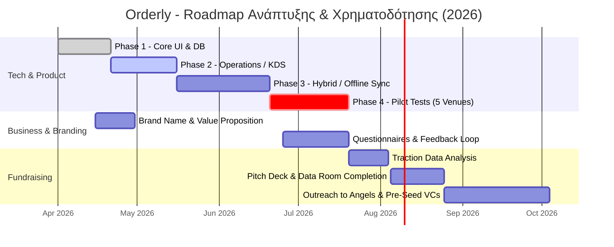

https://drive.google.com/file/d/1UyOKowuW6RmcB5ww9QeXLeq7ZtPctO44/view?usp=sharing

### 1. Στρατηγική Προϊόντος & Ομάδας (The 7 Pillars)

_Βασισμένο στο σεμινάριο του Alex Trimis (Welcome Pickups)_

- **Ομάδα & Vesting (Κρίσιμο):** Έχετε μια πολύ καλή ισορροπία στην ομάδα (2 Devs, 2 Business). Επειδή όμως τώρα ξεκινάτε, είναι απολύτως απαραίτητο να ορίσετε ένα "vesting schedule" (σταδιακή κατοχύρωση μετοχών) από την αρχή για να προστατεύσετε την εταιρεία. Ακόμα κι αν νιώθετε άβολα, οι λάθος αποφάσεις στην αρχή κοστίζουν ακριβά.
    
- **Προϊόν & Product-Market Fit (PMF):** Η απόφασή σας να λανσάρετε ένα ordering-first MVP (και όχι ένα βαρύ POS) είναι σωστή. Εστιάστε με μανία στο Product-Market Fit. Μην χτίσετε το τέλειο σύστημα για όλους, αλλά λύστε το πρόβλημα (ουρές, γλώσσα) άριστα για τα 5 πιλοτικά venues. Αν αυτοί οι 5 είναι διατεθειμένοι να πληρώσουν στο τέλος, είστε στον σωστό δρόμο.
    
- **Quality Assurance & Διανομή:** Το ερωτηματολόγιο που ετοιμάσατε είναι ο μηχανισμός του "Quality Assurance" σας. Στο GTM, ξεκινάτε σωστά με cold outreach, αλλά να περιμένετε ότι τα κανάλια κάποια στιγμή εξαντλούνται. Η ιδέα σας για affiliate deals με λογιστές/προμηθευτές (Business Development) είναι εξαιρετική, καθώς δεν πρέπει να βασίζεστε μόνο σε 1-2 κανάλια.
    
- **Economics:** Ο στόχος σας για ~80% Gross Margin είναι ιδανικός, καθώς τέτοια υγιή περιθώρια SaaS επιτρέπουν την ταχύτερη ανάπτυξη.
    

Απόσπασμα κώδικα

---

### 2. Branding & Positioning (Απαντώντας στα "Open Issues" σας)

_Βασισμένο στο Relevance Branding Workshop_

Αφού το Business Model Canvas (Value Proposition) και το τελικό όνομα είναι ανοιχτά, κρατήστε τα εξής:

- **Ονοματολογία:** Για το οριστικό όνομα (αν δεν κρατήσετε το Orderly), βεβαιωθείτε ότι περνάει το "Airplane Test" (αν το πείτε σε κάποιον σε μια πτήση, το καταλαβαίνει εύκολα;). Πρέπει να είναι 1-3 συλλαβές, εύκολο στην προφορά (ειδικά για τουρίστες) και να έχει διαθέσιμο domain.
    
- **Value Proposition & Story:** Το branding δεν είναι το λογότυπο, είναι το πώς κάνετε τον κόσμο να νιώθει. Το story σας δεν πρέπει να είναι το _τι_ κάνετε ("είμαστε ένα QR menu"), αλλά το _γιατί_.
    
    - _Παράδειγμα Value Prop:_ «Καταργούμε το χάος, την αναμονή και τα γλωσσικά εμπόδια. Δίνουμε στους τουρίστες zero-friction εξυπηρέτηση και στους ιδιοκτήτες ηρεμία και αύξηση τζίρου.»
        
- **Χρώμα & Τόνος Φωνής:** Η επιλογή του πράσινου είναι στρατηγικά σωστή, καθώς συμβολίζει τη φρεσκάδα, τη χαλάρωση (relaxation) και την ανάπτυξη — ακριβώς το αντίδοτο στο στρες των γεμάτων beach bars. Ο τόνος της φωνής (Tone of Voice) στο UI σας πρέπει να είναι ξεκάθαρος, γρήγορος (fast) και φιλικός, ώστε να εμπνέει σιγουριά στον τουρίστα.
    

---

### 3. Στρατηγική Χρηματοδότησης (Τα επόμενα βήματα)

_Βασισμένο στο σεμινάριο του CapsuleT (Travel/Hospitality Tech)_

- **Timing:** _Μην_ βγείτε για funding τώρα. Η σωστή στιγμή είναι αμέσως μετά την επικύρωση του MVP και τα θετικά σήματα από τα 5 πιλοτικά venues σας (δηλαδή προς τα τέλη καλοκαιριού 2026).
    
- **Runway:** Όταν ζητήσετε χρήματα, ζητήστε αρκετά για να έχετε διάδρομο (runway) 12-18 μηνών. Οι B2B λύσεις στη φιλοξενία χρειάζονται "υπομονετικά κεφάλαια" (patient capital) επειδή οι κύκλοι πωλήσεων επηρεάζονται από την εποχικότητα.
    
- **Πώς να πλασάρετε την Orderly στους επενδυτές:**
    
    - **Integrations:** Δώστε τεράστια έμφαση στις διασυνδέσεις σας (myDATA, Viva Wallet, SBZ). Στο travel tech, το integration είναι το παν.
        
    - **Scale & Defensibility:** Δείξτε ότι η Hybrid/Offline αρχιτεκτονική σας (Raspberry Pi local servers) λύνει ένα πραγματικό πρόβλημα (κακό σήμα στα νησιά) που οι διεθνείς ανταγωνιστές (π.χ. me&u) δεν μπορούν να λύσουν εύκολα από μακριά.
        
    - **Αγορά:** Προβάλετε έντονα τα νούμερά σας (75.000 επιχειρήσεις, 40M τουρίστες) για να αποδείξετε το μεγάλο TAM (Total Addressable Market).
        

Απόσπασμα κώδικα

---

Έχετε μια πραγματικά συμπαγή βάση. Επειδή αναφέρατε ότι το **Value Proposition** και το **Οριστικό Brand Name** είναι από τα πράγματα που δεν έχουν αποφασιστεί ακόμα, θέλετε να κάνουμε ένα γρήγορο brainstorming πάνω σε αυτά τα δύο για να κλείσουμε τα ανοιχτά μέτωπα;