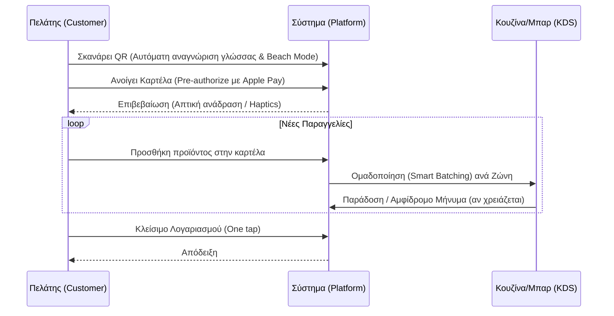

# Επαναστατικές Ιδέες για το Προϊόν Παραγγελιοληψίας σε Beach Bar (Revolutionary ideas for our beach bar platform)

Το προϊόν μας βρίσκεται στη διασταύρωση τριών ανεκπλήρωτων αναγκών:
1. Καμία πλατφόρμα παραγγελιών με QR (QR Ordering) δεν διαχειρίζεται εγγενώς την ελληνική φορολογική συμμόρφωση (myDATA).
2. Καμία δεν έχει αρχιτεκτονική ειδικά για περιβάλλοντα χωρίς σταθερό ίντερνετ (Offline-first / Local-first) σε παραλίες.
3. Καμία δεν εκμεταλλεύεται τη μοναδική επιχειρησιακή δυναμική της εποχικής φιλοξενίας στην παραλία.

Οι παρακάτω ιδέες αντλούνται από κορυφαίες πλατφόρμες (GoTab, Sunday, me&u/Mr Yum) και τεχνολογικές τάσεις, αξιοποιώντας την τεχνολογική μας στοίβα (Tech Stack). Επικεντρώνονται σε τέσσερις άξονες: επιχειρησιακή αποδοτικότητα, εμπειρία πελάτη, έξυπνα έσοδα και διαφοροποίηση πλατφόρμας.

---

## 1. Επιχειρησιακή αποδοτικότητα (Operational efficiency) που αναδιαμορφώνει τη στελέχωση

Το βασικό πρόβλημα είναι γεωμετρικό: οι παραγγελίες προέρχονται από δεκάδες διάσπαρτες ξαπλώστρες, αφορούν κυρίως ποτά (~70%), εξυπηρετούνται από εποχικό προσωπικό και κορυφώνονται ταυτόχρονα (αιχμή).

- **Έξυπνη ομαδοποίηση βάσει ζώνης και δρομολόγηση παράδοσης (Zone-based smart batching & routing):** Χωρισμός της παραλίας σε χρωματικά κωδικοποιημένες ζώνες. Το σύστημα ομαδοποιεί παραγγελίες από την ίδια ζώνη μέσα σε ένα παράθυρο 3-5 λεπτών, μειώνοντας τις διαδρομές. (Πιθανή αύξηση αποδοτικότητας κατά 30-50%).
- **Οπτικό Σύστημα Οθόνης Κουζίνας (Visual KDS) για εποχικό προσωπικό:** Αντί για κείμενο, εμφάνιση εικονιδίων (π.χ. εικόνα ενός mojito με τον αριθμό της ξαπλώστρας). Χρωματική κωδικοποίηση (red/yellow/green) για ευκολία, μειώνοντας δραματικά τον χρόνο εκπαίδευσης.
- **Έλεγχος ροής με μενού "Εξπρές" (Order throttling & Express menus):** Όταν ο όγκος παραγγελιών είναι τεράστιος, το σύστημα δείχνει αυτόματα εκτιμώμενο χρόνο αναμονής και προβάλλει ένα "Express" μενού με προϊόντα γρήγορης προετοιμασίας. Ενσωμάτωση με ειδοποιήσεις σε έξυπνα ρολόγια (Wearables) για το προσωπικό.
- **Αμφίδρομα μηνύματα (Two-way KDS-to-Guest messaging):** Η κουζίνα μπορεί να στείλει μήνυμα στον πελάτη (π.χ. "Μείναμε από δυόσμο, θέλετε κάτι άλλο;"), γλιτώνοντας τη μετακίνηση του σερβιτόρου.

---

## 2. Εμπειρία πελάτη (Customer experience) σχεδιασμένη για ξαπλώστρες, όχι τραπέζια

Οι πελάτες με μαγιό αντιμετωπίζουν άμεσο ηλιακό φως και δεν έχουν μαζί τους πορτοφόλια.

- **Αυτόματη ανίχνευση γλώσσας (Auto-language detection):** Χωρίς διακόπτη επιλογής (Toggle). Σκανάροντας, η συσκευή εντοπίζει τη γλώσσα και δείχνει το αντίστοιχο μενού (EN, EL, DE, FR, IT κ.λπ.).
- **Ψηφιακός Λογαριασμός Παραλίας (Digital Beach Tab):** Προέγκριση (Pre-authorize) κάρτας στο πρώτο σκανάρισμα. Οι επόμενες παραγγελίες προστίθενται στον λογαριασμό, ο οποίος κλείνει στο τέλος της ημέρας ή με ένα κουμπί. Ενσωμάτωση Apple Pay και Google Pay.
- **Λειτουργία Παραλίας (Beach Mode UI):** Διεπαφή χρήστη υψηλής αντίθεσης (High-contrast UI) για τον ήλιο, μεγάλα κουμπιά αφής (Minimum touch targets 48px), πλοήγηση με σάρωση (Swipe-based) και απτική ανάδραση (Haptic vibrations).
- **Ομαδοποίηση Ξαπλώστρας (Sunbed Group):** Δυνατότητα ομαδικού καλαθιού και διαχωρισμού του λογαριασμού (Split payment) μεταξύ φίλων στην ίδια παρέα.
- **Αντίστροφη μέτρηση ηλιοβασιλέματος (Sunset Timer):** Ειδοποιήσεις βάσει καιρού και ώρας (π.χ. "Ηλιοβασίλεμα σε 47 λεπτά, παράγγειλε ένα Aperol").

---

## 3. Έξυπνα έσοδα (Revenue intelligence) που μετατρέπουν τα δεδομένα σε ευρώ

- **Δυναμική τιμολόγηση βάσει χρόνου (Dynamic time-based pricing):** Τιμολόγηση τύπου "Happy Hour" με αυτοματοποιημένο τρόπο. Προσφορές όταν μειώνεται η πληρότητα (Occupancy-triggered promotions).
- **Σχετική Προώθηση (AI contextual upselling):** Όταν ο χρήστης προσθέτει μια μπίρα στο καλάθι, του προτείνεται πακέτο (Bucket) ή έξτρα προϊόντα. (Μπορεί να αυξήσει τη μέση αξία παραγγελίας (AOV - Average Order Value) κατά 10-15%).
- **Πρόβλεψη ζήτησης βάσει καιρού (Weather-integrated demand forecasting):** Σύνδεση με API καιρού για πρόβλεψη απαιτούμενου προσωπικού, πρώτων υλών και προετοιμασίας παρασκευών (Pre-batching).

### Οπτικοποίηση: Η ροή του Digital Beach Tab

## Επιπτώσεις για την ομάδα (Impact for the team)
Πολλά από αυτά τα χαρακτηριστικά είναι πολύ προχωρημένα για την Φάση 1 (Phase 1). Πρέπει να φιλτράρουμε τις ιδέες αυτές και να δούμε ποιες μπορούν να ενσωματωθούν στο MVP (π.χ. Apple Pay και Beach Mode) και ποιες θα πάνε στη Φάση 2 (π.χ. Weather API, AI Upselling).

## Σχετικές Σημειώσεις
- [[Product Design]]
- [[market_strategy]]
- [[features]]

## Επόμενες Ενέργειες
- [ ] Να αξιολογήσουμε σε συνάντηση εάν το "Zone-based smart batching" μπορεί να μπει στο τεχνικό MVP ή αν θα καθυστερήσει την κυκλοφορία.
- [ ] Να προστεθεί η υποστήριξη Apple Pay / Google Pay στις τεχνικές απαιτήσεις (Technical Requirements) για τη μείωση της τριβής στις πληρωμές.
