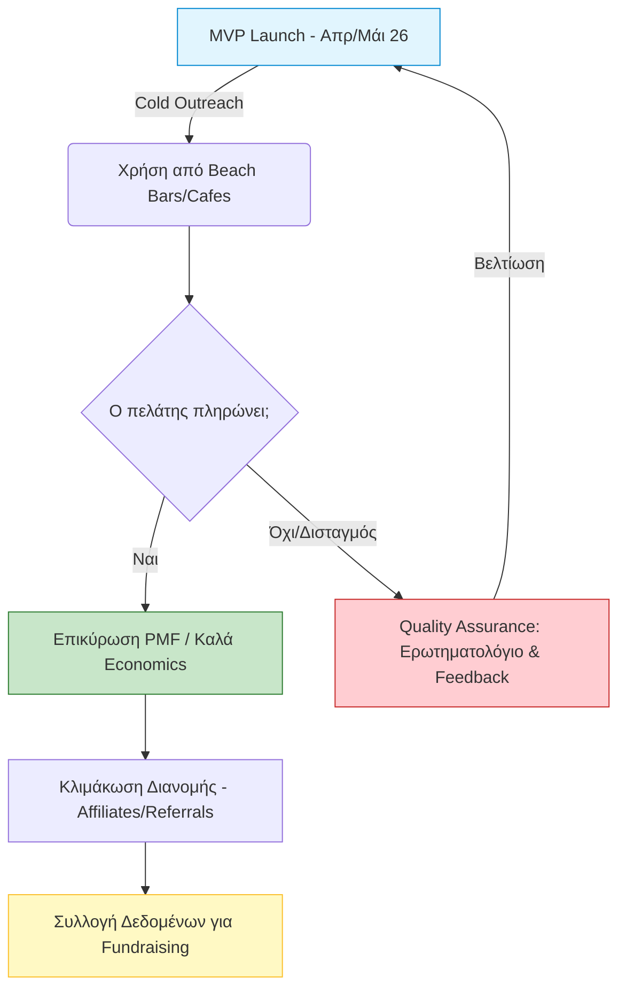
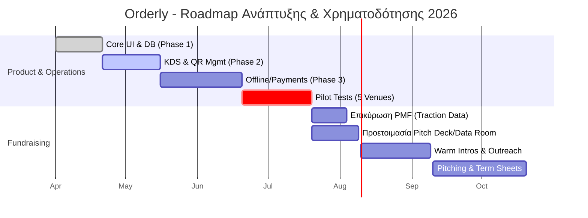

https://drive.google.com/file/d/1S5Z4Ie324xF5duFILi1S9RHdwQ9NEAIF/view?usp=sharing

# 🚀 Orderly: Στρατηγικές Σημειώσεις Ανάπτυξης & Χρηματοδότησης

## Μέρος 1: Τα 7 Θεμέλια της Επιτυχίας (Προσαρμογή στην Orderly)

Βασισμένο στο μοντέλο ανάπτυξης του Alex Trimis (Welcome Pickups).

1. **Ομάδα (Team):** * Έχετε ήδη μια συμπαγή ομάδα 4 ατόμων (2 Devs, 2 Business). Η συμβουλή είναι η αρχική ομάδα να παραμένει μικρή και με συμπληρωματικά skills.
    
    - _Action:_ Καθορίστε ξεκάθαρα τα vesting schedules (ποσοστά μετοχών σε βάθος χρόνου) από τώρα για να προστατεύσετε την εταιρεία.
        
2. **Προϊόν (Product):** * Εστιάστε στην εύρεση του Product-Market Fit (PMF). Η απόφασή σας να μην είστε ένα πλήρες POS στο MVP, αλλά ένα "ordering-first layer", ταυτίζεται με τη στρατηγική της κυκλοφορίας ενός στοχευμένου Minimum Viable Product (MVP) που λύνει ένα συγκεκριμένο πρόβλημα.
    
    - _Hint:_ Οι επενδυτές δεν πληρώνουν ιδέες, αλλά την εκτέλεση και το traction.
        
3. **Διασφάλιση Ποιότητας (Quality Assurance):** * Η πιλοτική σας φάση (Ιούνιος-Ιούλιος 2026) και το ερωτηματολόγιο που ετοιμάσατε είναι κρίσιμα. Πρέπει να ακούσετε προσεκτικά τους πελάτες (κυρίως τα παράπονά τους).
    
4. **Διανομή (Distribution):** * Το GTM πλάνο σας (Cold outreach / Walking in) είναι καλό για αρχή. Ωστόσο, μην βασίζεστε σε ένα μόνο κανάλι, καθώς τα κανάλια εξαντλούνται.
    
    - _Προοπτική:_ Εξετάστε τα 19 Traction Channels, όπως Business Development (π.χ. τα affiliate deals που σχεδιάζετε με λογιστές) και Content Marketing.
        
5. **Οικονομικά (Economics):** * Το SaaS/Subscription μοντέλο σας με στόχο ~80% Gross Margin είναι εξαιρετικό. Προτιμήστε επιχειρηματικά μοντέλα με μεγάλα, υγιή περιθώρια κέρδους.
    
6. **Επένδυση (Investment):**
    
    - Ετοιμαστείτε να σηκώσετε κεφάλαια _πριν_ ξεμείνετε από χρήματα (π.χ. αμέσως μετά την επιτυχία των πιλοτικών το καλοκαίρι).
        
7. **Μέλλον (Future):**
    
    - Οι τεχνολογικές αλλαγές έρχονται γρήγορα. Το όραμά σας για AI chatbot στο μέλλον δείχνει ότι σκέφτεστε την επόμενη μέρα.
        

### 📊 Διάγραμμα 1: Ο Κινητήρας Ανάπτυξης της Orderly (Feedback Loop)

Απόσπασμα κώδικα

---

## Μέρος 2: Στρατηγική Fundraising για Travel / Hospitality Tech

Βασισμένο στις οδηγίες του CapsuleT.

- **Πότε να ζητήσετε χρηματοδότηση (Timing):** Μην βγείτε τώρα. Η κατάλληλη στιγμή είναι μετά την επικύρωση του MVP και αφότου έχετε τα πρώτα θετικά μηνύματα από την αγορά (από τα 5 πιλοτικά venues σας).
    
- **Πόσα να ζητήσετε:** Υπολογίστε ένα ποσό που να σας εξασφαλίζει 12-18 μήνες "διάδρομο" (runway) συν ένα επιπλέον ασφαλές περιθώριο (buffer). Οι B2B λύσεις στον τομέα της φιλοξενίας απαιτούν μεγαλύτερα runways επειδή οι κύκλοι πωλήσεων είναι πιο αργοί και εποχιακοί.
    
- **Πώς να στήσετε το Pitch Deck της Orderly:**
    
    1. **TAM (Συνολική Αγορά):** Προβάλετε τα δυνατά σας νούμερα (75.000 επιχειρήσεις, 10,7 δις τζίρος, 40M τουρίστες).
        
    2. **Traction:** Τα δεδομένα από τα πιλοτικά venues θα είναι το πιο δυνατό σας χαρτί.
        
    3. **Travel Tech Insights:** Δώστε τεράστια έμφαση στα **Integrations** (Viva Wallet, myDATA, Epsilon Net), καθώς αυτό ψάχνουν οι επενδυτές στο hospitality.
        
    4. **Use Cases:** Μιλήστε με παραδείγματα για το _Guest Journey_ (πώς το batch logic και το αυτόματο translation λύνουν ουρές και γλωσσικά εμπόδια).
        
- **Προσοχή στα λάθη:** Αποφύγετε να μιλάτε σε λάθος επενδυτές. Ψάχνετε για VCs/Angels που κατανοούν ότι το Hospitality Tech χρειάζεται "patient capital" (επενδυτές με υπομονή).
    

### 📅 Διάγραμμα 2: Roadmap - Από το MVP στο Pre-Seed (2026)

Απόσπασμα κώδικα

### 💡 Το επόμενό σας βήμα

Δεδομένου ότι το Business Model Canvas σας είναι ακόμα ανοιχτό, προτεραιοποιήστε τον καθορισμό του **Value Proposition** (π.χ. _«Η Orderly μετατρέπει την αναμονή σε πωλήσεις για high-traffic venues, λύνοντας το γλωσσικό και λειτουργικό χάος μέσω zero-friction QR ordering»_). Αυτό θα είναι και ο πυρήνας της ιστορίας που θα πουλήσετε στους επενδυτές (η ικανότητα αφήγησης/storytelling είναι ζωτικής σημασίας).